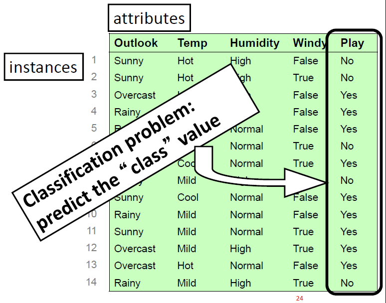

# WEKA 数据

- [WEKA 数据](#weka-数据)
  - [简介](#简介)
  - [概念](#概念)
  - [ARFF格式](#arff格式)
    - [@relation](#relation)
    - [@attribute](#attribute)
    - [@data](#data)
  - [数据类型](#数据类型)
    - [numeric 属性](#numeric-属性)
    - [枚举属性](#枚举属性)
    - [字符串属性](#字符串属性)
    - [日期和时间属性](#日期和时间属性)
  - [格式说明](#格式说明)

2023-12-11, 19:08
@author Jiawei Mao
****

## 简介

数据挖掘中有四种基本的学习模式：

- 分类学习（classification learning），从已分类的实例中学习分类规则，对新的实例进行分类。
- 关联学习（association learning），寻找特征之间的关联信息，而不仅仅是某一类值。
- 聚类（clustering，对实例进行分类。
- 数值预测（numeric prediction），预测结果为数值，而不是离散的类。

不管要学习的是什么，我们将需要学习的内容称为**概念**（concept），将学习的结果称为**概念描述**（concept description）。

## 概念

**Instance**  
**实例**，相当于统计学中的样本，或者数据库中的记录。

**Attribute**

**属性**，相当于统计学中的变量，或者数据库中的字段。

|属性类型|说明|
|---|---|
|`nominal`|只能做是否相等操作|
|`ordinal`|可以比对大小排序，但是不能计算距离，不能进行加减运算|

**class**  
分类。

{width="450"}

## ARFF格式

WEKA 数据存储格式 ARFF（Attribute-Relation File Format）是一种 ASCII 文本文件，用于描述包含相同属性的实例。

- %, 注释行。
- 空行和注释行均被忽略。

ARFF文件可以分为两部分：

- 标题（Head information），包括对关系（relation）的声明和对属性的声明。
- 数据（Data information），即数据集中给出的信息，以“@data”标记开始，后面的都是数据信息。

@RELATION, @ATTRIBUTE, @DATA均忽略大小写。

### @relation

`@relation` 是 ARFF 文件第一个有效行：

```arff
@relation <relation-name>
```

关系声明，或数据集名称，是 ARFF 文件的第一个有效行。如果包含空格，需要加引号。

relation-names 或 attribute-names不能以如下字符开头：

`\\u0021 以下的字符以及 {, }, ',', '%'`

### @attribute

属性声明，说明数据包含哪些属性，定义属性名称和数据类型。每个属性对应一行属性声明。格式：

```arff
@attribute <属性名> <数据类型>
```

属性名，必须以字母开头的字符串。

属性名声明的顺序和对应属性在数据中的位置**一一对应**。

- 属性名必须以字符开头，如果属性名包含空格，必须加引号
- 属性声明顺序表明属性在数据中的位置
- 声明的最后一个属性被称作 class 属性，在分类或回归任务重，是默认的目标变量

如下是一个简单的 ARFF 文件：


### @data

`@data` 表示下面为具体数据，接下来每行对应一个实例数据。实例的各属性值用逗号隔开，缺失值用 ? 表示。

## 数据类型

WEKA支持四种数据类型：

| 类型    | 说明             |
| ------- | ---------------- |
| numeric | 数值型，实数或整数 |
| nominal | 枚举型            |
| string  | 字符串型          |
| date    | 日期              |

说明：

- integer 和 real 类型，WEKA 都当做 "numeric" 处理；
- "integer", "real", "numeric", "date" 和 "string" 这些关键字区分大小写；
- "relation", "attribute"和 "data"不区分大小写。

### numeric 属性

数值型定义：

```arff
@attribute <name> numeric
```

后面类型：

- `numeric=integer=real`，都表示数值类型
- "integer", "real", "numeric", "date" 和 "string" 这些关键字区分大小写
- "relation", "attribute" 和 "data" 不区分大小写。

数值型属性示例：

```arff
@relation example
@attribute temperature real
@data
86
72.5
```

### 枚举属性

枚举属性定义：

- 枚举属性由一系列可能的类别名称组成，放在大括号中
- "<name>" 或 "<nominal-name>" 中如果有空格，需要加引号
- 枚举属性名称区分大小写

```arff
@attribute <name> {<nominal-name1>,<nominal-name2>,...}
```

例如：

```arff
@relation example
@attribute outlook {sunny, rainy}
@data
sunny
rainy
```

### 字符串属性

字符串属性：

- 这类属性在文本挖掘中非常有用
- 名称如果有空格，需加引号
- 字符串属性的 "data" 可以包含任意文本，如果有空格，需加引号

```arff
@attribute <name> string
```

示例：

```arff
@relation example
@attribute LCC string
@data
"Science-Soviet Union-History"
Encycolpedias
ab0324
```

### 日期和时间属性

日期属性格式：

- 日期和时间统一用 "data" 类型表示
- `<date-format>` 为可选的字符串，用于指定日期格式，被 `SimpleDateFormat` 使用。默认为 `yyyy-MM-dd'T'HH:mm:ss`。

```arff
@attribute <属性名> date[<date-format>]
```

例如：

```arff
@relation example
@attribute timestamp date "yyyy-MM-dd HH:mm:ss"
@data
"2023-12-11 05:59:01"
```

## 格式说明

WEKA 除了默认 arff 格式，还可以读取 csv 文件。使用 Arff viewer 打开 csv 文件，可以转换为 ARFF 格式。