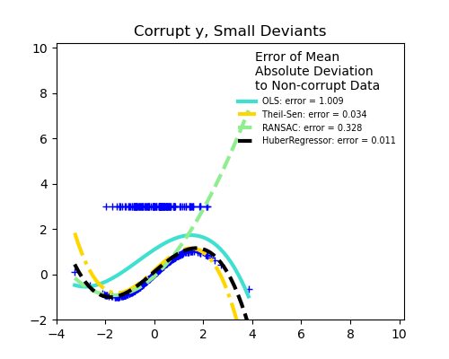

# 线性模型

***

## 简介

下面介绍一系列用于线性回归分析的方法，其 target 值是一系列 feature 的线性组合，即广义的线性模型。在数学中，如果 $\hat{y}$ 是预测值，线性组合可以表示为：

$$\hat{y}(w,x)=w_0+w_1x_1+...+w_px_p$$

其中，向量 $w=(w_1,...,w_p)$ 为参数向量 `ceof_`，$w_0$ 为截距 `intercept_`。

使用广义线性模型进行分类，可以参考 [逻辑回归](#逻辑回归)。

## 最小二乘法

`LinearRegression` 使用参数 $w=(w_1,...,w_p)$ 拟合线性模型，使得数据集 targets 的观测值和模型的预测值之间的残差平方和最小。从数学角度来说是解决如下问题：

$${min\atop w} \lVert X_w - y\rVert _2^2$$
![[2021-07-26-11-08-50.png|400]]
`LinearRegression` 的 `fit` 方法接收 $X$, $y$ 数据进行拟合，并将线性模型的系数 $w$ 保存在成员变量 `coef_`中：

```python
>>> from sklearn import linear_model
>>> reg = linear_model.LinearRegression()
>>> reg.fit([[0, 0], [1, 1], [2, 2]], [0, 1, 2])
LinearRegression()
>>> reg.coef_
array([0.5, 0.5])
```

普通最小二乘（Ordinary Least Squares）的系数估计依赖于 features 的独立性。当 feature 之间相关且设计矩阵（design matrix） $X$ 的 column 之间具有近似线性关系，此时设计矩阵近似为奇异（singular）矩阵，从而导致最小二乘对 target 的随机错误十分敏感，产生较大的方差。在没有仔细设计实验的情况下收集数据，可能会出现这种多重共线性（*multicollinearity*）的情况。
## 11. 逻辑回归

逻辑回归实现为 [LogisticRegression](https://scikit-learn.org/stable/modules/generated/sklearn.linear_model.LogisticRegression.html)。虽然叫逻辑回归，但是它是线性分类模型。logistic-regression 在文献中也称为 logit-regression，maximum-entropy classification 或 log-linear classifier。在该模型中，使用逻辑函数建模单个试验的概率。

## 16. 稳健回归

稳健回归旨在拟合存在离群值（outlier）或存在模型错误的数据。

### 不同场景和概念

当处理包含离群值的数据，需要考虑以下几点：

- **离群值是 X 还是 y?**

|y 方向的离群值|X 方向的离群值|
|---|---|
|||


## 参考

- https://scikit-learn.org/stable/modules/linear_model.html
- https://www.mathsisfun.com/data/least-squares-regression.html
