# Generative Adversarial Network

- [Generative Adversarial Network](#generative-adversarial-network)
  - [Network as Generator](#network-as-generator)
    - [Why distribution ?](#why-distribution-)
  - [GAN](#gan)
    - [Anime Face Generation](#anime-face-generation)
    - [Discriminator](#discriminator)
    - [核心概念](#核心概念)
    - [算法](#算法)
    - [GAN 发展](#gan-发展)
  - [GAN 理论](#gan-理论)
    - [目标](#目标)
    - [Sampling is good enough](#sampling-is-good-enough)
    - [Discriminator 目标](#discriminator-目标)
    - [多种 divergence](#多种-divergence)
  - [Tips for GAN](#tips-for-gan)
    - [JS divergence 的问题](#js-divergence-的问题)
    - [Wasserstein distance](#wasserstein-distance)
  - [WGAN ^[https://arxiv.org/abs/1701.07875]](#wgan-httpsarxivorgabs170107875)

## Network as Generator

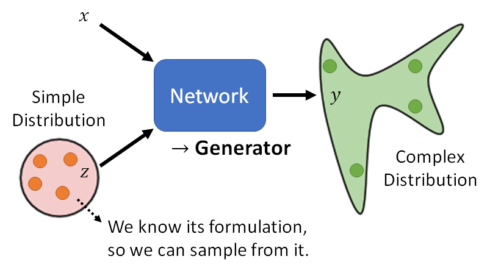

Generator 多了一个新的输入：Simple Distribution (z)。

`z` 的特点：

- 它不是固定的，是从一个分布中抽样出来的。
- 足够简单

输出也是一个分布，这种输出一个分布的 network，就称为 Generator。

### Why distribution ?

一些需要 "创造力" 的任务，需要这种输出分布的 Generator：

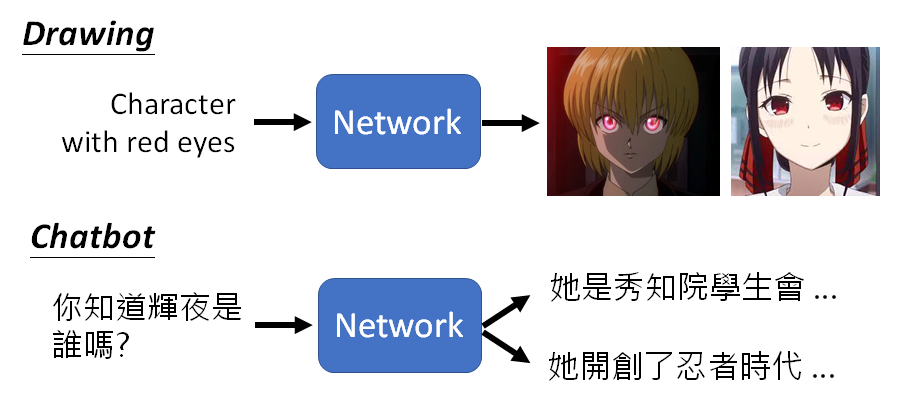

## GAN

GAN 有许多种变体，Github 仓库 [The GAN Zoo](https://github.com/hindupuravinash/the-gan-zoo) 收集了许多类型。

### Anime Face Generation

Unconditional generation，只有分布向量输入，没有 x 输入：

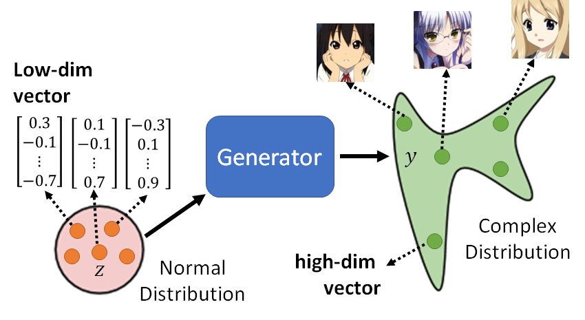

> 这里也可以采用正态分布以外的分布，不同分布的差异不是特别大。

### Discriminator

Discriminator 也是一个神经网络，输入图片，输出标量，这个标量反应图片与所需图片（如二次元图像）是否相似。

### 核心概念

NN Generator 生成图片，如果 Discriminator 无法区分该图片和所需图片，就算成功。

Generator 和 Discriminator 在互相对抗中共同进步，所以模型称为对抗网络。

### 算法

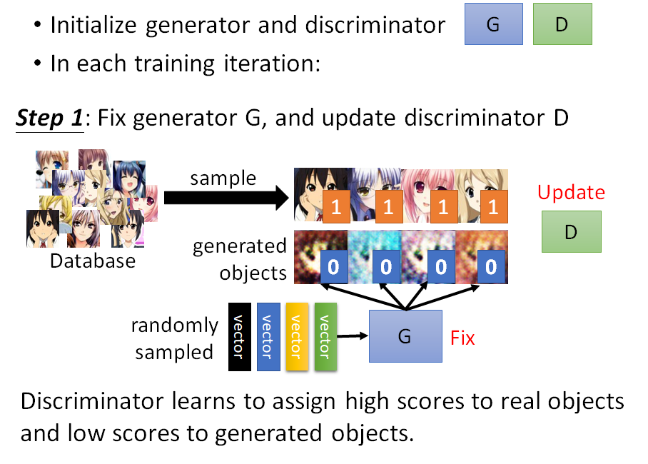

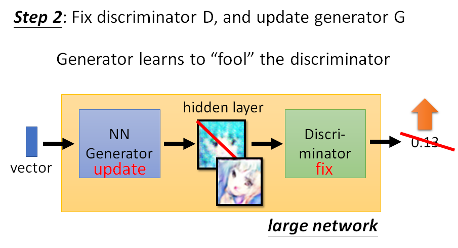

重复以上两个步骤：

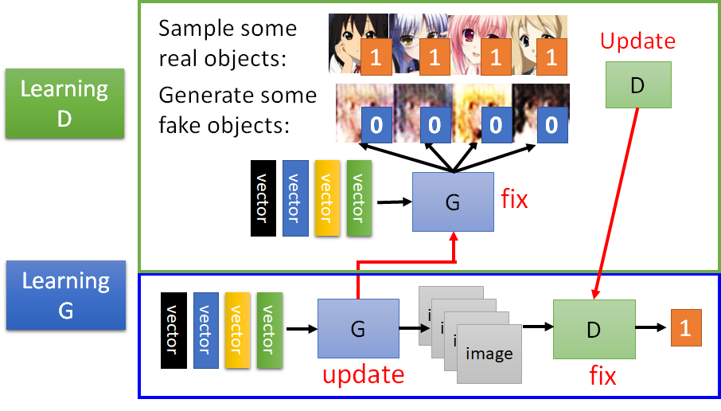

- 生成动画脸的 StyleGAN

[StyleGAN](https://www.gwern.net/Faces)

- 生成真实人脸的 Progressive GAN ^[https://arxiv.org/abs/1710.10196]

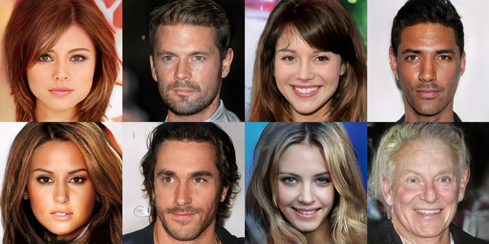

上下两排人脸都是模型生成的。

GAN 输入向量，输出图片，如果使用等差向量，可以生成渐变的图像：

### GAN 发展

- GAN 是 Ian J. Goodfellow 2014 年提出来的 ^[https://arxiv.org/abs/1406.2661]，当时的效果：

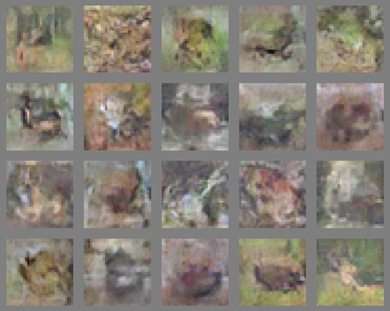

- 而 2018 年的 BigGAN ^[https://arxiv.org/abs/1809.11096]，已经达到下图的效果：

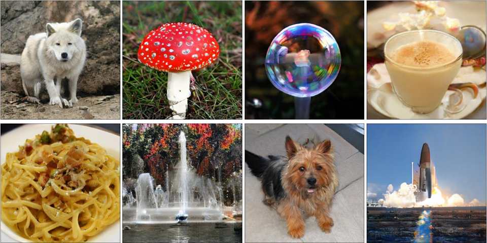

生成的图片还是有点问题，比如那只狗多了只脚，那个杯子有些变形。

## GAN 理论

### 目标

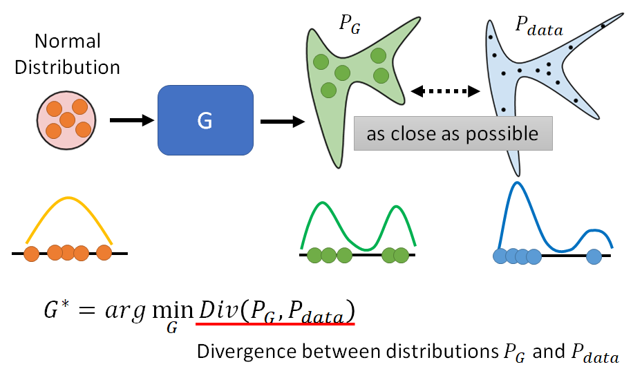

目标是最小化 $P_G$ 和 $P_{data}$ 的差异。现在的问题是，如何计算这种差异（divergence）？

### Sampling is good enough

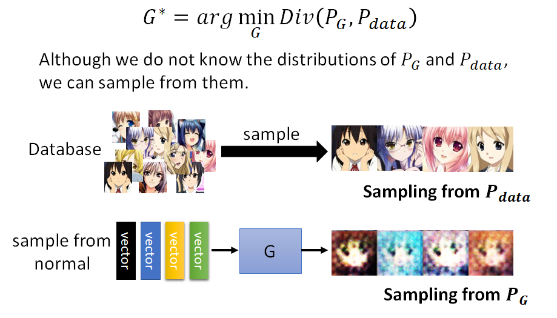

### Discriminator 目标

 ^[https://arxiv.org/abs/1406.2661]

### 多种 divergence

Using the divergence you like ^[https://arxiv.org/abs/1606.00709] 对不同的 divergence，如何设计 object function。

不过，虽然有很多 divergence，但是 GAN 很难训练，GAN 以其难训练而闻名。

## Tips for GAN

### JS divergence 的问题

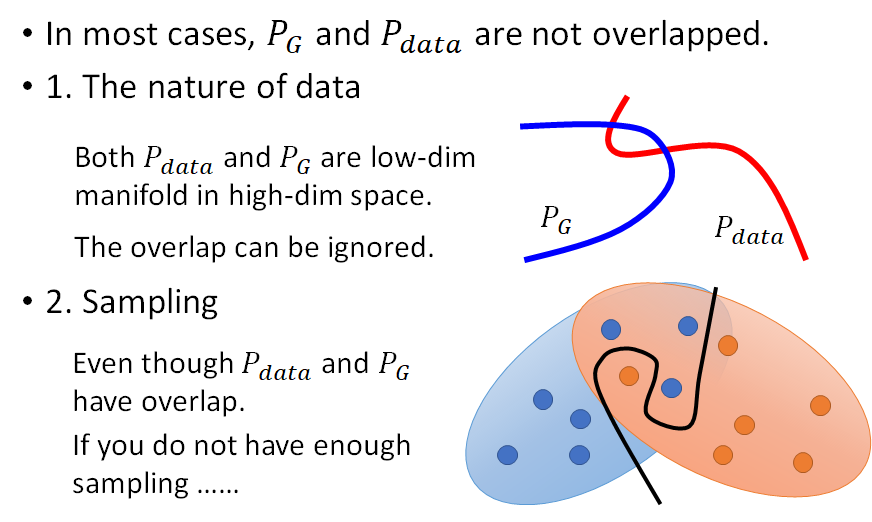

如果两个分布没有重合，JS divergence 算出来总是 log2。

Intuition: If two distributions do not overlap, binary classifier achieves 100% accuracy.

The accuracy (or loss) means nothing during GAN training.

### Wasserstein distance

当 P 和 Q 的分布不同 ^[https://vincentherrmann.github.io/blog/wasserstein/]

There are many possible “moving plans”.

Using the “moving plan” with the smallest average distance to define the Wasserstein distance.

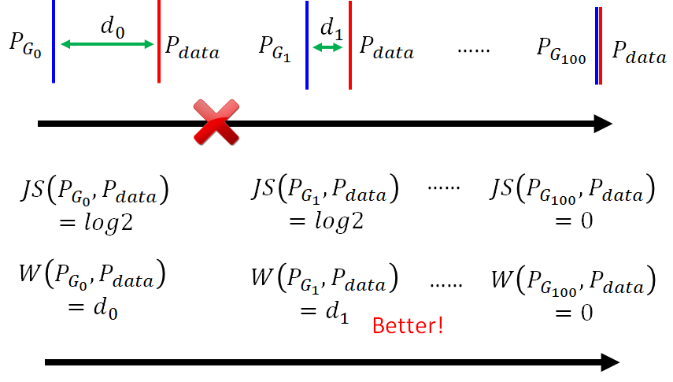

## WGAN ^[https://arxiv.org/abs/1701.07875]

- 原 WGAN -> Weight

Force the parameters w between c and -c

After parameter update, if w > c, w = c; if w < -c, w = -c

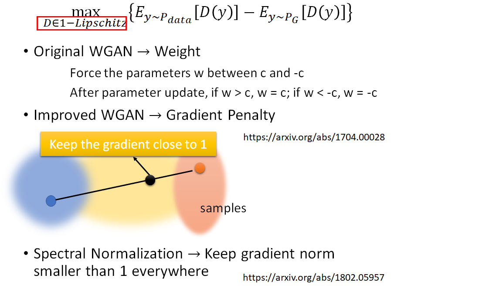

