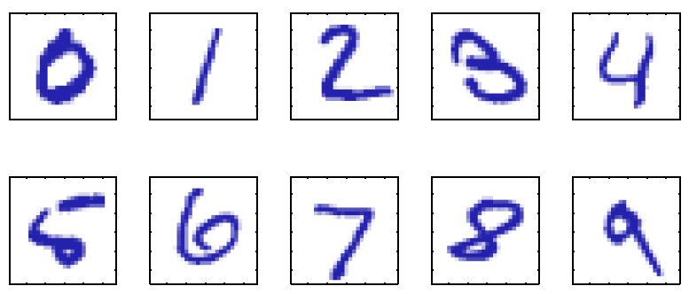

# 概述

- [概述](#概述)
  - [简介](#简介)
  - [特征提取](#特征提取)
  - [模式识别分类](#模式识别分类)

2023-12-18, 15:32
****

## 简介

在数据中发现模式是一个基本问题，并有着悠久而成功的历史。例如，Tycho Brahe 在 16 世纪积累的天文观测数据使得 Johannes Kepler 发现行星运动的经验规律，这又为经典力学的发展奠定基础。20 世纪初原子光谱中规律性的发现对量子物理的发展和验证起着关键作用。

**模式识别**：使用计算机算法自动发现数据中的规律，并使用这些规律进行数据分类等应用。

**示例：** 手写数字识别
输入：如 **图 1.1** 所示，每个 28x28 像素的图像对应一个数字，图像可以表示为长度 784 的向量 $x$。
目的：构建一个模型，输入向量 $x$，输出对应数字 $0,...,9$。

由于不同人的笔记不一样，这个问题并不简单。我们可以尝试手动编写规则或使用启发式方法来根据笔画的形状区分数字，但在实践中，这种方法会导致规则过多或规则外的情况过多，性能很差。

{width="200"}

> **图 1.1** 手写数字示例。

采用机器学习可以获得更好的结果。

- 训练集

将包含 $N$ 个样本的集合 ${x_1,...,x_N}$ 称为**训练集**（train set），用来调整自适应模型的参数。
在训练集中，图像中包含的数字是预先知道的，用目标向量 $t$ 来表示数字类别。因此，训练集中每个数字图像 $x$，对应一个目标向量 $t$。

机器学习算法可以表示为一个函数 $y(x)$，它以数字图像 $x$ 为输入，生成输出向量 $y$，$y$ 的编码方式与目标向量 $t$ 相同。函数 $y(x)$ 的精确形式在训练阶段根据训练数据确定。

- 测试集

训练好模型，就能用它识别新的数字图像，新的测试图像称为**测试集**（test set）。

正确分类不同于训练集的新样本的能力称为**泛化**（generalization）。在实际应用中，训练数据一般只包含所有可能输入向量的一小部分，因此泛化是模式识别的核心目标。

## 特征提取

在大多数实际应用中，通常会对原始输入变量进行预处理，将其转换到新的变量空间，使得模式识别问题更容易解决。例如，在数字识别问题中，通常会对数字图像进行平移和缩放，使得每个数字包含在固定大小的框中。这大大减少了每个数字类别的可变性，使得后续模式识别算法更容易区分不同的类别。这个预处理阶段有时也叫**特征提取**（feature extraction）。需要注意的是，新的测试数据也必须使用与训练数据相同的预处理步骤。

**预处理还可以用于加快计算速度**。例如，在高分辨视频流中实时检测人脸，计算机每秒要处理大量像素，而将这些像素直接呈现给复杂的模式识别算法会带来很大的计算开销。如果只保留足够区分人脸和非人脸的有用特征，将这些特征用作模式识别算法的输入，能显著提高计算速度。例如，可以快速计算矩形区域上图像强度均值，而使用一组这样的矩形能够快速检测人脸（Viola and Jones, 2004）。由于这些特征的数量小于像素数量，因此这种预处理是一种降维操作。在预处理过程中必须小心，避免丢失重要信息，导致最终模型性能受影响。

## 模式识别分类

训练数据包含输入向量及其对应的目标向量，也称为**监督学习**（supervised learning）：

- 如数字识别问题，其目的是将输入向量映射到有限的离散类别，又称为**分类**（classification）
- 如果输出包含一个或多个连续变量，则该任务称为**回归**（regression）。如根据反应物浓度、温度和压力预测化学反应的产量就是回归问题。

在其它模式识别问题中，训练数据只有输入向量，没有目标值，这类问题称为**无监督学习**（unsupervised learning）：

- 在数据中发现相似样本的无监督学习，称为**聚类**（clustering）
- 确定输入空间中数据的分布，称为**密度估计**（density estimation）
- 将数据从高维空间投影到二维或三维空间，用于可视化

最后，**强化学习**（reinforcement learning, Sutton and Barto, 1998）是在给定条件下寻找合适动作以最大化奖励的问题。与监督学习不同，强化学习没有给出最佳输出的例子，而是要通过试错来发现。通常有一系列状态和动作，学习算法与环境相互作用。在许多情况下，当前动作不仅影响即时奖励，还会影响后续步骤的奖励。例如，通过适当的强化学习技术，神经网络可以学习高水平的西洋双陆棋（Tesauro, 1994）。对该问题，神经网络必须学习将棋盘位置和骰子结果为输入，产生的移动为输出。通过让神经网络与自己的副本进行 100 万场比赛来实现。该问题的一个主要挑战是，西洋双陆棋可能每次包含数十种移动，但只有在游戏结束才能获得胜利形式的奖励。比如将奖励归因到导致胜利的所有动作，即使有些动作很好，有些不好。这是一个信用分配问题。强化学习一个重要特征是探索和开发之间的权衡：

- 探索（exploration）：系统采用新的动作，看看新动作的效果
- 开发（exploitation）：系统利用已知会产生高回报的动作

过于探索过于开发都会导致结果不好。强化学习仍然是机器学习研究的一个活跃领域。

尽管上面这些任务都需要自己的工具和技术，但它们的许多关键思想是通用的。本章的一个主要目标是以一种相对非正式的方式介绍机器学习的一些重要概念，并用简单的例子来辅助说明。在本书后面，我们将看到这些相同的思想在用于实际问题的更复杂的模型中再次出现。本章后面还介绍三个重要工具，即概率论、决策理论和信息论。虽然这些概念听起来更复杂，其实很简单。
