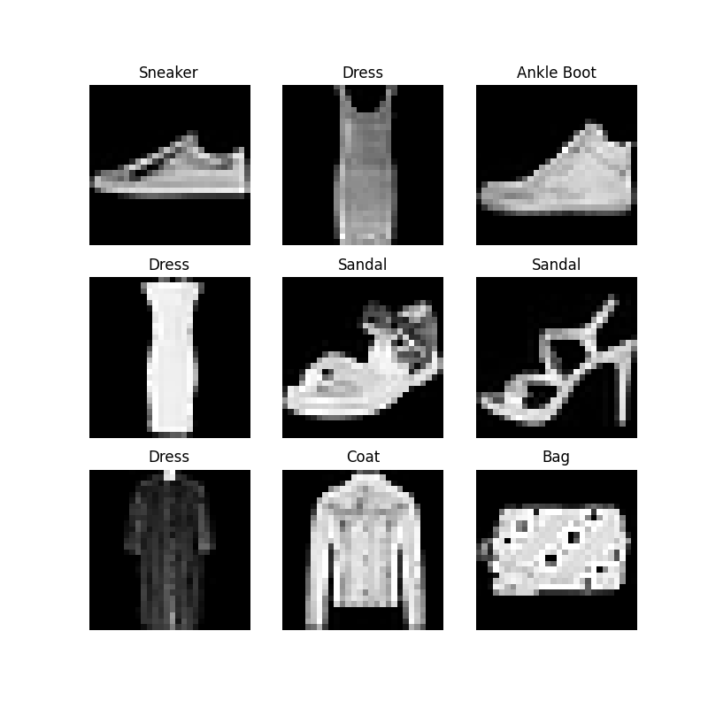
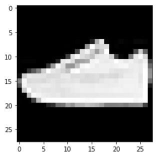

# DATASETS & DATALOADERS

- [DATASETS \& DATALOADERS](#datasets--dataloaders)
  - [简介](#简介)
  - [加载数据集](#加载数据集)
  - [迭代和可视化数据集](#迭代和可视化数据集)
  - [自定义数据集](#自定义数据集)
    - [`__init__`](#__init__)
    - [`__len__`](#__len__)
    - [`__getitem__`](#__getitem__)
  - [准备 DataLoader](#准备-dataloader)
  - [遍历 DataLoaderr](#遍历-dataloaderr)
  - [参考](#参考)

Last updated: 2022-11-07, 18:29
****

## 简介

数据预处理的代码容易变得混乱而难以维护，理想情况下，数据集代码与模型训练代码应该分离，以获得更好的可读性和模块化。PyTorch 提供了两个数据类：`torch.utils.data.DataLoader` 和 `torch.utils.data.Dataset` 用来加载数据。`Dataset` 存储样本及其标签，`DataLoader` 将 `Dataset` 封装为可迭代对象，包括访问数据。

PyTorch 特定领域库提供了许多预加载的数据集（如 FashionMNIST），这些数据集扩展 `torch.utils.data.Dataset` 并实现了特定于数据的函数。它们可用于模型的原型和基准测试。数据集位置：[图像数据集](https://pytorch.org/vision/stable/datasets.html)，[文本数据集](https://pytorch.org/text/stable/datasets.html)，[音频数据集](https://pytorch.org/audio/stable/datasets.html)。

## 加载数据集

下面演示如何从 TorchVision 加载 [Fashion-MNIST](https://github.com/zalandoresearch/) 数据集。Fashion-MNIST 数据集是 Zalando 文章中的一个图像数据集，包含 6 万训练样本和 1 万测试样本。每个样本包含一个 28x28 灰度图像和 10 分类标签。

使用以下参数加载 [FashionMNIST 数据集](https://pytorch.org/vision/stable/datasets.html#fashion-mnist)：

- `root` 是保存 train/test 数据的路径；
- `train` 指定是训练集还是测试集；
- `download=True` 表示如果 `root` 目录没有该数据，是否从网上下载；
- `transform` 和 `target_transform` 指定对特征和标签的转换操作。

```python
import torch
from torch.utils.data import Dataset
from torchvision import datasets
from torchvision.transforms import ToTensor
import matplotlib.pyplot as plt

training_data = datasets.FashionMNIST(
    root="D:\\data",
    train=True,
    download=True,
    transform=ToTensor()
)

test_data = datasets.FashionMNIST(
    root="D:\\data",
    train=False,
    download=True,
    transform=ToTensor()
)
```

## 迭代和可视化数据集

可以像使用 list 一样对 `Dataset` 进行索引，例如 `training_data[index]`。使用 matplotlib 对训练数据的一些样本进行可视化。

```python
labels_map = {
    0: "T-Shirt",
    1: "Trouser",
    2: "Pullover",
    3: "Dress",
    4: "Coat",
    5: "Sandal",
    6: "Shirt",
    7: "Sneaker",
    8: "Bag",
    9: "Ankle Boot",
}
figure = plt.figure(figsize=(8, 8))
cols, rows = 3, 3
for i in range(1, cols * rows + 1):
    sample_idx = torch.randint(len(training_data), size=(1,)).item()
    img, label = training_data[sample_idx]
    figure.add_subplot(rows, cols, i)
    plt.title(labels_map[label])
    plt.axis("off")
    plt.imshow(img.squeeze(), cmap="gray")
plt.show()
```



## 自定义数据集

自定义数据集必须实现三个函数：`__init__`, `__len__`, `__getitem__`。如下收拾，FashionMNIST 图像存储在 `img_dir` 目录，它们的标签单独保存在 CSV 文件 `annotations_file` 中。

```python
import os
import pandas as pd
from torchvision.io import read_image

class CustomImageDataset(Dataset):
    def __init__(self, annotations_file, img_dir, transform=None, target_transform=None):
        self.img_labels = pd.read_csv(annotations_file)
        self.img_dir = img_dir
        self.transform = transform
        self.target_transform = target_transform

    def __len__(self):
        return len(self.img_labels)

    def __getitem__(self, idx):
        img_path = os.path.join(self.img_dir, self.img_labels.iloc[idx, 0])
        image = read_image(img_path)
        label = self.img_labels.iloc[idx, 1]
        if self.transform:
            image = self.transform(image)
        if self.target_transform:
            label = self.target_transform(label)
        return image, label
```

### `__init__`

`__init__` 函数在实例化 Dataset 对象时运行一次。在其中初始化包含图像的目录、注释文件以及两个转换。

labels.csv 文件格式如下：

```csv
tshirt1.jpg, 0
tshirt2.jpg, 0
......
ankleboot999.jpg, 9
```

```python
def __init__(self, annotations_file, img_dir, transform=None, target_transform=None):
    self.img_labels = pd.read_csv(annotations_file)
    self.img_dir = img_dir
    self.transform = transform
    self.target_transform = target_transform
```

### `__len__`

`__len__` 函数返回数据集中样本的数量。例如：

```python
def __len__(self):
    return len(self.img_labels)
```

### `__getitem__`

`__getitem__` 从指定索引处加载并返回数据集的一个样本。根据索引确定图像在 disk 上的位置，使用 `read_image` 将其转换为张量，从 `self.img_labels` 检索相应的标签，调用变换函数（如果有），返回包含图像张量和标签的 tuple。

```python
def __getitem__(self, idx):
    img_path = os.path.join(self.img_dir, self.img_labels.iloc[idx, 0])
    image = read_image(img_path)
    label = self.img_labels.iloc[idx, 1]
    if self.transform:
        image = self.transform(image)
    if self.target_transform:
        label = self.target_transform(label)
    return image, label
```

## 准备 DataLoader

`Dataset` 检索数据集，一次一个样本。而在训练模型时，通常以小批量的方式传递样本，在每个 epoch 对数据洗牌以减少过拟合，并使用 Python 的多处理器来加速数据检索。

`DataLoader` 是一个可迭代对象，对 Dataset 进行包装，提供了以上功能。

```python
from torch.utils.data import DataLoader

train_dataloader = DataLoader(training_data, batch_size=64, shuffle=True)
test_dataloader = DataLoader(test_data, batch_size=64, shuffle=True)
```

## 遍历 DataLoaderr

获得 DataLoader 后，可以根据需要迭代数据集。下面的每次迭代返回一批 (`batch_size=64`) `train_features` 和 `train_labels`。因为设置了 `shuffle=True`，遍历所有 batch 后（1 个 epoch），数据会洗牌（要对数据加载的顺序进行更细粒度的控制，请查看 [Sampler](https://pytorch.org/docs/stable/data.html#data-loading-order-and-sampler)）。

```python
# Display image and label.
train_features, train_labels = next(iter(train_dataloader))
print(f"Feature batch shape: {train_features.size()}")
print(f"Labels batch shape: {train_labels.size()}")
img = train_features[0].squeeze()
label = train_labels[0]
plt.imshow(img, cmap="gray")
plt.show()
print(f"Label: {label}")
```



```txt
Feature batch shape: torch.Size([64, 1, 28, 28])
Labels batch shape: torch.Size([64])
Label: 7
```

## 参考

- https://pytorch.org/tutorials/beginner/basics/data_tutorial.html
