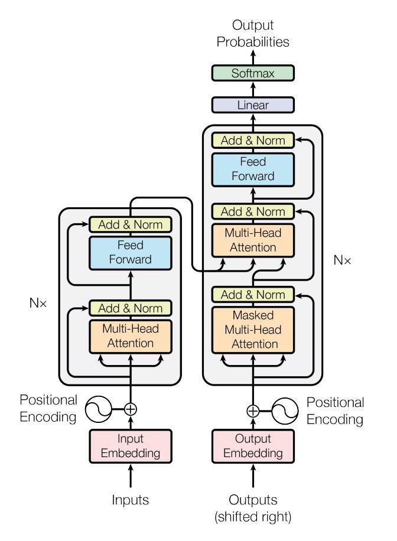

# 使用 nn.Transformer 和 TorchText 构建语言模型

## 简介

下面介绍使用 [nn.Transformer](https://pytorch.org/docs/stable/generated/torch.nn.Transformer.html) 模块训练 seq2seq 模型。

PyTorch 1.2 根据论文 [Attention is All You Need](https://arxiv.org/pdf/1706.03762.pdf) 实现了一个标准 Transformer 模块。与 RNN 相比，Transformer 模型已被证明在许多 seq2seq 任务中质量更好，同时具有更强的并行性。`nn.Transformer` 模块完全依赖于注意力机制（实现为 [nn.MultiheadAttention](https://pytorch.org/docs/stable/generated/torch.nn.MultiheadAttention.html)）来绘制输入到输出的全局依赖关系。`nn.Transformer` 模块高度模块化，因此其单个组件（如 [nn.TransformerEncoder](https://pytorch.org/docs/stable/generated/torch.nn.TransformerEncoder.html)）可以很容易地修改和组合。



## 定义模型

下面定义一个语言建模任务的 `nn.TransformerEncoder` 模型。语言建模是预测单词序列的下一个单词为指定单词的概率。首先将 token 序列传递给嵌入层，然后是位置编码。`nn.TransformerEncoder` 包含多层 [nn.TransformerEncoderLayer](https://pytorch.org/docs/stable/generated/torch.nn.TransformerEncoderLayer.html)。除了输入序列，还需要一个 attention mask，因为 `nn.TransformerEncoder` 中的 self-attention 层只允许注意序列中当前时间步前面的序列。对语言建模，当前时间步后的所有 token 都应该屏蔽。为了获得输出单词的概率分布，将 `nn.TransformerEncoder` 模型的输出传入 log-softmax 函数。

```python

```

## 参考

- https://pytorch.org/tutorials/beginner/transformer_tutorial.html
