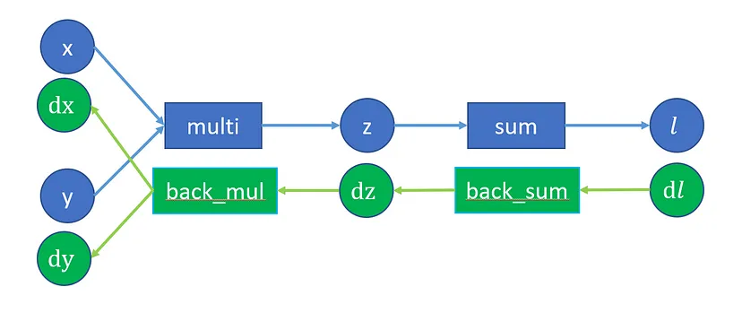

# Autograd

## 简介

使用 `requires_grad=True` 启用 autograd，`grad_fn` 

```python
torch.manual_seed(6)
x = torch.randn(4, 4, requires_grad=True)
y = torch.randn(4, 4, requires_grad=True)
z = x * y
l = z.sum()
l.backward()
print(x.grad)
print(y.grad)
```

```txt
tensor([[-1.4801, -1.0631,  0.3630,  0.3995],
        [ 0.1457, -0.7345, -0.9873,  1.8512],
        [-1.3437,  0.8535,  0.8811, -0.6522],
        [ 0.5810,  0.3561,  0.0160,  0.4019]])
tensor([[-1.2113,  0.6304, -1.4713, -1.3352],
        [-0.4897,  0.1317,  0.3295,  0.3264],
        [-0.4806,  1.1032,  2.5485,  0.3006],
        [-0.5432, -1.0841,  1.4612, -1.6279]])
```

其正向传播和反向传播示意图如下：



基于链式法则，可以想象每个变量（x, y, z, l）都有一个相关梯度（dx, dy, dz, dl）。最后一个变量 `l` 的梯度为 1。我们可按如下方式计算 x 和 y 的梯度：

```python
torch.manual_seed(6)
x = torch.randn((4, 4), requires_grad=True)
y = torch.randn((4, 4), requires_grad=True)
z = x * y
l = z.sum()

dl = torch.tensor(1.)

back_sum = l.grad_fn
dz = back_sum(dl)
back_mul = back_sum.next_functions[0][0]
dx, dy = back_mul(dz)
back_x = back_mul.next_functions[0][0]
back_x(dx)
back_y = back_mul.next_functions[1][0]
back_y(dy)
print(x.grad)
print(y.grad)
```

```txt
tensor([[-1.4801, -1.0631,  0.3630,  0.3995],
        [ 0.1457, -0.7345, -0.9873,  1.8512],
        [-1.3437,  0.8535,  0.8811, -0.6522],
        [ 0.5810,  0.3561,  0.0160,  0.4019]], grad_fn=<CopyBackwards>)
tensor([[-1.2113,  0.6304, -1.4713, -1.3352],
        [-0.4897,  0.1317,  0.3295,  0.3264],
        [-0.4806,  1.1032,  2.5485,  0.3006],
        [-0.5432, -1.0841,  1.4612, -1.6279]], grad_fn=<CopyBackwards>)
```

结果和前面调用 `l.backward()` 得到的一样。说明：

- `l.grad_fn` 获得 `l` 函数的逆函数，所以命名为 `back_sum`；
- `back_sum.next_functions` 是一个 tuple，其元素也是 tuple，每个包含两个值：
  - 第一个是 next function，这里为 `back_mul`;
  - 第二个是 `back_mul` 中 `dz` 参数索引，即如果为 0，表示 `dz` 是 `back_mul` 的第 0 个参数
- `back_mul(dz)` 返回两个值，即 `back_mul.next_functions` 包含两个元素：
  - 第一个输出 `dx` 作为 `back_mul.next_functions[0][0]` 的第 0 个参数（`back_mul.next_functions[0][1] == 0`）
  - 第二个输出 `dy` 作为 `back_mul.next_functions[1][0]` 的第 0 个参数 (`back_mul.next_functions[1][0] == 0 `)
- 最后调用 b`ack_x(dx)` 和 `back_y(dy)` 来填充 x 和 y 的 `grad` 字段

## 创建支持梯度的张量

```python
b = torch.randn(1, requires_grad=True,
                dtype=torch.float, device=device)
w = torch.randn(1, requires_grad=True,
                dtype=torch.float, device=device)
```

在创建张量时指定 `device` 可以避免不必要的问题。

## 更新参数

```python
# Sets learning rate - this is "eta" ~ the "n"-like Greek letter
lr = 0.1

# Step 0 - Initializes parameters "b" and "w" randomly
torch.manual_seed(42)
b = torch.randn(1, requires_grad=True, \
                dtype=torch.float, device=device)
w = torch.randn(1, requires_grad=True, \
                dtype=torch.float, device=device)

# Defines number of epochs
n_epochs = 1000

for epoch in range(n_epochs):
    # Step 1 - Computes model's predicted output - forward pass
    yhat = b + w * x_train_tensor

    # Step 2 - Computes the loss
    # We are using ALL data points, so this is BATCH gradient
    # descent. How wrong is our model? That's the error!
    error = (yhat - y_train_tensor)
    # It is a regression, so it computes mean squared error (MSE)
    loss = (error ** 2).mean()

    # Step 3 - Computes gradients for both "b" and "w" parameters
    loss.backward()      

    # 暂时关闭梯度，从而在不影响计算图的情况下更新参数
    with torch.no_grad(): 
        b -= lr * b.grad
        w -= lr * w.grad

    b.grad.zero_()
    w.grad.zero_()

print(b, w)
```

使用 optimizer，代码更简洁：

```python
# Sets learning rate - this is "eta" ~ the "n"-like Greek letter
lr = 0.1

# Step 0 - Initializes parameters "b" and "w" randomly
torch.manual_seed(42)
b = torch.randn(1, requires_grad=True,
                dtype=torch.float, device=device)
w = torch.randn(1, requires_grad=True,
                dtype=torch.float, device=device)

# Defines a SGD optimizer to update the parameters
optimizer = optim.SGD([b, w], lr=lr)

# Defines number of epochs
n_epochs = 1000

for epoch in range(n_epochs):
    # Step 1 - Computes model's predicted output - forward pass
    yhat = b + w * x_train_tensor

    # Step 2 - Computes the loss
    # We are using ALL data points, so this is BATCH gradient 
    # descent. How wrong is our model? That's the error! 
    error = (yhat - y_train_tensor)
    # It is a regression, so it computes mean squared error (MSE)
    loss = (error ** 2).mean()

    # Step 3 - Computes gradients for both "b" and "w" parameters
    loss.backward()

    # Step 4 - Updates parameters using gradients and 
    # the learning rate. No more manual update!
    # with torch.no_grad():
    #     b -= lr * b.grad
    #     w -= lr * w.grad
    optimizer.step()

    # No more telling Pytorch to let gradients go!
    # b.grad.zero_()
    # w.grad.zero_()
    optimizer.zero_grad()

print(b, w)
```


## 参考

- https://pytorch.org/tutorials/beginner/introyt/autogradyt_tutorial.html
