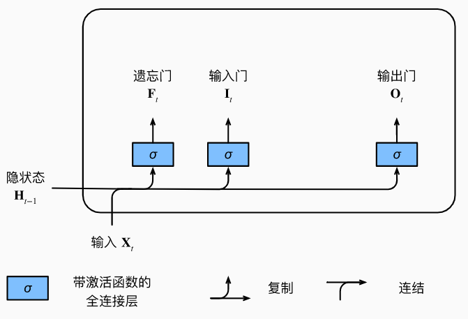
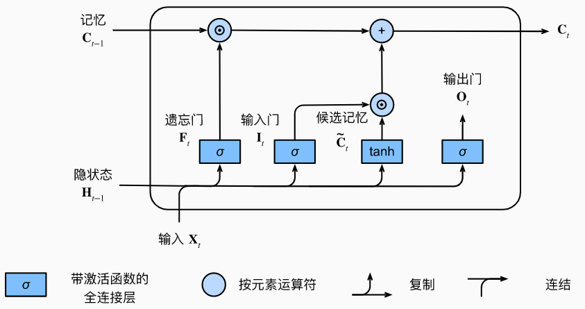
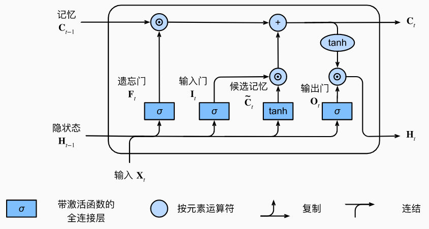

# 长短期记忆网络（LSTM）

- [长短期记忆网络（LSTM）](#长短期记忆网络lstm)
  - [门控记忆元](#门控记忆元)
    - [门](#门)
    - [候选记忆单元](#候选记忆单元)
    - [记忆元](#记忆元)
    - [隐状态](#隐状态)
  - [参考](#参考)

2022-01-10, 13:24
***

## 门控记忆元

长短期记忆网络（long short-term memoRY, LSTM）的设计灵感来自计算机的逻辑门。LSTM 引入记忆元（memory cell），或简称为单元（cell）。为了控制记忆元，需要许多门：

- 用来从单元中输出条目的门，称为输出门（output gate）；
- 用来决定何时将数据读入单元，称为输入门（input gate）；
- 用来重置单元的内容，称为遗忘门（forget gate）。

LSTM 记忆元结构如下：

$$I_t=\sigma(X_t W_{xi}+H_{t-1}W_{hi}+b_i)$$

$$F_t=\sigma(X_tW_{xf}+H_{t-1}W_{hf}+b_f)$$

$$O_t=\sigma(X_tW_{xo}+H_{t-1}W_{ho}+b_o)$$

$$\tilde{C}_t=tanh(X_tW_{xc}+H_{t-1}W_{hc}+b_c)$$

$$C_t=F_t\bigodot C_{t-1}+I_t\bigodot \tilde{C}_t$$

$$H_t=O_t\bigodot tanh(C_t)$$

说明：

- 批量大小为 $n$，输入数为 $d$，即输入 $X_t \isin \Reals^{n\times d}$
- 假设有 $h$ 个隐藏单元
- $W_{xi}, W_{xf}, W_{xo}\isin \Reals^{d\times h}$ 为权重参数
- 前一时间步的隐状态为 $H_{t-1}\isin \Reals^{n\times h}$
- $W_{hi}, W_{hf}, W_{ho} \isin \Reals^{h\times h}$ 是权重参数
- $b_i, b_f, b_o \isin \Reals^{1\times h}$ 是偏置参数
- 输入门 $I_t\isin \Reals^{n\times h}$
- 遗忘门 $F_t\isin \Reals^{n\times h}$
- 输出门 $O_t\isin \Reals^{n\times h}$

### 门

和 GRU 一样，当前时间步的输入和前一个时间步的*隐状态*作为数据送入 LSTM 的门中，如下图所示：

它们由三个具有 sigmoid 激活函数的全连接层处理，以计算输入门、遗忘门和输出门的值。因此，这三个门的值都在 (0,1) 之间。

假设有 $h$ 个隐藏单元，批量大小为 $n$，输入数为 $d$，输入为 $X_t \isin \Reals^{n\times d}$，前一时间步的隐状态为 $H_{t-1}\isin \Reals^{n\times h}$。相应的，时间步 $t$ 的门被定义为：输入门 $I_t\isin \Reals^{n\times h}$，遗忘门 $F_t\isin \Reals^{n\times h}$，输出门 $O_t\isin \Reals^{n\times h}$，计算方式如下：

$$I_t=\sigma(X_t W_{xi}+H_{t-1}W_{hi}+b_i)$$

$$F_t=\sigma(X_tW_{xf}+H_{t-1}W_{hf}+b_f)$$

$$O_t=\sigma(X_tW_{xo}+H_{t-1}W_{ho}+b_o)$$

其中 $W_{xi}, W_{xf}, W_{xo}\isin \Reals^{d\times h}$ 和 $W_{hi}, W_{hf}, W_{ho} \isin \Reals^{h\times h}$ 是权重参数，$b_i, b_f, b_o \isin \Reals^{1\times h}$ 是偏置参数。

### 候选记忆单元

候选记忆元（candidate memory cell）$\tilde{C}_t \isin \Reals^{n\times h}$ 的计算与上述的三个门的计算类似，但是使用 tanh 作为激活函数，函数的值范围为 (-1, 1)。下面是在时间步 $t$ 处的候选记忆单元：

$$\tilde{C}_t=tanh(X_tW_{xc}+H_{t-1}W_{hc}+b_c)$$

其中 $W_{xc} \isin \Reals^{d\times h}$ 和 $W_{hc}\isin \Reals^{h\times h}$ 是权重参数，$b_c\isin \Reals^{1\times h}$ 是偏置参数。

候选记忆元的计算图如下：

### 记忆元

在 GRU 中，有一种机制用来控制输入和遗忘，类似地，在 LSTM 中，也有两个门用于这样的目的：输入门 $I_t$ 控制采用多少来自 $\tilde{C}_t$ 的新数据，而遗忘门 $F_t$ 控制保留多少过去的记忆元 $C_{t-1}\isin \Reals^{n\times h}$ 的内容：

$$C_t=F_t\bigodot C_{t-1}+I_t\bigodot \tilde{C}_t$$

如果遗忘门始终为 1 且输入门始终为 0，则过去的记忆元 $C_{t-1}$ 将随时间被保存并传递到当前时间步。引入这种设计时为了缓解梯度消失问题，并更好地捕获序列中的长距离依赖关系。

这样就得到了计算记忆元的流程图：

### 隐状态

最后，我们需要定义如何计算隐状态 $H_t\isin \Reals^{n\times h}$，这就是输出门发挥作用的地方。在 LSTM 中，它仅仅是记忆元的 tanh 的门控版本，确保 $H_t$ 的值始终在区间 (-1,1) 内：

$$H_t=O_t\bigodot tanh(C_t)$$

只要输出门接近 1，我们就能够有效地将所有记忆信息传递给预测不份额，而对于输出门接近 0，只保留记忆元内的所有信息，而不需要更新隐状态。

下图是最终数据流的图形化演示：

## 参考

- 《动手学深度学习》
