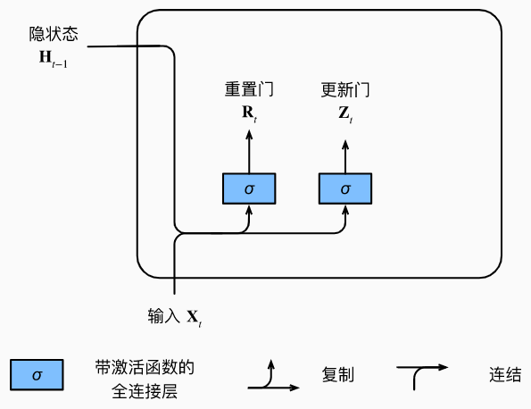
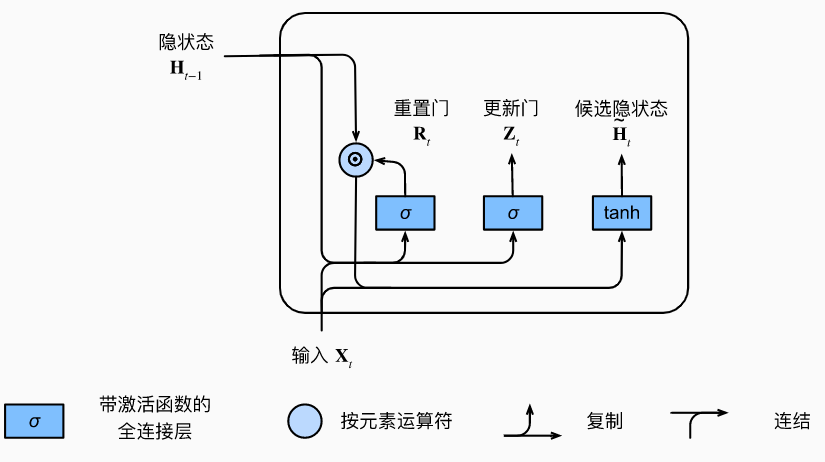
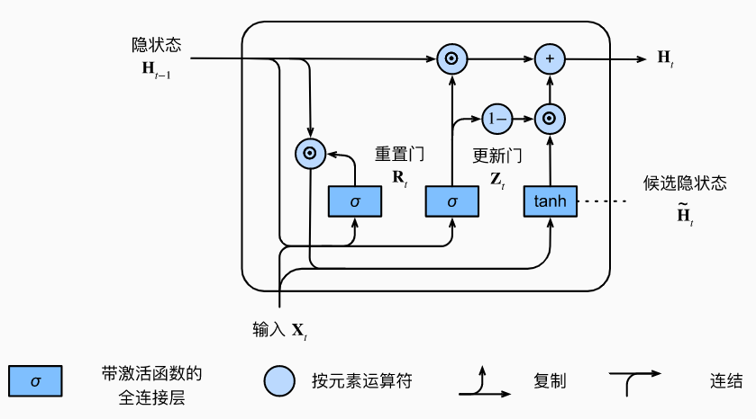

# GRU

- [GRU](#gru)
  - [简介](#简介)
  - [门控隐状态](#门控隐状态)
    - [门](#门)
    - [候选隐状态](#候选隐状态)
    - [隐状态](#隐状态)
  - [LSTM vs. GRU](#lstm-vs-gru)
  - [参考](#参考)

2022-01-10, 13:29
***

## 简介

在循环神经网络中计算梯度，矩阵连续乘积可能导致梯度消失或梯度爆炸的问题。这种梯度异常在实践中的意义，考虑如下几种情况：

- 早期观测值对预测所有未来观测值具有非常重要的意义。考虑一个极端情况，如果第一个观测值包含一个校验和，目标是在序列的末尾辨别校验和是否正确。在这种情况下，第一个词元的影响至关重要。我们希望有某些机制能够在一个记忆元里存储重要的早期信息。如果没有这样的机制，我们将不得不给这个观测值指定一个非常大的梯度，因为它会影响所有后续的观测值。
- 一些词元没有相关的观测值。例如，在对网页内容进行情感分析时，可能有一些辅助 HTML 代码与网页传达的情绪无关。我们希望有一些机制来*跳过*隐藏状态表示你中的此类词元。
- 序列的各个部分之间存在逻辑中断。例如，书的章节之间可能会有过渡存在你，或者证券的熊市和牛市之间可能会有过渡存在。在这种情况下，最好有一种方法来*重置*我们的内部状态表示。

在学术界已经提出了许多方法来解决这类问题。其中最早的方法是“长短期记忆”（long-short-term memory, [LSTM](rnn_LSTM.md)）[Hochreiter & Schmidhuber, 1997](https://dl.acm.org/doi/10.1162/neco.1997.9.8.1735)。门控循环单元（gated recurrent unit, GRU）是一个稍微简化的变体，通常能够提供同等的效果，并且计算速度明显更快。

GRU 和 LSTM 一样，都是为了解决长期记忆和反向传播中的梯度等问题而提出来的，GRU 和 LSTM 在很多情况下表现差不多，那么我们为什么要使用 GRU 呢？因为 GRU 的实验效果与 LSTM 相似，但是更易于计算。

实际情况下不要用 RNN，而用 GRU 或 LSTM。长度尽量不要超过 100，否则可以考虑用注意力机制。

## 门控隐状态

GRU 与普通的循环神经网络之间的关键区别在于：GRU 支持隐状态的门控。即 GRU 有专门的机制来确定应该何时*更新*隐状态，以及应该何时*重置*隐状态。这些机制是可学习的，并且能够解决上面列出的问题。例如，如果第一个词元非常重要，模型将学会在第一次观测后不更新隐状态。同样，模型也可以学会跳过不相关的临时观测。最后，模型还学会在需要时重置隐状态。

### 门

首先介绍重置门（reset gate）和更新门（update gate）。我们把它们设计成 (0,1) 区间中的向量，这样就可以进行凸组合。重置门允许我们控制想记住的过去状态的数目；更新门允许我们控制新状态中有多少个是旧状态的副本。

如下图所示：

输入由当前时间步的输入和前一时间步的隐状态给出。两个门的输出是由 sigmoid 激活函数的两个全连接层给出。

对于给定的时间步 $t$，假设输入是一个小批量 $X_t \isin \Reals^{n\times d}$（样本个数：n，输入个数：d），上一个时间步的隐状态是 $H_{t-1}\isin \Reals^{n\times h}$（隐藏单元个数：h）。那么，重置门 $R_t \isin \Reals^{n\times h}$和更新门 $Z_t \isin \Reals^{n\times h}$ 的计算如下所示：

$$R_t = \sigma (X_tW_{xr}+H_{t-1}W_{hr}+b_r)$$

$$Z_t = \sigma (X_tW_{xz}+H_{t-1}W_{hz}+b_z)$$

其中 $W_{xr}, W_{xz} \isin \Reals^{d\times h}$，$W_{hr}, W_{hz}\isin \Reals^{h\times h}$ 是权重参数，$b_r, b_z \isin \Reals^{1 \times h}$ 是偏置参数。用 sigmoid 函数将输入值转换到区间 (0,1)。

### 候选隐状态

下面将重置门 $R_t$ 与常规隐状态更新机制集成，得到在时间步 $t$ 的候选隐状态（candidate hidden state） $\tilde{H}_t \isin \Reals^{n\times h}$：

$$\tilde{H}_t=tanh(X_tW_{xh}+(R_t\bigodot H_{t-1})W_{hh}+b_h)$$

其中 $W_{xh}\isin \Reals^{d\times h}$ 和 $W_{hh}\isin \Reals^{h\times h}$是权重参数，$b_h\isin \Reals^{1\times h}$ 是偏置项，符号 $\bigodot$ 是 Hadamard 积（按元素乘积）运算符。在这里，我们使用 tanh 非线性激活函数来确定候选隐状态中的值保持在区间 (-1,1)。

与 RNN 的隐状态相比，额外的$R_t$ 和 $H_{t-1}$ 的元素相乘可以减少以往状态的影响。每当重置门 $R_t$ 的值接近 1 时，就是一个普通的循环神经网络。如果重置门 $R_t$ 的值接近 0，候选隐状态是以 $X_t$ 作为输入的多层感知机的结果，此时，任何预先存在的隐状态都被重置为默认值。

下图说明了应用重置门之后的计算流程：

### 隐状态

下面结合候选隐状态和更新门 $Z_t$ 确定隐状态。这一步确定隐状态 $H_t \isin \Reals^{n\times h}$ 在多大程度上来自旧的状态 $H_{t-1}$ 和新的候选状态 $\tilde{H}_t$。更新门 $Z_t$ 仅需要在 $H_{t-1}$ 和 $\tilde{H}_t$ 之间按元素的凸组合就可以实现这个目标，得到门控循环单元的最终更新公式：

$$H_t = Z_t \bigodot H_{t-1}+(1-Z_t)\bigodot \tilde{H}_t$$

每当更新门 $Z_t$ 接近 1，模型就倾向只保留旧状态。此时，来自 $X_t$ 的信息基本被忽略，从而有效跳过依赖链条中的时间步 $t$。相反，当 $Z_t$ 接近 0 时，新的隐状态 $H_t$ 就会接近候选隐状态 $\tilde{H}_t$。这些设计可以帮助我们处理循环神经网络中的踢梯度消失问题，并更好地捕获时间步距离很长的序列的依赖关系。例如，如果整个子序列的所有时间步的更新门都接近 1，则无论序列的长度如何额，在序列起始时间步的旧隐状态都将很容易保留并传递到序列结束。

下图是更新门其作用后的计算流：

总之，门控循环单元具有以下两个显著特征：

- 重置门有助于捕获序列中的短期依赖关系；
- 更新门有助于捕获序列中的长期依赖关系。

## LSTM vs. GRU

https://ieeexplore.ieee.org/document/9221727

在模型训练速度方面，在相同数据集上 GRU 比 LSTM 快 30% 左右；而性能方面，二者的性能差距往往不大，远没有调参所带来的效果明显。如将 tanh 改为 tanh 变体，权重初始化等。

由于 RNN 是序列模型，无法并行，因此一般训练起来相当耗时，如果效果不好，可以试试 Transformer，可并行，效果一般会比 RNN 要好一些。

## 参考

- https://zh-v2.d2l.ai/chapter_recurrent-modern/gru.html
