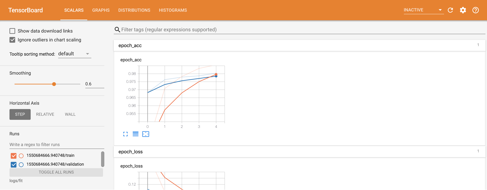

# TensorBoard 入门

- [TensorBoard 入门](#tensorboard-入门)
  - [简介](#简介)
  - [在 Keras Model.fit 中使用 TensorBoard](#在-keras-modelfit-中使用-tensorboard)
  - [在其它方法中使用 TensorBoard](#在其它方法中使用-tensorboard)
  - [参考](#参考)

@author Jiawei Mao
***

## 简介

在机器学习中，要改善某个指标，首先需要对其进行计算。TensorBoard 提供了机器学习中指标值的计算和可视化功能。它可以追踪实验指标（如损失值、准确性）、可视化模型图、将嵌入映射到较低维度等。

下面演示如何使用 TensorBoard。

- 加载 TensorBoard notebook 扩展

```python
%load_ext tensorboard
```

```python
import tensorflow as tf
import datetime
```

清除以前运行留下的日志：

```powershell
rm -rf ./logs/
```

- 以 MNIST 数据集为例，归一化数据，并创建一个 Keras 模型将图片分为 10 类：

```python
mnist = tf.keras.datasets.mnist

(x_train, y_train), (x_test, y_test) = mnist.load_data()
x_train, x_test = x_train / 255.0, x_test / 255.0

def create_model():
    return tf.keras.models.Sequential([
        tf.keras.layers.Flatten(input_shape=(28, 28)),
        tf.keras.layers.Dense(512, activation='relu'),
        tf.keras.layers.Dropout(0.2),
        tf.keras.layers.Dense(10, activation='softmax')
    ])
```

```txt
Downloading data from https://storage.googleapis.com/tensorflow/tf-keras-datasets/mnist.npz
11490434/11490434 [==============================] - 1s 0us/step
```

## 在 Keras Model.fit 中使用 TensorBoard

使用 Keras 的 `Model.fit()` 训练模型时，添加 `tf.keras.callbacks.TensorBoard` callback 以确保创建和存储日志。另外，设置 `histogram_freq=1` 在每个 epoch 计算直方图（默认关闭）。

将日志放在带时间戳的子目录，便于选择不同的训练日志：

```python
model = create_model()
model.compile(optimizer='adam',
              loss='sparse_categorical_crossentropy',
              metrics=['accuracy'])

log_dir = "logs/fit/" + datetime.datetime.now().strftime("%Y%m%d-%H%M%S")
tensorboard_callback = tf.keras.callbacks.TensorBoard(log_dir=log_dir, histogram_freq=1)

model.fit(x=x_train,
          y=y_train,
          epochs=5,
          validation_data=(x_test, y_test),
          callbacks=[tensorboard_callback])
```

通过命令行或 notebook 启动 TensorBoard。这两个接口通常一样。在 notebook 中，使用 `%tensorboard` magic，在命令行，运行不带 "%" 的命令。

```python
%tensorboard --logdir logs/fit
```



TensorBoard 主要包括：

- **Scalars** 面板展示损失值等指标随 epoch 的变化。使用该面板还可以跟踪训练速度、学习速率以及其它标量值。
- **Graphs** 面板用于可视化模型。对该示例，显示 Keras 模型图，有助于确保模型的正确。
- **Distributions** 和 **Histograms** 面板显示张量随时间的分布。这有助于可视化权重和偏差，查看它们是否按照预期的方式在变化。

当记录其它类型的数据时，会自动启用与其对应的 TensorBoard 插件。例如，Keras TensorBoard callback 可以记录图像和嵌入。点击右下角的 "inactive" 下拉框可以看到其它插件。

## 在其它方法中使用 TensorBoard

当使用 `tf.GradientTape()` 等方法训练时，使用 `tf.summary` 记录所需信息。

还是使用 MNIST 数据集，但将其转换为 `tf.data.Dataset` 以利用批处理功能：

```python
train_dataset = tf.data.Dataset.from_tensor_slices((x_train, y_train))
test_dataset = tf.data.Dataset.from_tensor_slices((x_test, y_test))

train_dataset = train_dataset.shuffle(60000).batch(64)
test_dataset = test_dataset.batch(64)
```

训练代码同[快速入门教程](https://www.tensorflow.org/tutorials/quickstart/advanced)，展示如何将指标记录到 TensorBoard。选择 loss 和 optimizer：

```python
loss_object = tf.keras.losses.SparseCategoricalCrossentropy()
optimizer = tf.keras.optimizers.Adam()
```

创建指标：

```python
# Define our metrics
train_loss = tf.keras.metrics.Mean('train_loss', dtype=tf.float32)
train_accuracy = tf.keras.metrics.SparseCategoricalAccuracy('train_accuracy')
test_loss = tf.keras.metrics.Mean('test_loss', dtype=tf.float32)
test_accuracy = tf.keras.metrics.SparseCategoricalAccuracy('test_accuracy')
```

定义训练和测试函数：

```python
def train_step(model, optimizer, x_train, y_train):
  with tf.GradientTape() as tape:
    predictions = model(x_train, training=True)
    loss = loss_object(y_train, predictions)
  grads = tape.gradient(loss, model.trainable_variables)
  optimizer.apply_gradients(zip(grads, model.trainable_variables))

  train_loss(loss)
  train_accuracy(y_train, predictions)

def test_step(model, x_test, y_test):
  predictions = model(x_test)
  loss = loss_object(y_test, predictions)

  test_loss(loss)
  test_accuracy(y_test, predictions)
```

设置 summary writer，将摘要写入 disk 不同的日志目录：

```python
current_time = datetime.datetime.now().strftime("%Y%m%d-%H%M%S")
train_log_dir = 'logs/gradient_tape/' + current_time + '/train'
test_log_dir = 'logs/gradient_tape/' + current_time + '/test'
train_summary_writer = tf.summary.create_file_writer(train_log_dir)
test_summary_writer = tf.summary.create_file_writer(test_log_dir)
```

开始训练，使用 `tf.summary.scalar()` 在训练、测试期间记录指标。可以设置记录哪些指标，以及记录的频率。其它 `tf.summary` 函数支持记录其它类型数据。

```python
model = create_model() # reset our model

EPOCHS = 5

for epoch in range(EPOCHS):
  for (x_train, y_train) in train_dataset:
    train_step(model, optimizer, x_train, y_train)
  with train_summary_writer.as_default():
    tf.summary.scalar('loss', train_loss.result(), step=epoch)
    tf.summary.scalar('accuracy', train_accuracy.result(), step=epoch)

  for (x_test, y_test) in test_dataset:
    test_step(model, x_test, y_test)
  with test_summary_writer.as_default():
    tf.summary.scalar('loss', test_loss.result(), step=epoch)
    tf.summary.scalar('accuracy', test_accuracy.result(), step=epoch)

  template = 'Epoch {}, Loss: {}, Accuracy: {}, Test Loss: {}, Test Accuracy: {}'
  print (template.format(epoch+1,
                         train_loss.result(), 
                         train_accuracy.result()*100,
                         test_loss.result(), 
                         test_accuracy.result()*100))

  # Reset metrics every epoch
  train_loss.reset_states()
  test_loss.reset_states()
  train_accuracy.reset_states()
  test_accuracy.reset_states()
```

## 参考

- https://www.tensorflow.org/tensorboard/get_started
