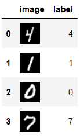

# 入门

- [入门](#入门)
  - [简介](#简介)
  - [安装](#安装)
  - [查找数据集](#查找数据集)
  - [加载数据集](#加载数据集)
    - [tfds.load](#tfdsload)
    - [tfds.builder](#tfdsbuilder)
    - [tfds build CLI](#tfds-build-cli)
  - [迭代数据集](#迭代数据集)
    - [as dict](#as-dict)
    - [as tuple(as\_supervised=True)](#as-tupleas_supervisedtrue)
    - [as numpy](#as-numpy)
    - [as batch tf.Tensor(batch\_size=-1)](#as-batch-tftensorbatch_size-1)
  - [数据集 benchmark](#数据集-benchmark)
  - [可视化](#可视化)
    - [tfds.as\_dataframe](#tfdsas_dataframe)
    - [tfds.show\_examples](#tfdsshow_examples)
  - [访问数据集元数据](#访问数据集元数据)
    - [Feature metadata](#feature-metadata)
    - [split 元数据](#split-元数据)
  - [排错](#排错)
    - [手动下载（下载失败）](#手动下载下载失败)
    - [NonMatchingChecksumError](#nonmatchingchecksumerror)
  - [引用](#引用)
  - [参考](#参考)

2022-01-18, 14:40
@author Jiawei Mao
****

## 简介

TFDS 提供了一组现成的数据集，可以在 TensorFlow、Jax 和其它机器学习框架中使用过。

还可以用来下载和构建 `tf.data.Dataset`（或 `np.array`）。

> ⭐ 不要 TFDS（本库）和 `tf.data`（TensorFlow 用来构建数据管道的 API）。TFDS 对 `tf.data` 进行了包装。

## 安装

TFDS 有两个包：

- `pip install tensorflow-datasets`，安装稳定版本，每隔几个月发布一次；
- `pip install tfds-nightly`，每天发布，包含数据集的最新版本。

```python
import matplotlib.pyplot as plt
import numpy as np
import tensorflow as tf

import tensorflow_datasets as tfds
```

## 查找数据集

所有数据集构建器都是 `tfds.core.DatasetBuilder` 的子类。可以使用 `tfds.list_builders()` 查看可用构建器，或者查看 TensorFlow 提供的[数据集目录](https://www.tensorflow.org/datasets/catalog/overview)。

```python
tfds.list_builders()
```

```sh
['abstract_reasoning',
 'accentdb',
 'aeslc',
 ...
 'yelp_polarity_reviews',
 'yes_no',
 'youtube_vis']
```

里面有 278 个数据集（tensorflow-datasets 4.4.0）。

## 加载数据集

### tfds.load

使用 `tfds.load` 加载数据集最简单。它会执行如下操作：

1. 下载数据，并保存为 [tfrecord](https://www.tensorflow.org/tutorials/load_data/tfrecord) 文件；
2. 加载 `tfrecord`并创建 `tf.data.Dataset`。

```python
ds = tfds.load('mnist', split='train', shuffle_files=True)
assert isinstance(ds, tf.data.Dataset)
print(ds)
```

```sh
<_OptionsDataset shapes: {image: (28, 28, 1), label: ()}, types: {image: tf.uint8, label: tf.int64}>
```

参数说明：

- `split=`，读取哪个 slit，参考 [split guide](4_split_slice.md)；
- `shuffle_files=`，在每个 epoch 之前是否打乱文件（TFDS 将大数据集保存为多个文件）；
- `data_dir=`，保存数据集的位置，默认为 `~/tensorflow_datasets/`；
- `with_info=True`，返回包含数据集元数据的 `tfds.core.DatasetInfo`；
- `download=False`，禁用下载。

### tfds.builder

`tfds.load` 只是对 `tfds.core.DatasetBuilder` 进行简单包装，也可以直接使用 `tfds.core.DatasetBuilder` 获得相同输出：

```python
builder = tfds.builder('mnist')
# 1. Create the tfrecord files (no-op if already exists)
builder.download_and_prepare()
# 2. Load the `tf.data.Dataset`
ds = builder.as_dataset(split='train', shuffle_files=True)
print(ds)
```

```sh
<_OptionsDataset shapes: {image: (28, 28, 1), label: ()}, types: {image: tf.uint8, label: tf.int64}>
```

### tfds build CLI

如果要生成特定数据集，可以使用 [tfds 命令行](3_tfds_cli.md)。例如：

```sh
tfds build mnist
```

## 迭代数据集

### as dict

`tf.data.Dataset` 默认包含 `tf.Tensor` 的 dict：

```python
ds = tfds.load('mnist', split='train')
ds = ds.take(1)  # Only take a single example

for example in ds:  # example is `{'image': tf.Tensor, 'label': tf.Tensor}`
  print(list(example.keys()))
  image = example["image"]
  label = example["label"]
  print(image.shape, label)
```

```sh
['image', 'label']
(28, 28, 1) tf.Tensor(4, shape=(), dtype=int64)
```

对 `dict` 的键名称和结构，可以查看 TensorFlow 提供的[数据集页面](https://www.tensorflow.org/datasets/catalog/overview)，如 [mnist 数据集](https://www.tensorflow.org/datasets/catalog/mnist)。

### as tuple(as_supervised=True)

添加 `as_supervised=True` 参数返回监督数据集的 `(features, label)` tuple：

```python
ds = tfds.load('mnist', split='train', as_supervised=True)
ds = ds.take(1)

for image, label in ds:  # example is (image, label)
  print(image.shape, label)
```

```sh
(28, 28, 1) tf.Tensor(4, shape=(), dtype=int64)
```

### as numpy

`tfds.as_numpy` 执行如下转换：

- [tf.Tensor](../../api/tf/Tensor.md) -> `np.array`
- [tf.data.Dataset](../../api/tf/data/Dataset.md) -> `Iterator[Tree[np.array]]`，`Tree` 可以是任意嵌套的 `dict`, `tuple`

```python
ds = tfds.load('mnist', split='train', as_supervised=True)
ds = ds.take(1)

for image, label in tfds.as_numpy(ds):
  print(type(image), type(label), label)
```

```sh
<class 'numpy.ndarray'> <class 'numpy.int64'> 4
```

### as batch tf.Tensor(batch_size=-1)

使用 `batch_size=-1`，可以将整个数据集以单个批处理加载完。将其与 `as_supervised=True` 和 [tfds.as_numpy](as_numpy.md) 结合使用，可以获得 `(np.array, np.array)` 形式的数据：

```python
image, label = tfds.as_numpy(tfds.load(
    'mnist',
    split='test',
    batch_size=-1,
    as_supervised=True,
))

print(type(image), image.shape)
```

```sh
<class 'numpy.ndarray'> (10000, 28, 28, 1)
```

## 数据集 benchmark

使用 `tfds.benchmark` 对数据集进行基准测试，该函数可用于任何可迭代对象，包括 `tf.data.Dataset`, `tfds.as_numpy` 等。

```python
ds = tfds.load('mnist', split='train')
ds = ds.batch(32).prefetch(1)

tfds.benchmark(ds, batch_size=32)
tfds.benchmark(ds, batch_size=32)  # Second epoch much faster due to auto-caching
```

> ⭐ 运行该示例需要安装 pandas

```sh
 0%|          | 1/1875 [00:00<?, ?it/s]
************ Summary ************

Examples/sec (First included) 69737.87 ex/sec (total: 60000 ex, 0.86 sec)
Examples/sec (First only) 1306.53 ex/sec (total: 32 ex, 0.02 sec)
Examples/sec (First excluded) 71743.02 ex/sec (total: 59968 ex, 0.84 sec)
  0%|          | 1/1875 [00:00<?, ?it/s]
************ Summary ************

Examples/sec (First included) 303431.66 ex/sec (total: 60000 ex, 0.20 sec)
Examples/sec (First only) 2565.71 ex/sec (total: 32 ex, 0.01 sec)
Examples/sec (First excluded) 323686.12 ex/sec (total: 59968 ex, 0.19 sec)
```


要点：

- 使用 `batch_size=` 参数规范每个批量的大小；
- 在 summary 中，第一个 batch 和其它分离，从而捕获 `tf.data.Dataset` 额外初始化所需时间；
- 可以看到，由于[自动缓存](5_performance.md)，第二次迭代的速度要快许多；
- `tfds.benchmark` 返回 `tfds.core.BenchmarkResult`，可用于进一步分析。

## 可视化

### tfds.as_dataframe

可以使用 `tfds.as_dataframe` 将 `tf.data.Dataset` 转换为 `pandas.DataFrame`，然后进行可视化：

- 将 `tfds.core.DatasetInfo` 作为 `tfds.as_dataframe` 的第二个参数，用于可视化图像、音频、文本以及视频等；
- 使用 `ds.take(x)` 只显示前面 `x` 个样本。`pandas.DataFrame` 在内存中加载完整的数据集，因此耗内存，因此采用这种方式比较合适。

```python
ds, info = tfds.load('mnist', split='train', with_info=True)
tfds.as_dataframe(ds.take(4), info)
```



### tfds.show_examples

[tfds.show_examples](show_examples.md) 返回 `matplotlib.figure.Figure`（目前只支持图像数据集）：

```python
ds, info = tfds.load('mnist', split='train', with_info=True)

fig = tfds.show_examples(ds, info)
```


## 访问数据集元数据

所有 builder 都包含 `tfds.core.DatasetInfo` 对象，该对象包含数据集元数据。

可以通过如下方式获得：

- `tfds.load` API

```python
ds, info = tfds.load('mnist', with_info=True)
```

- 使用 `tfds.core.DatasetBuilder` API

```python
builder = tfds.builder('mnist')
info = builder.info
```

数据集元数据包含数据集的版本、引用、主页、描述信息等等：

```python
print(info)
```

```sh
tfds.core.DatasetInfo(
    name='mnist',
    full_name='mnist/3.0.1',
    description="""
    The MNIST database of handwritten digits.
    """,
    homepage='http://yann.lecun.com/exdb/mnist/',
    data_path='C:\\Users\\happy\\tensorflow_datasets\\mnist\\3.0.1',
    download_size=11.06 MiB,
    dataset_size=21.00 MiB,
    features=FeaturesDict({
        'image': Image(shape=(28, 28, 1), dtype=tf.uint8),
        'label': ClassLabel(shape=(), dtype=tf.int64, num_classes=10),
    }),
    supervised_keys=('image', 'label'),
    disable_shuffling=False,
    splits={
        'test': <SplitInfo num_examples=10000, num_shards=1>,
        'train': <SplitInfo num_examples=60000, num_shards=1>,
    },
    citation="""@article{lecun2010mnist,
      title={MNIST handwritten digit database},
      author={LeCun, Yann and Cortes, Corinna and Burges, CJ},
      journal={ATT Labs [Online]. Available: http://yann.lecun.com/exdb/mnist},
      volume={2},
      year={2010}
    }""",
)
```

### Feature metadata

特征的元数据，如 label names, image shape 等，访问 `tfds.features.FeatureDict`：

```python
info.features
```

```sh
FeaturesDict({
    'image': Image(shape=(28, 28, 1), dtype=tf.uint8),
    'label': ClassLabel(shape=(), dtype=tf.int64, num_classes=10),
})
```

类别数，标签名称：

```python
print(info.features["label"].num_classes)
print(info.features["label"].names)
print(info.features["label"].int2str(7))  # Human readable version (8 -> 'cat')
print(info.features["label"].str2int('7'))
```

```sh
10
['0', '1', '2', '3', '4', '5', '6', '7', '8', '9']
7
7
```

shapes, dtypes：

```python
print(info.features.shape)
print(info.features.dtype)
print(info.features['image'].shape)
print(info.features['image'].dtype)
```

```sh
{'image': (28, 28, 1), 'label': ()}
{'image': tf.uint8, 'label': tf.int64}
(28, 28, 1)
<dtype: 'uint8'>
```

### split 元数据

访问 `tfds.core.SplitDict`：

```python
print(info.splits)
```

```sh
{'test': <SplitInfo num_examples=10000, num_shards=1>, 'train': <SplitInfo num_examples=60000, num_shards=1>}
```

可用的 splits：

```python
print(list(info.splits.keys()))
```

```sh
['test', 'train']
```

获得单个 split 的信息：

```python
print(info.splits['train'].num_examples)
print(info.splits['train'].filenames)
print(info.splits['train'].num_shards)
```

```sh
60000
['mnist-train.tfrecord-00000-of-00001']
1
```

对 subsplit 一样：

```python
print(info.splits['train[15%:75%]'].num_examples)
print(info.splits['train[15%:75%]'].file_instructions)
```

```sh
36000
[FileInstruction(filename='mnist-train.tfrecord-00000-of-00001', skip=9000, take=36000, num_examples=36000)]
```

## 排错

### 手动下载（下载失败）

如果由于某种原因下载失败（如脱机），可以手动下载数据集，并将其放在 `manual_dir` 目录（默认为 `~/tensorflow_datasets/download/manual/`）。

查找下载链接：

- 新数据集放在特定文件夹：[tensorflow_datasets](https://github.com/tensorflow/datasets/tree/master/tensorflow_datasets/)`/<type>/<dataset_name>/checksums.tsv`

例如 [tensorflow_datasets/text/bool_q/checksums.tsv](https://github.com/tensorflow/datasets/blob/master/tensorflow_datasets/text/bool_q/checksums.tsv)。

在 TensorFlow 的[数据集页面](https://www.tensorflow.org/datasets/catalog/overview)可以找到数据集的下载位置。

- 老数据集放在 [tensorflow_datasets/url_checksums/<dataset_name>.txt](https://github.com/tensorflow/datasets/tree/master/tensorflow_datasets/url_checksums)

### NonMatchingChecksumError

TFDS 通过验证下载挖网址的校验和来确定可信性。如果抛出 `NonMatchingChecksumError`，可能原因：

- 网站可能已关闭（503 status code），请检查网址；
- 对 Google Drive URL，可以稍后再试，因为 Drive 有时会因为访问人太多而拒绝下载；
- 原数据集文件可能已更新。对该情况，应该更新 TFDS 数据集 builder。

## 引用

如果在论文中使用了 tensorflow-datasets，除了使用过的数据集的引用之外，请包括一下引用：

```python
@misc{TFDS,
  title = { {TensorFlow Datasets}, A collection of ready-to-use datasets},
  howpublished = {\url{https://www.tensorflow.org/datasets} },
}
```

## 参考

- https://www.tensorflow.org/datasets/overview
