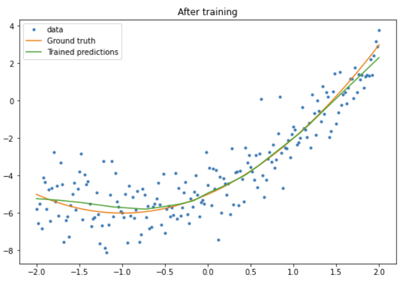
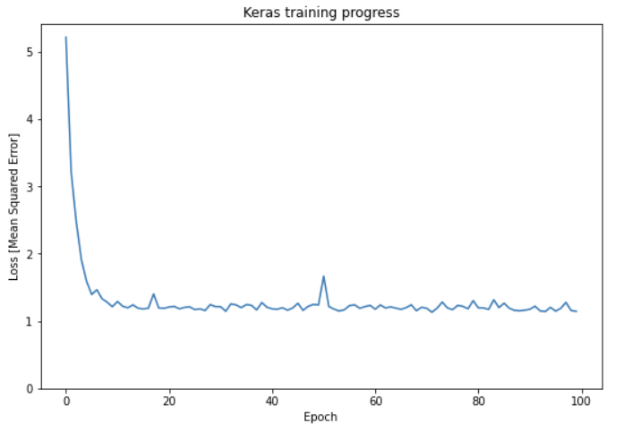

# TensorFlow 基础

- [TensorFlow 基础](#tensorflow-基础)
  - [简介](#简介)
  - [张量](#张量)
  - [变量](#变量)
  - [自动微分](#自动微分)
  - [Graph 和 tf.function](#graph-和-tffunction)
  - [Module, layer, model](#module-layer-model)
  - [Training loop](#training-loop)
  - [参考](#参考)

2021-12-20, 17:01
***

## 简介

这部分对 TensorFlow 的基础知识进行一个简单概述。

TensorFlow 是一个端到端的机器学习平台，支持：

- 基于多维数组的数值计算（类似 NumPy）；
- GPU 和分布式处理；
- 自动微分；
- 模型的构建、训练和导出；
- ...

## 张量

TensorFlow 将高维数组称为张量（tensor），以 `tf.Tensor` 对象表示。下面是一个二维张量：

```python
>>> import tensorflow as tf
>>> x = tf.constant([[1., 2., 3.],
                     [4., 5., 6.]])
>>> x
<tf.Tensor: shape=(2, 3), dtype=float32, numpy=
array([[1., 2., 3.],
       [4., 5., 6.]], dtype=float32)>
>>> x.shape
TensorShape([2, 3])
>>> x.dtype
tf.float32
```

`shape` 和 `dtype` 是 `tf.Tensor` 两个最重要的属性：

- `Tensor.shape`，张量在各个轴上的大小；
- `Tensor.dtype`，张量包含的元素的类型。

TensorFlow 实现了张量的标准数学运算，以及许多用于机器学习的运算。例如：

```python
>>> x = tf.constant([[1., 2., 3.],
                     [4., 5., 6.]])
>>> x + x
<tf.Tensor: shape=(2, 3), dtype=float32, numpy=
array([[ 2.,  4.,  6.],
       [ 8., 10., 12.]], dtype=float32)>
>>> 5 * x
<tf.Tensor: shape=(2, 3), dtype=float32, numpy=
array([[ 5., 10., 15.],
       [20., 25., 30.]], dtype=float32)>
>>> x @ tf.transpose(x)
<tf.Tensor: shape=(2, 2), dtype=float32, numpy=
array([[14., 32.],
       [32., 77.]], dtype=float32)>
>>> tf.concat([x, x, x], axis=0)
<tf.Tensor: shape=(6, 3), dtype=float32, numpy=
array([[1., 2., 3.],
       [4., 5., 6.],
       [1., 2., 3.],
       [4., 5., 6.],
       [1., 2., 3.],
       [4., 5., 6.]], dtype=float32)>
>>> tf.nn.softmax(x, axis=-1)
<tf.Tensor: shape=(2, 3), dtype=float32, numpy=
array([[0.09003057, 0.24472848, 0.6652409 ],
       [0.09003057, 0.24472848, 0.6652409 ]], dtype=float32)>
>>> tf.reduce_sum(x)
<tf.Tensor: shape=(), dtype=float32, numpy=21.0>
```

在 CPU 上运行大型运算可能会很慢。通过配置，TensorFlow 可以使用加速硬件（如 GPU）快速执行操作。

```python
if tf.config.list_physical_devices('GPU'):
  print("TensorFlow **IS** using the GPU")
else:
  print("TensorFlow **IS NOT** using the GPU")
```

详情可以参考 [Tensor 指南](basic_tensor.md)

## 变量

常规 `tf.Tensor` 对象不可变（immutable）。要在 TensorFlow 中存储类似模型权重状态可变的值，使用 `tf.Variable`。

```python
>>> var = tf.Variable([0.0, 0.0, 0.0])
>>> var
<tf.Variable 'Variable:0' shape=(3,) dtype=float32, numpy=array([0., 0., 0.], dtype=float32)>
>>> var.assign([1, 2, 3])
<tf.Variable 'UnreadVariable' shape=(3,) dtype=float32, numpy=array([1., 2., 3.], dtype=float32)>
>>> var.assign_add([1, 1, 1])
<tf.Variable 'UnreadVariable' shape=(3,) dtype=float32, numpy=array([2., 3., 4.], dtype=float32)>
```

详情可参考 [Variable 指南](basic_variable.md)。

## 自动微分

梯度下降及其相关算法是现代机器学习的基石。为了实现梯度下降，TensorFlow 实现了自动微分（autodiff），即使用微积分计算梯度。我们通常会使用自动微分计算模型的误差（error）或损失（loss）相对权重（weight）的梯度。例如：

```python
>>> x = tf.Variable(1.0)
>>> def f(x):
      y = x**2 + 2*x - 5
      return y
>>> f(x)
<tf.Tensor: shape=(), dtype=float32, numpy=-2.0>
```

上面的计算，表示在 $x=1.0$ 时，计算 $y=f(x)=(1^2+2\times 1-5)=-2$。

$y$ 的导数为 $y'=f'(x)=(2\times x+2)=4$。TensorFlow 可以自动计算：

```python
>>> with tf.GradientTape() as tape:
      y = f(x)
>>> g_x = tape.gradient(y, x)  # g(x) = dy/dx
>>> g_x
<tf.Tensor: shape=(), dtype=float32, numpy=4.0>
```

这个简单的例子只是对单个标量 `x` 求导，TensorFlow 还可以同时对任意数量的张量计算梯度。

详细可以参考 [梯度和自动微分指南](basic_autodiff.md)。

## Graph 和 tf.function

虽然可以像使用 Python 库一样交互式地使用 TensorFlow，TensorFlow 还提供了如下工具：

- **性能优化**，加快训练和推断；
- **导出模型**，这样在训练完后可以保存模型。

要利用这些工具，需要使用 `tf.function` 将纯 TensorFlow 代码和常规 Python 代码区分开：

```python
@tf.function
def my_func(x):
  print('Tracing.\n')
  return tf.reduce_sum(x)
```

在**第一次**运行 `tf.function` 时，虽然是在 Python 中执行，但 TensorFlow 会捕获一个完整的、优化过的计算图（graph），表示函数中 TensorFlow 执行的计算。

```python
>>> x = tf.constant([1, 2, 3])
>>> my_func(x)
Tracing.
<tf.Tensor: shape=(), dtype=int32, numpy=6>
```

在**下次**继续调用 `my_func`，TensorFlow 只执行优化后的 graph，跳过任何非 TensorFlow 的步骤。如下，调用`my_func` 不再打印 "Tracing"，因为 `print` 是 Python 函数，不是 TensorFlow 函数。

```python
>>> x = tf.constant([10, 9, 8])
>>> my_func(x)
<tf.Tensor: shape=(), dtype=int32, numpy=27>
```

这些捕获的计算图提供两个好处：

- 在大多情况下，执行速度显著提高；
- 可以使用 `tf.saved_model` 保存计算图。

详情参考 [Graph 指南](basic_graph.md)。

## Module, layer, model

`tf.Module` 是用于管理 `tf.Variable` 对象以及对齐进行操作的 `tf.function` 对象的类。

`tf.Module` 类对于支持两个重要特性是必须的：

1. 可以使用 `tf.train.Checkpoint` 保存和恢复变量值。这在训练模型期间内十分有用，因为它可以快速保存和恢复模型状态；
2. 可以使用 `tf.saved_model` 导入和导出 `tf.Variable` 值和 `tf.function` 计算图。

下面是一个导出 `tf.Module` 对象的完整示例：

```python
class MyModule(tf.Module):
  def __init__(self, value):
    self.weight = tf.Variable(value)

  @tf.function
  def multiply(self, x):
    return x * self.weight
```

```python
>>> mod = MyModule(3)
>>> mod.multiply(tf.constant([1, 2, 3]))
<tf.Tensor: shape=(3,), dtype=int32, numpy=array([3, 6, 9])>
```

保存 `Module`：

```python
>>> save_path = './saved'
>>> tf.saved_model.save(mod, save_path)
INFO:tensorflow:Assets written to: .saved\assets
```

保存的模型独立于创建它的代码。保存后可以从 Python，其它语言绑定或 TensorFlow Serving 中重新加载该模型。也可以转到 TensorFlow Lite 或 TensorFlow JS 中运行。

```python
>>> reloaded = tf.saved_model.load(save_path)
>>> reloaded.multiply(tf.constant([1, 2, 3]))
<tf.Tensor: shape=(3,), dtype=int32, numpy=array([3, 6, 9])>
```

`tf.keras.layers.Layer` 和 `tf.keras.Model` 类都是在 `tf.Module` 的基础上构建，并提供了便于构建、训练和保存模型的额外方法。

详细参考 [模块、层和模型指南](basic_module.md)。

## Training loop

现在把上面的功能组合在一起，建立一个基本的模型。

首先，创建一些样本数据。生成一组数据点，大致遵循一条二次曲线：

```python
import matplotlib
from matplotlib import pyplot as plt

matplotlib.rcParams['figure.figsize'] = [9, 6]
```

```python
x = tf.linspace(-2, 2, 201)
x = tf.cast(x, tf.float32)

def f(x):
    y = x ** 2 + 2 * x - 5
    return y

y = f(x) + tf.random.normal(shape=[201])

plt.plot(x.numpy(), y.numpy(), '.', label='Data')
plt.plot(x, f(x), label='Ground truth')
plt.legend()
```


创建模型：

```python
class Model(tf.keras.Model):
  def __init__(self, units):
    super().__init__()
    self.dense1 = tf.keras.layers.Dense(units=units,
                                        activation=tf.nn.relu,
                                        kernel_initializer=tf.random.normal,
                                        bias_initializer=tf.random.normal)
    self.dense2 = tf.keras.layers.Dense(1)

  def call(self, x, training=True):
    # For Keras layers/models, implement `call` instead of `__call__`.
    x = x[:, tf.newaxis]
    x = self.dense1(x)
    x = self.dense2(x)
    return tf.squeeze(x, axis=1)
```

```python
model = Model(64)
```

下面绘制初始状态，即未训练时的效果：

```python
plt.plot(x.numpy(), y.numpy(), '.', label='data')
plt.plot(x, f(x),  label='Ground truth')
plt.plot(x, model(x), label='Untrained predictions')
plt.title('Before training')
plt.legend();
```


添加一个简单的训练循环：

```python
variables = model.variables

optimizer = tf.optimizers.SGD(learning_rate=0.01)

for step in range(1000):
    with tf.GradientTape() as tape:
        prediction = model(x)
        error = (y - prediction) ** 2
        mean_error = tf.reduce_mean(error)
    gradient = tape.gradient(mean_error, variables)
    optimizer.apply_gradients(zip(gradient, variables))

    if step % 100 == 0:
        print(f'Mean squared error: {mean_error.numpy():0.3f}')
```

输出如下：

```sh
Mean squared error: 21.861
Mean squared error: 1.042
Mean squared error: 1.029
Mean squared error: 1.021
Mean squared error: 1.016
Mean squared error: 1.012
Mean squared error: 1.009
Mean squared error: 1.007
Mean squared error: 1.005
Mean squared error: 1.004
```

绘制训练后模型的拟合效果：

```python
plt.plot(x.numpy(),y.numpy(), '.', label="data")
plt.plot(x, f(x),  label='Ground truth')
plt.plot(x, model(x), label='Trained predictions')
plt.title('After training')
plt.legend()
```



可以看到，效果还不错。不过在 `tf.keras` 模型中提供了通用的训练工具。不需要自己写 for 循环进行训练。例如：

```python
new_model = Model(64)

new_model.compile(
    loss=tf.keras.losses.MSE,
    optimizer=tf.optimizers.SGD(learning_rate=0.01))

history = new_model.fit(x, y,
                        epochs=100,
                        batch_size=32,
                        verbose=0)

model.save('./my_model')
```

将损失值绘制出来：

```python
plt.plot(history.history['loss'])
plt.xlabel('Epoch')
plt.ylim([0, max(plt.ylim())])
plt.ylabel('Loss [Mean Squared Error]')
plt.title('Keras training progress');
```



详情可参考 [训练循环指南](basic_training_loop.md)。

## 参考

- https://tensorflow.google.cn/guide/basics
