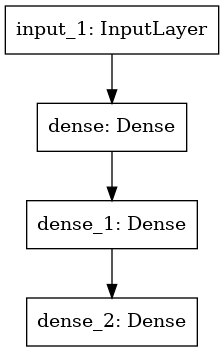
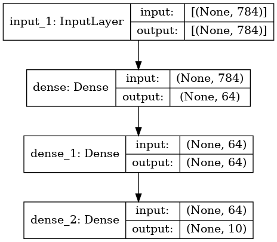
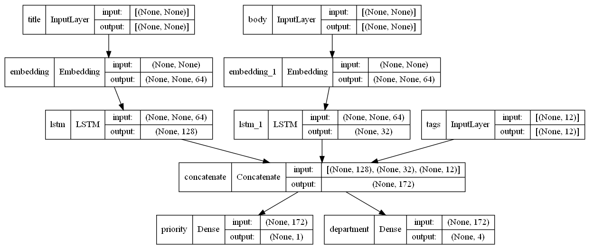

# Functional API

2022-02-16, 10:13
***

## 配置

```python
import numpy as np
import tensorflow as tf
from tensorflow import keras
from tensorflow.keras import layers
```

## 简介

Keras 函数式（functional）API 是一种比 [tf.keras.Sequential](sequential_model.md) 更灵活的创建模型的方法。函数式 API 可以创建非线性拓扑结构、共享层，甚至可以创建包含多个输入或多个输出的模型。

其主要思想是，深度学习模型是由神经网络层组成的有向无环图（directed acyclic graph, DAG），函数式 API 提供构建这种图的方法。

考虑如下模型：

```python
(input: 784-dimensional vectors)
       ↧
[Dense (64 units, relu activation)]
       ↧
[Dense (64 units, relu activation)]
       ↧
[Dense (10 units, softmax activation)]
       ↧
(output: logits of a probability distribution over 10 classes)
```

该模型包含三层。使用函数 API 创建该模型，首先创建输入节点：

```python
inputs = keras.Input(shape=(784,))
```

输入数据向量长度设置为 784。此处只指定样本 shape，忽略 batch size。

假如输入是 shape 为 `(32, 32, 3)` 的图片。此时输入定义方法为：

```python
img_inputs = keras.Input(shape=(32, 32, 3))
```

`keras.Input` 返回的 `inputs` 包含输入数据的 shape 和 `dtype`：

```python
>>> inputs.shape
TensorShape([None, 784])
>>> inputs.dtype
tf.float32
```

然后 DAG 图的下一个节点，将 `inputs` 对象作为输入：

```python
dense = layers.Dense(64, activation="relu")
x = dense(inputs)
```

层调用（layer call）就像从 "inputs" 到这个 dense 层画了个箭头。将 `inputs` 传入 `dense` 层，获得输出 `x`。

继续创建图中余下两层：

```python
x = layers.Dense(64, activation="relu")(x)
outputs = layers.Dense(10)(x)
```

此时可以将 `inputs` 和 `outputs` 作为参数创建 `Model`：

```python
model = keras.Model(inputs=inputs, outputs=outputs, name="mnist_model")
```

让我们来看看这个模型：

```python
>>> model.summary()

Model: "mnist_model"
_________________________________________________________________
 Layer (type)                Output Shape              Param #   
=================================================================
 input_1 (InputLayer)        [(None, 784)]             0         
                                                                 
 dense (Dense)               (None, 64)                50240     
                                                                 
 dense_1 (Dense)             (None, 64)                4160      
                                                                 
 dense_2 (Dense)             (None, 10)                650       
                                                                 
=================================================================
Total params: 55,050
Trainable params: 55,050
Non-trainable params: 0
_________________________________________________________________
```

将模型结构输出为图片：

```python
keras.utils.plot_model(model, "my_first_model.png")
```

> 导出图片需要安装 [Graphviz](https://graphviz.org/)，同时安装 python 包 pydot



导出图片时可以显示每个 layer 的输入和输出 shape:

```python
keras.utils.plot_model(model, "my_first_model_with_shape_info.png", show_shapes=True)
```



这个图和创建该图的代码几乎相同。只是将连接箭头用方法调用替换了。

## 训练、评估和推断

使用函数 API 构建的模型，在训练、评估和推断方面与 [Sequential](sequential_model.md) 模型完全相同。

`Model` 类内置有训练循环方法 `fit()` 和评估循环方法 `evaluate()`，并且可以自定义这些循环，以实现监督学习以外的算法，如 GAN。

下面，我们载入 MNIST 数据集，将其 reshape 为向量，训练上面创建的模型，在 validation split 上监视性能，并使用测试集评估模型：

```python
(x_train, y_train), (x_test, y_test) = keras.datasets.mnist.load_data()

x_train = x_train.reshape(60000, 784).astype("float32") / 255
x_test = x_test.reshape(10000, 784).astype("float32") / 255

model.compile(
    loss=keras.losses.SparseCategoricalCrossentropy(from_logits=True),
    optimizer=keras.optimizers.RMSprop(),
    metrics=["accuracy"],
)

history = model.fit(x_train, y_train, batch_size=64, epochs=2, validation_split=0.2)

test_scores = model.evaluate(x_test, y_test, verbose=2)
print("Test loss:", test_scores[0])
print("Test accuracy:", test_scores[1])
```

```sh
Epoch 1/2
750/750 [==============================] - 1s 1ms/step - loss: 0.3340 - accuracy: 0.9047 - val_loss: 0.1792 - val_accuracy: 0.9486
Epoch 2/2
750/750 [==============================] - 1s 907us/step - loss: 0.1558 - accuracy: 0.9530 - val_loss: 0.1485 - val_accuracy: 0.9569
313/313 - 0s - loss: 0.1512 - accuracy: 0.9560 - 152ms/epoch - 486us/step
Test loss: 0.15118415653705597
Test accuracy: 0.9559999704360962
```

## 保存和序列化

使用函数式 API 创建的模型的保存与序列化方式与使用 [Sequential](sequential_model.md) 创建的模型相同。

保存函数式 API 创建的模型的标准方法是调用 `model.save()` 将整个模型保存为单个文件。随后可以用该文件重新创建完全相同的模型。

该文件包括：

- 模型结构
- 模型权重值（训练时学到的参数）
- 模型训练配置（传递给 `compile` 的参数）
- optimizer 及其状态（方便从训练中断的位置重新开始训练）

保存模型：

```python
model_path = r"D:\it\test\model"
model.save(model_path)
```

```sh
INFO:tensorflow:Assets written to: D:\it\test\model\assets
```

然后重新载入模型：

```python
del model
model = keras.models.load_model(model_path
```

## 使用相同的 graph layers 定义多个模型

在函数式 API 中，通过指定图的输入和输出创建模型。这意味着可以使用单个 graph of layers 生成多个模型。

下面我们演示使用相同的 layers 堆栈实例化两个模型：

- 一个将输入图像转换为 16 维向量 `encoder` 模型
- 一个用于训练的端到端 autoencoder。

```python
encoder_input = keras.Input(shape=(28, 28, 1), name='img')
x = layers.Conv2D(16, 3, activation='relu')(encoder_input)
x = layers.Conv2D(32, 3, activation='relu')(x)
x = layers.MaxPooling2D(3)(x)
x = layers.Conv2D(32, 3, activation='relu')(x)
x = layers.Conv2D(16, 3, activation='relu')(x)
encoder_output = layers.GlobalMaxPooling2D()(x)

encoder = keras.Model(encoder_input, encoder_output, name='encoder')
encoder.summary()
```

```sh
Model: "encoder"
_________________________________________________________________
 Layer (type)                Output Shape              Param #   
=================================================================
 img (InputLayer)            [(None, 28, 28, 1)]       0         
                                                                 
 conv2d (Conv2D)             (None, 26, 26, 16)        160       
                                                                 
 conv2d_1 (Conv2D)           (None, 24, 24, 32)        4640      
                                                                 
 max_pooling2d (MaxPooling2D  (None, 8, 8, 32)         0         
 )                                                               
                                                                 
 conv2d_2 (Conv2D)           (None, 6, 6, 32)          9248      
                                                                 
 conv2d_3 (Conv2D)           (None, 4, 4, 16)          4624      
                                                                 
 global_max_pooling2d (Globa  (None, 16)               0         
 lMaxPooling2D)                                                  
                                                                 
=================================================================
Total params: 18,672
Trainable params: 18,672
Non-trainable params: 0
_________________________________________________________________
```

```python
x = layers.Reshape((4, 4, 1))(encoder_output)
x = layers.Conv2DTranspose(16, 3, activation='relu')(x)
x = layers.Conv2DTranspose(32, 3, activation='relu')(x)
x = layers.UpSampling2D(3)(x)
x = layers.Conv2DTranspose(16, 3, activation='relu')(x)
decoder_output = layers.Conv2DTranspose(1, 3, activation="relu")(x)

autoencoder = keras.Model(encoder_input, decoder_output, name='autoencoder')
autoencoder.summary()
```

```sh
Model: "autoencoder"
_________________________________________________________________
 Layer (type)                Output Shape              Param #   
=================================================================
 img (InputLayer)            [(None, 28, 28, 1)]       0         
                                                                 
 conv2d (Conv2D)             (None, 26, 26, 16)        160       
                                                                 
 conv2d_1 (Conv2D)           (None, 24, 24, 32)        4640      
                                                                 
 max_pooling2d (MaxPooling2D  (None, 8, 8, 32)         0         
 )                                                               
                                                                 
 conv2d_2 (Conv2D)           (None, 6, 6, 32)          9248      
                                                                 
 conv2d_3 (Conv2D)           (None, 4, 4, 16)          4624      
                                                                 
 global_max_pooling2d (Globa  (None, 16)               0         
 lMaxPooling2D)                                                  
                                                                 
 reshape (Reshape)           (None, 4, 4, 1)           0         
                                                                 
 conv2d_transpose (Conv2DTra  (None, 6, 6, 16)         160       
 nspose)                                                         
                                                                 
 conv2d_transpose_1 (Conv2DT  (None, 8, 8, 32)         4640      
 ranspose)                                                       
                                                                 
 up_sampling2d (UpSampling2D  (None, 24, 24, 32)       0         
 )                                                               
                                                                 
 conv2d_transpose_2 (Conv2DT  (None, 26, 26, 16)       4624      
 ranspose)                                                       
                                                                 
 conv2d_transpose_3 (Conv2DT  (None, 28, 28, 1)        145       
 ranspose)                                                       
                                                                 
=================================================================
Total params: 28,241
Trainable params: 28,241
Non-trainable params: 0
_________________________________________________________________
```

这里解码架构与编码架构严格对称，因此输出形状和输入形状 `(28, 28, 1)` 相同。

`Conv2D` 层反过来是 `Conv2DTranspose` 层，`MaxPooling2D` 层反过来是 `UpSampling2D`层。

## 模型是可调用的

模型和 layer 一样，都是可调用的。通过调用模型，不仅可以重用模型结构，还可以重用它的权重。

为了演示模型调用的效果，下面用另一个 autoencoder 示例演示：创建一个 encoder 模型和一个 decoder 模型，然后通过两次调用将它们连接起来获得最终的 autoencoder 模型：

```python
encoder_input = keras.Input(shape=(28, 28, 1), name="original_img")
x = layers.Conv2D(16, 3, activation="relu")(encoder_input)
x = layers.Conv2D(32, 3, activation="relu")(x)
x = layers.MaxPooling2D(3)(x)
x = layers.Conv2D(32, 3, activation="relu")(x)
x = layers.Conv2D(16, 3, activation="relu")(x)
encoder_output = layers.GlobalMaxPooling2D()(x)

encoder = keras.Model(encoder_input, encoder_output, name="encoder")
encoder.summary()

decoder_input = keras.Input(shape=(16,), name="encoded_img")
x = layers.Reshape((4, 4, 1))(decoder_input)
x = layers.Conv2DTranspose(16, 3, activation="relu")(x)
x = layers.Conv2DTranspose(32, 3, activation="relu")(x)
x = layers.UpSampling2D(3)(x)
x = layers.Conv2DTranspose(16, 3, activation="relu")(x)
decoder_output = layers.Conv2DTranspose(1, 3, activation="relu")(x)

decoder = keras.Model(decoder_input, decoder_output, name="decoder")
decoder.summary()

autoencoder_input = keras.Input(shape=(28, 28, 1), name="img")
encoded_img = encoder(autoencoder_input)
decoded_img = decoder(encoded_img)
autoencoder = keras.Model(autoencoder_input, decoded_img, name="autoencoder")
autoencoder.summary()
```

如上所示，模型可以嵌套，一个模型可以包含子模型。模型嵌套常用于模型集成。例如，下面将一个组模型组合成一个单一模型，来平均它们的预测：

```python
def get_model():
    inputs = keras.Input(shape=(128,))
    outputs = layers.Dense(1)(inputs)
    return keras.Model(inputs, outputs)


model1 = get_model()
model2 = get_model()
model3 = get_model()

inputs = keras.Input(shape=(128,))
y1 = model1(inputs)
y2 = model2(inputs)
y3 = model3(inputs)
outputs = layers.average([y1, y2, y3])
ensemble_model = keras.Model(inputs=inputs, outputs=outputs)
```

## 处理复杂拓扑图形结构

### 多个输入和输出

函数式 API 可以创建包含多个输入和输出的模型，[Sequential](sequential_model.md) API 就不行。

例如，如果你要构建一个系统，用于按优先级对客户的票据进行排序，并将其转到正确的部门，那么该模型至少有三个输入：

- 票据的标题（文本输入）
- 票据的内容（文本输入）
- 用户添加的标签（分类输入）

该模型包含两个输出：

- 优先级打分（0 到 1 之间，sigmoid 输出）
- 处理票据的部门（softmax 输出）

下面使用函数式 API 构建该模型：

```python
num_tags = 12  # 标签个数
num_words = 10000  # 处理文本数据时的词汇量大小
num_departments = 4  # 部门数

title_input = keras.Input(
    shape=(None,), name="title"
)  # 变长标题序列
body_input = keras.Input(shape=(None,), name="body")  # 变长内容序列
tags_input = keras.Input(
    shape=(num_tags,), name="tags"
)  # 长度为 `num_tags` 的二进制向量

# 将标题嵌入到 64 维向量
title_features = layers.Embedding(num_words, 64)(title_input)
# 将内容嵌入到 64 维向量
body_features = layers.Embedding(num_words, 64)(body_input)

# 将标题中嵌入的单词序列简化为 128 维向量
title_features = layers.LSTM(128)(title_features)
# 将内容中嵌入的单词序列简化为 32 维向量
body_features = layers.LSTM(32)(body_features)

# 通过串联将所有特征合并到一个向量
x = layers.concatenate([title_features, body_features, tags_input])

# 预测优先级的回归层
priority_pred = layers.Dense(1, name="priority")(x)
# 部门分类功能
department_pred = layers.Dense(num_departments, name="department")(x)

# 实例化一个预测优先级和部门的端到端模型
model = keras.Model(
    inputs=[title_input, body_input, tags_input],
    outputs=[priority_pred, department_pred],
)
```

模型的图示：

```python
keras.utils.plot_model(model, "multi_input_and_output_model.png", show_shapes=True)
```



在编译这个模型时，不同输出可以采用不同的损失函数。甚至可以为不同损失分配不同的权重，以调整它们对总训练损失的贡献：

```python
model.compile(
    optimizer=keras.optimizers.RMSprop(1e-3),
    loss=[
        keras.losses.BinaryCrossentropy(from_logits=True),
        keras.losses.CategoricalCrossentropy(from_logits=True),
    ],
    loss_weights=[1.0, 0.2],
)
```

因为两个输出层的名称不同，所以也可以根据名称指定损失函数和权重：

```python
model.compile(
    optimizer=keras.optimizers.RMSprop(1e-3),
    loss={
        "priority": keras.losses.BinaryCrossentropy(from_logits=True),
        "department": keras.losses.CategoricalCrossentropy(from_logits=True),
    },
    loss_weights={"priority": 1.0, "department": 0.2},
)
```

输入数据和目标值通过 NumPy 数组传入：

```python
# Dummy input data
title_data = np.random.randint(num_words, size=(1280, 10))
body_data = np.random.randint(num_words, size=(1280, 100))
tags_data = np.random.randint(2, size=(1280, num_tags)).astype("float32")

# Dummy target data
priority_targets = np.random.random(size=(1280, 1))
dept_targets = np.random.randint(2, size=(1280, num_departments))

model.fit(
    {"title": title_data, "body": body_data, "tags": tags_data},
    {"priority": priority_targets, "department": dept_targets},
    epochs=2,
    batch_size=32,
)
```

## 参考

- https://www.tensorflow.org/guide/keras/functional
