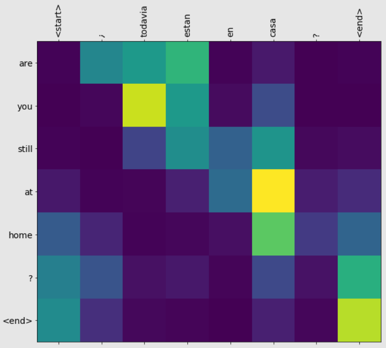

# 基于注意力机制的神经机器翻译

- [基于注意力机制的神经机器翻译](#基于注意力机制的神经机器翻译)
  - [简介](#简介)
  - [设置](#设置)
  - [数据](#数据)
    - [下载并准备数据](#下载并准备数据)
    - [创建 tf.data 数据集](#创建-tfdata-数据集)
  - [参考](#参考)

## 简介

下面基于论文 [Effective Approaches to Attention-based Neural Machine Translation](https://arxiv.org/abs/1508.04025v5) 训练一个 seq2seq 模型用于西班牙语到英语的翻译。这是一个高级示例，需要如下知识：

- [Sequence-to-sequence](https://proceedings.neurips.cc/paper/2014/file/a14ac55a4f27472c5d894ec1c3c743d2-Paper.pdf) 模型
- TensorFlow 基础：
  - [张量基础](https://www.tensorflow.org/guide/tensor)
  - 自定义 Layer 和模型

虽然这个架构有点过时，但是对理解 seq2seq 模型和注意力机制，依然是个很有用的项目。

在本教程训练模型后，可以将西班牙语句子如 "¿todavia estan en casa?" 转换为英文句子 "are you still at home?"。

生成的模型可以导出为 `tf.saved_model`，这样就可以在其它 TensorFlow 环境中使用。

对一个 toy 示例来说，模型的翻译质量是合理的，但是生成的 attention plot 可能更有意思。下图显示输入语句中在翻译时哪一部分获得了模型的 attention：



> [!NOTE]
> 这个示例在单个 P100 GPU 上运行需要大约 10 分钟。

## 设置

```powershell
$pip install "tensorflow-text==2.8.*"
```

```python
import numpy as np

import typing
from typing import Any, Tuple

import tensorflow as tf

import tensorflow_text as tf_text

import matplotlib.pyplot as plt
import matplotlib.ticker as ticker
```

本教程使用了许多底层 API，因此 shape 很容易出错。下面的类用于检查 shape：

```python
class ShapeChecker():
  def __init__(self):
    # Keep a cache of every axis-name seen
    self.shapes = {}

  def __call__(self, tensor, names, broadcast=False):
    if not tf.executing_eagerly():
      return

    if isinstance(names, str):
      names = (names,)

    shape = tf.shape(tensor)
    rank = tf.rank(tensor)

    if rank != len(names):
      raise ValueError(f'Rank mismatch:\n'
                       f'    found {rank}: {shape.numpy()}\n'
                       f'    expected {len(names)}: {names}\n')

    for i, name in enumerate(names):
      if isinstance(name, int):
        old_dim = name
      else:
        old_dim = self.shapes.get(name, None)
      new_dim = shape[i]

      if (broadcast and new_dim == 1):
        continue

      if old_dim is None:
        # If the axis name is new, add its length to the cache.
        self.shapes[name] = new_dim
        continue

      if new_dim != old_dim:
        raise ValueError(f"Shape mismatch for dimension: '{name}'\n"
                         f"    found: {new_dim}\n"
                         f"    expected: {old_dim}\n")
```

## 数据

使用 http://www.manythings.org/anki/ 提供的语言数据集，该数据集包含如下格式的成对的语言翻译，两个句子以制表符 `\t` 分开：

```txt
May I borrow this book? ¿Puedo tomar prestado este libro?
```

他们提供了多种语言的数据集，我们使用 "英语-西班牙语" 数据集。

### 下载并准备数据

为了方便，我们在谷歌云上放了数据集的副本。下载数据集后，采用以下步骤准备数据：

1. 为每个句子添加 `start` 和 `end` token
2. 通过删除特殊字符来清理句子
3. 创建单词索引（word -> id 和 id -> word）
4. 将每个句子填充到允许的最大长度

- 下载文件

```python
import pathlib

path_to_zip = tf.keras.utils.get_file(
    'spa-eng.zip', origin='http://storage.googleapis.com/download.tensorflow.org/data/spa-eng.zip',
    extract=True)

path_to_file = pathlib.Path(path_to_zip).parent / 'spa-eng/spa.txt'
```

```txt
Downloading data from http://storage.googleapis.com/download.tensorflow.org/data/spa-eng.zip
2638744/2638744 [==============================] - 2s 1us/step
```

- 定义加载数据函数

```python
def load_data(path):
    text = path.read_text(encoding='utf-8')

    lines = text.splitlines()
    pairs = [line.split('\t') for line in lines]

    inp = [inp for targ, inp in pairs]
    targ = [targ for targ, inp in pairs]

    return targ, inp
```

- 加载数据

```python
targ, inp = load_data(path_to_file)
print(inp[-1])
```

```txt
Si quieres sonar como un hablante nativo, debes estar dispuesto a practicar diciendo la misma frase una y otra vez de la misma manera en que un músico de banjo practica el mismo fraseo una y otra vez hasta que lo puedan tocar correctamente y en el tiempo esperado.
```

```python
print(targ[-1])
```

```txt
If you want to sound like a native speaker, you must be willing to practice saying the same sentence over and over in the same way that banjo players practice the same phrase over and over until they can play it correctly and at the desired tempo.
```

### 创建 tf.data 数据集

使用上述的字符串数组创建 `tf.data.Dataset`：

```python
BUFFER_SIZE = len(inp)
BATCH_SIZE = 64

dataset = tf.data.Dataset.from_tensor_slices((inp, targ)).shuffle(BUFFER_SIZE)
dataset = dataset.batch(BATCH_SIZE)
```

```python
for example_input_batch, example_target_batch in dataset.take(1):
    print(example_input_batch[:5])
    print()
    print(example_target_batch[:5])
    break
```

```txt
tf.Tensor(
[b'\xc3\x89l escribe libretos para TV.'
 b'\xc2\xbfEn tu casa qui\xc3\xa9n lleva los pantalones?'
 b'\xc2\xbfPuede pasarme la sal, por favor?' b'Ella lleva medias.'
 b'Estuve en Par\xc3\xads.'], shape=(5,), dtype=string)

tf.Tensor(
[b'He writes scripts for TV shows.' b'Who wears the pants in your family?'
 b'Could you pass me the salt, please?' b"She's wearing tights."
 b'I have been in Paris.'], shape=(5,), dtype=string)
```

## 参考

- https://www.tensorflow.org/text/tutorials/nmt_with_attention
