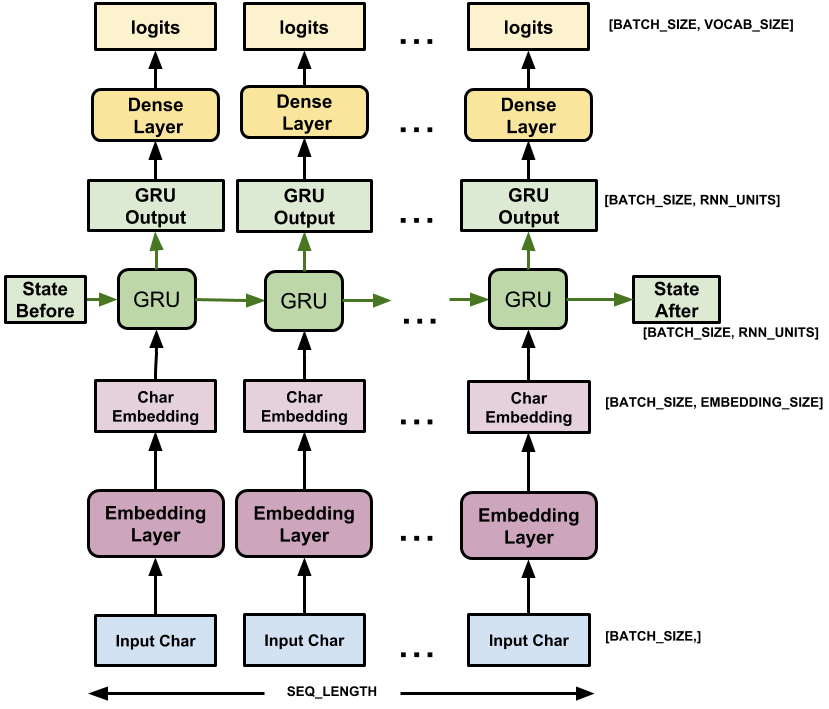

# Text generation with an RNN

- [Text generation with an RNN](#text-generation-with-an-rnn)
  - [简介](#简介)
  - [初始设置](#初始设置)
    - [导入包](#导入包)
    - [下载数据集](#下载数据集)
    - [读取数据](#读取数据)
  - [处理文本](#处理文本)
    - [向量化文本](#向量化文本)
    - [预测任务](#预测任务)
    - [创建训练样本和目标值](#创建训练样本和目标值)
    - [创建训练 batches](#创建训练-batches)
  - [构建模型](#构建模型)
  - [试用模型](#试用模型)
  - [训练模型](#训练模型)
    - [设置 optimizer 和 loss function](#设置-optimizer-和-loss-function)
    - [设置 checkpoints](#设置-checkpoints)
    - [开始训练](#开始训练)
  - [生成文本](#生成文本)
  - [自定义训练](#自定义训练)
  - [参考](#参考)

2022-02-11, 17:15
***

## 简介

下面演示使用基于字符的 RNN 生成文本。使用 Andrej Karpathy 的博客 [The Unreasonable Effectiveness of Recurrent Neural Networks](http://karpathy.github.io/2015/05/21/rnn-effectiveness/) 中使用的 Shakespeare 的一篇文章作为数据集。给定该数据中的字符序列（"Shakespear"），训练模型预测序列中的下一个字符（"e"）。反复调用模型可以生成较长的文本序列。

下面使用 `tf.keras` 实现，以下文本是模型训练 30 个 epoch 后使用提示 "Q" 开始获得的输出：

```txt
QUEENE:
I had thought thou hadst a Roman; for the oracle,
Thus by All bids the man against the word,
Which are so weak of care, by old care done;
Your children were in your holy love,
And the precipitation through the bleeding throne.

BISHOP OF ELY:
Marry, and will, my lord, to weep in such a one were prettiest;
Yet now I was adopted heir
Of the world's lamentable day,
To watch the next way with his father with his face?

ESCALUS:
The cause why then we are all resolved more sons.

VOLUMNIA:
O, no, no, no, no, no, no, no, no, no, no, no, no, no, no, no, no, no, no, no, no, it is no sin it should be dead,
And love and pale as any will to that word.

QUEEN ELIZABETH:
But how long have I heard the soul for this world,
And show his hands of life be proved to stand.

PETRUCHIO:
I say he look'd on, if I must be content
To stay him from the fatal of our country's bliss.
His lordship pluck'd from this sentence then for prey,
And then let us twain, being the moon,
were she such a case as fills m
```

虽然有些句子语法正确，但是大多数句子没有意义，该模型没有学习到单词的含义，但是考虑到：

- 模型是基于字符的。模型并不知道如何拼写英文单词，甚至不知道这些单词是文本的基本组成；
- 训练数据集批量较小（每个 100 字符）。

## 初始设置

### 导入包

```python
import tensorflow as tf

import numpy as np
import os
import time
```

### 下载数据集

```python
path_to_file = tf.keras.utils.get_file('shakespeare.txt', 'https://storage.googleapis.com/download.tensorflow.org/data/shakespeare.txt')
```

```sh
Downloading data from https://storage.googleapis.com/download.tensorflow.org/data/shakespeare.txt
1122304/1115394 [==============================] - 0s 0us/step
1130496/1115394 [==============================] - 0s 0us/step
```

### 读取数据

首先查看文本：

```python
# Read, then decode for py2 compat.
text = open(path_to_file, 'rb').read().decode(encoding='utf-8')
# length of text is the number of characters in it
print(f'Length of text: {len(text)} characters')
```

```sh
Length of text: 1115394 characters
```

查看文本的前 250 个字符：

```python
# Take a look at the first 250 characters in text
print(text[:250])
```

```sh
First Citizen:
Before we proceed any further, hear me speak.

All:
Speak, speak.

First Citizen:
You are all resolved rather to die than to famish?

All:
Resolved. resolved.

First Citizen:
First, you know Caius Marcius is chief enemy to the people.
```

文件中字符种类数：

```python
# The unique characters in the file
vocab = sorted(set(text))
print(f'{len(vocab)} unique characters')
```

```sh
65 unique characters
```

## 处理文本

### 向量化文本

在训练前需要将文本转换为数值表示。

`tf.keras.layers.StringLookup` layer 可以将字符转换为数字 ID，只需要先将文本拆分为 tokens：

```python
example_texts = ['abcdefg', 'xyz']

chars = tf.strings.unicode_split(example_texts, input_encoding='UTF-8')
chars
```

```sh
<tf.RaggedTensor [[b'a', b'b', b'c', b'd', b'e', b'f', b'g'], [b'x', b'y', b'z']]>
```

然后创建 [tf.keras.layers.StringLookup](../api/tf/keras/layers/StringLookup.md) layer：

```python
ids_from_chars = tf.keras.layers.StringLookup(vocabulary=list(vocab), mask_token=None)
```

该 layer 负责将 tokens 转换为数字 ID：

```python
ids = ids_from_chars(chars)
ids
```

```sh
<tf.RaggedTensor [[40, 41, 42, 43, 44, 45, 46], [63, 64, 65]]>
```

由于构建模型的目的是生成文本，因此还需要逆操作，即将数字ID转换为字符。此时可以使用 [tf.keras.layers.StringLookup(..., invert=True)](../api/tf/keras/layers/StringLookup.md)。

为了保证两个 `StringLookup` 具有相同的词汇表，下面使用 `get_vocabulary()` 获得上面的词汇表：

```python
chars_from_ids = tf.keras.layers.StringLookup(
    vocabulary=ids_from_chars.get_vocabulary(), invert=True, mask_token=None)
```

该 layer 将 ID 向量转换为字符，返回字符类型的 [tf.RaggedTensor](../api/tf/RaggedTensor.md)：

```python
chars = chars_from_ids(ids)
chars
```

```sh
<tf.RaggedTensor [[b'a', b'b', b'c', b'd', b'e', b'f', b'g'], [b'x', b'y', b'z']]>
```

可以用 [tf.strings.reduce_join](../api/tf/strings/reduce_join.md) 将字符连接为字符串：

```python
tf.strings.reduce_join(chars, axis=-1).numpy()
```

```sh
array([b'abcdefg', b'xyz'], dtype=object)
```

```python
def text_from_ids(ids):
  return tf.strings.reduce_join(chars_from_ids(ids), axis=-1)
```

### 预测任务

给定一个字符或一串字符，下一个最可能的字符是什么？这就是模型所需执行的任务。该模型的输入是一个字符序列，需要训练该模型来预测下一个时间步的字符是什么。

### 创建训练样本和目标值

下面将文本划分为样本序列。每个输入序列为来自文本长度为 `seq_length` 字符序列。

对每个输入序列，对应的目标包含相同长度的文本，只是向右移了一个字符。假设 `seq_length` 为 4，文本为 "Hello"。则输入为 "Hell"，目标序列为 "ello"。

为此，首先使用 [tf.data.Dataset.from_tensor_slices](../api/tf/data/Dataset.md#fromtensorslices) 函数将文本向量转换为字符索引流。

```python
all_ids = ids_from_chars(tf.strings.unicode_split(text, 'UTF-8'))
all_ids
```

```sh
<tf.Tensor: shape=(1115394,), dtype=int64, numpy=array([19, 48, 57, ..., 46,  9,  1])>
```

```python
ids_dataset = tf.data.Dataset.from_tensor_slices(all_ids)
```

```python
for ids in ids_dataset.take(10):
    print(chars_from_ids(ids).numpy().decode('utf-8'))
```

```sh
F
i
r
s
t
 
C
i
t
i
```

```python
seq_length = 100
examples_per_epoch = len(text)//(seq_length+1)
```

使用 `batch` 方法可以轻松将这些单个字符转换为指定长度的序列：

```python
sequences = ids_dataset.batch(seq_length+1, drop_remainder=True)

for seq in sequences.take(1):
  print(chars_from_ids(seq))
```

```sh
tf.Tensor(
[b'F' b'i' b'r' b's' b't' b' ' b'C' b'i' b't' b'i' b'z' b'e' b'n' b':'
 b'\n' b'B' b'e' b'f' b'o' b'r' b'e' b' ' b'w' b'e' b' ' b'p' b'r' b'o'
 b'c' b'e' b'e' b'd' b' ' b'a' b'n' b'y' b' ' b'f' b'u' b'r' b't' b'h'
 b'e' b'r' b',' b' ' b'h' b'e' b'a' b'r' b' ' b'm' b'e' b' ' b's' b'p'
 b'e' b'a' b'k' b'.' b'\n' b'\n' b'A' b'l' b'l' b':' b'\n' b'S' b'p' b'e'
 b'a' b'k' b',' b' ' b's' b'p' b'e' b'a' b'k' b'.' b'\n' b'\n' b'F' b'i'
 b'r' b's' b't' b' ' b'C' b'i' b't' b'i' b'z' b'e' b'n' b':' b'\n' b'Y'
 b'o' b'u' b' '], shape=(101,), dtype=string)
```

将上面的 tokens 连接成字符串，更容易看出效果：

```python
for seq in sequences.take(5):
  print(text_from_ids(seq).numpy())
```

```sh
b'First Citizen:\nBefore we proceed any further, hear me speak.\n\nAll:\nSpeak, speak.\n\nFirst Citizen:\nYou '
b'are all resolved rather to die than to famish?\n\nAll:\nResolved. resolved.\n\nFirst Citizen:\nFirst, you k'
b"now Caius Marcius is chief enemy to the people.\n\nAll:\nWe know't, we know't.\n\nFirst Citizen:\nLet us ki"
b"ll him, and we'll have corn at our own price.\nIs't a verdict?\n\nAll:\nNo more talking on't; let it be d"
b'one: away, away!\n\nSecond Citizen:\nOne word, good citizens.\n\nFirst Citizen:\nWe are accounted poor citi'
```

为了训练，我们需要 `(input, label)` 成对的数据集，`input` 和 `label` 都是序列。在每个时间步，输入是当前字符，输出 label 是下一个字符。

下面的函数，将输入序列复制并移动 1 位，从而将每个时间步的输入字符和 label 字符对齐：

```python
def split_input_target(sequence):
    input_text = sequence[:-1]
    target_text = sequence[1:]
    return input_text, target_text
```

```python
split_input_target(list("Tensorflow"))
```

```sh
(['T', 'e', 'n', 's', 'o', 'r', 'f', 'l', 'o'],
 ['e', 'n', 's', 'o', 'r', 'f', 'l', 'o', 'w'])
```

```python
dataset = sequences.map(split_input_target)
```

```python
for input_example, target_example in dataset.take(1):
    print("Input :", text_from_ids(input_example).numpy())
    print("Target:", text_from_ids(target_example).numpy())
```

```sh
Input : b'First Citizen:\nBefore we proceed any further, hear me speak.\n\nAll:\nSpeak, speak.\n\nFirst Citizen:\nYou'
Target: b'irst Citizen:\nBefore we proceed any further, hear me speak.\n\nAll:\nSpeak, speak.\n\nFirst Citizen:\nYou '
```

### 创建训练 batches

前面使用 [tf.data](../api/tf/data/tf.data.md) 将文本拆分为序列集合。将输入输入模型之前，还需要将数据打乱，并打包成 batches。

```python
# Batch size
BATCH_SIZE = 64

# Buffer size to shuffle the dataset
# (TF data is designed to work with possibly infinite sequences,
# so it doesn't attempt to shuffle the entire sequence in memory. Instead,
# it maintains a buffer in which it shuffles elements).
BUFFER_SIZE = 10000

dataset = (
    dataset
    .shuffle(BUFFER_SIZE)
    .batch(BATCH_SIZE, drop_remainder=True)
    .prefetch(tf.data.experimental.AUTOTUNE))

dataset
```

```sh
<PrefetchDataset element_spec=(TensorSpec(shape=(64, 100), dtype=tf.int64, name=None), TensorSpec(shape=(64, 100), dtype=tf.int64, name=None))>
```

## 构建模型

下面通过扩展 [keras.Model](../api/tf/keras/Model.md) 类定义模型。

该模型包含三层：

- [tf.keras.layers.Embedding](../api/tf/keras/layers/Embedding.md)：输入层。可训练的查找表，将字符 ID 映射到维度为 `embedding_dim` 的向量；
- [tf.keras.layers.GRU](../api/tf/keras/layers/GRU.md)：一种 RNN，大小为 `units=rnn_units`，这里也可以使用 LSTM。
- [tf.keras.layers.Dense](../api/tf/keras/layers/Dense.md)：输出层，输出 `vocab_size`。它为词汇表的每个字符输出一个 logit。

```python
# 以字符表示的词汇表长度
vocab_size = len(vocab)

# 嵌入维度
embedding_dim = 256

# RNN 单元数
rnn_units = 1024
```

```python
class MyModel(tf.keras.Model):
  def __init__(self, vocab_size, embedding_dim, rnn_units):
    super().__init__(self)
    self.embedding = tf.keras.layers.Embedding(vocab_size, embedding_dim)
    self.gru = tf.keras.layers.GRU(rnn_units,
                                   return_sequences=True,
                                   return_state=True)
    self.dense = tf.keras.layers.Dense(vocab_size)

  def call(self, inputs, states=None, return_state=False, training=False):
    x = inputs
    x = self.embedding(x, training=training)
    if states is None:
      states = self.gru.get_initial_state(x)
    x, states = self.gru(x, initial_state=states, training=training)
    x = self.dense(x, training=training)

    if return_state:
      return x, states
    else:
      return x
```

```python
model = MyModel(
    # Be sure the vocabulary size matches the `StringLookup` layers.
    vocab_size=len(ids_from_chars.get_vocabulary()),
    embedding_dim=embedding_dim,
    rnn_units=rnn_units)
```

对每个字符，模型查找嵌入，将嵌入输入 GRU 运行一个时间步，再输入 Dense 层生成 logits 来预测下一个字符：



> 😊:这里也可以使用 [keras.Sequential](../api/tf/keras/Sequential.md) 模型。为了稍后能生成文本，需要管理 RNN 内部状态。提前包含状态的输入和输出选项比稍后重整模型要简单得多。

## 试用模型

运行模型，看看它的行为是否符合预期。

首先检查输出 shape：

```python
for input_example_batch, target_example_batch in dataset.take(1):
    example_batch_predictions = model(input_example_batch)
    print(example_batch_predictions.shape, "# (batch_size, sequence_length, vocab_size)")
```

```sh
(64, 100, 66) # (batch_size, sequence_length, vocab_size)
```

在上例中，输出序列长度为 100，但模型可以处理任意长度的输入：

```python
model.summary()
```

```sh
Model: "my_model"
_________________________________________________________________
 Layer (type)                Output Shape              Param #   
=================================================================
 embedding (Embedding)       multiple                  16896     
                                                                 
 gru (GRU)                   multiple                  3938304   
                                                                 
 dense (Dense)               multiple                  67650     
                                                                 
=================================================================
Total params: 4,022,850
Trainable params: 4,022,850
Non-trainable params: 0
_________________________________________________________________
```

为了从模型获得实际的预测，需要从输出分布中取样，以获得实际字符索引。该分布由词汇表上的 logit 定义。

> 从输出分布中取样很重要，

试一下这批数据的第一个样本：

```python
sampled_indices = tf.random.categorical(example_batch_predictions[0], num_samples=1)
sampled_indices = tf.squeeze(sampled_indices, axis=-1).numpy()
```

在每个时间步预测下一个字符索引：

```python
sampled_indices
```

```sh
array([29, 23, 11, 14, 42, 27, 56, 29, 14,  6,  9, 65, 22, 15, 34, 64, 44,
       41, 11, 51, 10, 44, 42, 56, 13, 50,  1, 33, 45, 23, 28, 43, 12, 62,
       45, 60, 43, 62, 38, 19, 50, 35, 19, 14, 60, 56, 10, 64, 39, 56,  2,
       51, 63, 42, 39, 64, 43, 20, 20, 17, 40, 15, 52, 46,  7, 25, 34, 43,
       11, 11, 31, 34, 38, 44, 22, 49, 23,  4, 27,  0, 31, 39,  5,  9, 43,
       58, 33, 30, 49,  6, 63,  5, 50,  4,  6, 14, 62,  3,  7, 35])
```

解码，看看这个未经训练的模型预测的文本：

```python
print("Input:\n", text_from_ids(input_example_batch[0]).numpy())
print()
print("Next Char Predictions:\n", text_from_ids(sampled_indices).numpy())
```

```sh
Input:
 b":\nWherein the king stands generally condemn'd.\n\nBAGOT:\nIf judgement lie in them, then so do we,\nBeca"

Next Char Predictions:
 b"PJ:AcNqPA'.zIBUyeb:l3ecq?k\nTfJOd;wfudwYFkVFAuq3yZq lxcZydGGDaBmg,LUd::RUYeIjJ\\(N[UNK]RZ&.dsTQj'x&k\\)'Aw!,V"
```

## 训练模型

此时，问题可以视为一个标准的分类模型。给定前面的 RNN 状态和当前时间步的输入，预测下一个字符的类别。

### 设置 optimizer 和 loss function

标准 [tf.keras.losses.sparse_categorical_crossentropy](../api/tf/keras/metrics/sparse_categorical_crossentropy.md) 损失函数适合该情况，它应用于预测的最后一个维度。

由于模型返回 logit，所以要添加 `from_logits` 标签：

```python
loss = tf.losses.SparseCategoricalCrossentropy(from_logits=True)
```

```python
example_batch_mean_loss = loss(target_example_batch, example_batch_predictions)
print("Prediction shape: ", example_batch_predictions.shape, " # (batch_size, sequence_length, vocab_size)")
print("Mean loss:        ", example_batch_mean_loss)
```

```sh
Prediction shape:  (64, 100, 66)  # (batch_size, sequence_length, vocab_size)
Mean loss:         tf.Tensor(4.1895466, shape=(), dtype=float32)
```

刚初始化的模型输出 logit 接近随机分布。为了证实这一点，可以检查平均损失的指数应该接近词汇表的大小。更高的损失均值意味着模型确定其答案是错误的，说明没初始化好：

```python
tf.exp(example_batch_mean_loss).numpy()
```

```sh
65.99286
```

使用 [tf.keras.Model.compile](../api/tf/keras/Model.md) 配置训练过程。使用 [tf.keras.optimizers.Adam](../api/tf/keras/optimizers/Adam.md)和上面的损失函数：

```python
model.compile(optimizer='adam', loss=loss)
```

### 设置 checkpoints

使用 [tf.keras.callbacks.ModelCheckpoint](../api/tf/keras/callbacks/ModelCheckpoint.md) 来保证训练期间保存检查点：

```python
# Directory where the checkpoints will be saved
checkpoint_dir = './training_checkpoints'
# Name of the checkpoint files
checkpoint_prefix = os.path.join(checkpoint_dir, "ckpt_{epoch}")

checkpoint_callback = tf.keras.callbacks.ModelCheckpoint(
    filepath=checkpoint_prefix,
    save_weights_only=True)
```

### 开始训练

## 生成文本

使用该模型生成文本的最简单方法是在训练中运行，并在执行时跟踪模型内部状态。


每次调用模型，传入一个文本和内部状态，模型返回下一个字符的预测及新状态，将预测和状态传回模型继续生成文本。

以下是单步预测：

```python
class OneStep(tf.keras.Model):
  def __init__(self, model, chars_from_ids, ids_from_chars, temperature=1.0):
    super().__init__()
    self.temperature = temperature
    self.model = model
    self.chars_from_ids = chars_from_ids
    self.ids_from_chars = ids_from_chars

    # 创建 mask 以避免生成 "[UNK]"
    skip_ids = self.ids_from_chars(['[UNK]'])[:, None]
    sparse_mask = tf.SparseTensor(
        # Put a -inf at each bad index.
        values=[-float('inf')]*len(skip_ids),
        indices=skip_ids,
        # Match the shape to the vocabulary
        dense_shape=[len(ids_from_chars.get_vocabulary())])
    self.prediction_mask = tf.sparse.to_dense(sparse_mask)

  @tf.function
  def generate_one_step(self, inputs, states=None):
    # Convert strings to token IDs.
    input_chars = tf.strings.unicode_split(inputs, 'UTF-8')
    input_ids = self.ids_from_chars(input_chars).to_tensor()

    # Run the model.
    # predicted_logits.shape is [batch, char, next_char_logits]
    predicted_logits, states = self.model(inputs=input_ids, states=states,
                                          return_state=True)
    # Only use the last prediction.
    predicted_logits = predicted_logits[:, -1, :]
    predicted_logits = predicted_logits/self.temperature
    # Apply the prediction mask: prevent "[UNK]" from being generated.
    predicted_logits = predicted_logits + self.prediction_mask

    # Sample the output logits to generate token IDs.
    predicted_ids = tf.random.categorical(predicted_logits, num_samples=1)
    predicted_ids = tf.squeeze(predicted_ids, axis=-1)

    # Convert from token ids to characters
    predicted_chars = self.chars_from_ids(predicted_ids)

    # Return the characters and model state.
    return predicted_chars, states
```

## 自定义训练


## 参考

- https://www.tensorflow.org/text/tutorials/text_generation
