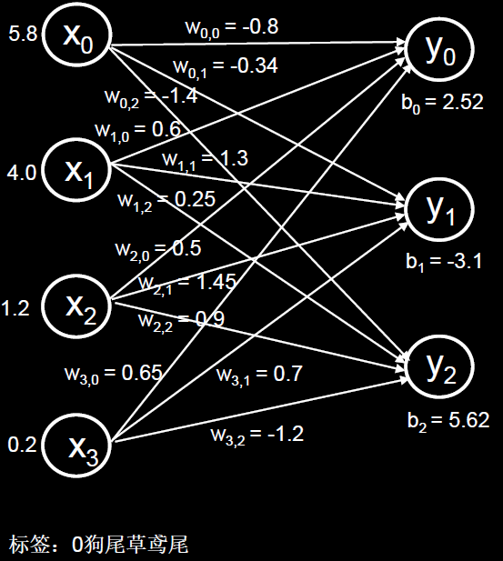
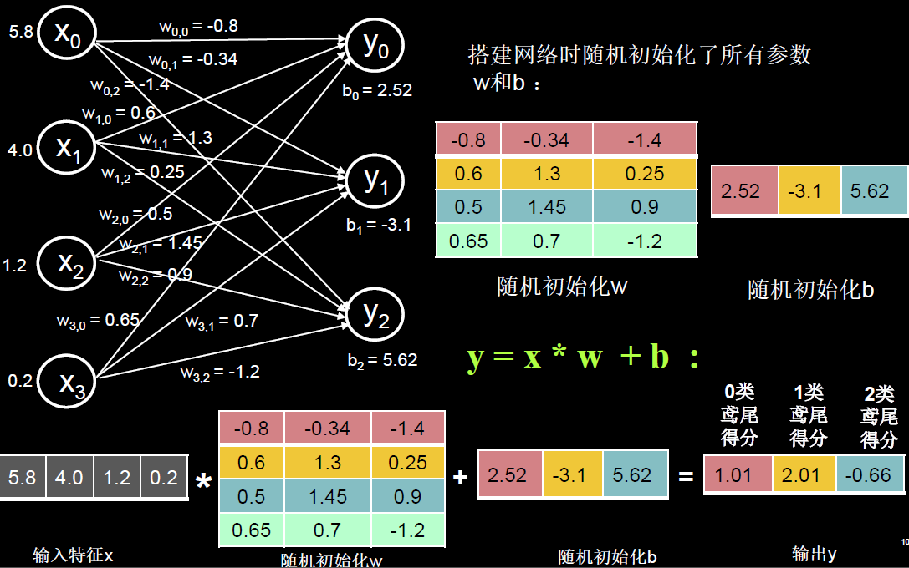
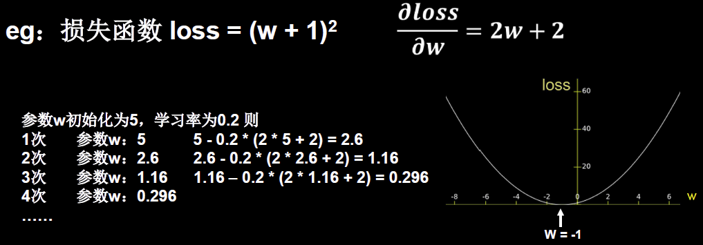
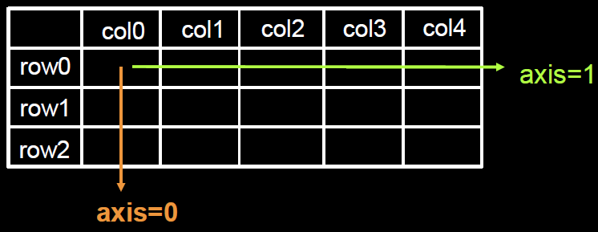

# 神经网络计算过程及模型搭建

- [神经网络计算过程及模型搭建](#神经网络计算过程及模型搭建)
  - [人工智能三学派](#人工智能三学派)
  - [神经网络设计](#神经网络设计)
    - [用神经网络实现鸢尾花的分类](#用神经网络实现鸢尾花的分类)
    - [搭建网络](#搭建网络)
    - [喂入数据](#喂入数据)
    - [前向传播](#前向传播)
    - [损失函数](#损失函数)
    - [梯度下降](#梯度下降)
    - [反向传播](#反向传播)
  - [张量](#张量)
    - [数据类型](#数据类型)
    - [创建 Tensor](#创建-tensor)
  - [TF2 常用函数](#tf2-常用函数)
    - [数学运算](#数学运算)
    - [Dataset.from_tensor_slices](#datasetfrom_tensor_slices)
    - [tf.GradientTape](#tfgradienttape)
    - [tf.one_hot](#tfone_hot)
    - [tf.nn.softmax](#tfnnsoftmax)
    - [assign_sub](#assign_sub)
    - [tf.argmax](#tfargmax)
  - [鸢尾花数据集（Iris）](#鸢尾花数据集iris)
    - [加载 iris 数据集](#加载-iris-数据集)
  - [神经网络实现鸢尾花分类](#神经网络实现鸢尾花分类)

***

## 人工智能三学派

人工智能：让机器具备人的思维和意识。

人工智能三学派：

- 行为主义：基于控制论，构建感知-动作控制系统。（控制论，如平衡、行走、避障等自适应控制系统）
- 符号主义：基于算数逻辑表达式，求解问题时先把问题描述为表达式，再求解表达式。（可用公式描述、实现理性思维，如专家系统）
- 连接主义：仿生学，模仿神经元连接关系。（仿脑神经元连接，实现感性思维，如神经网络）

用计算机模仿神经网络连接关系，让计算机具备感性思维。


- [x] 准备数据：采集大量“特征/标签”数据 (数据量越大越好)
- [x] 搭建网络：搭建神经网络结构
- [x] 优化参数：训练网络获取最佳参数（反传）
- [x] 应用网络：将网络保存为模型，输入新数据，输出分类或预测结果（前传）

## 神经网络设计

通过鸢尾花分类的例子来感受神经网络的设计过程。

鸢尾花可以分为三类：

- 0 狗尾草鸢尾
- 1 杂色鸢尾
- 2 弗吉尼亚鸢尾

人们通过经验总结出了规律：通过测量花的花萼长、花萼宽、花瓣长、花瓣宽，可以得出鸢尾花的类别。（如：花萼长>花萼宽且花瓣长/花瓣宽>2 则为1杂色鸢尾）。

if 语句 case 语句 —— **专家系统**把专家的经验告知计算机，计算机执行逻辑判别（理性计算），给出分类。

**神经网络**：采集大量（花萼长、花萼宽、花瓣长、花瓣宽，对应的类别）数据对构成数据集。

把数据集喂给搭建好的神经网络结构，网络优化参数得到模型，模型读入新输入特征，输出识别结果。

### 用神经网络实现鸢尾花的分类


输入是 shape 为 (1,4) 的数据，输出是每个种类的可能性大小，shape 为 (1, 3)。

### 搭建网络


### 喂入数据



### 前向传播



### 损失函数

**损失函数**（loss function）：预测值（y）与标准答案（y_）的差距。

损失函数可以定量判断W、b的优劣，当损失函数输出最小时，参数W、b会出现最优值。

均方误差：$MSE(y, y\_)=\frac{\sum_{k=0}^n (y-y\_)^2}{n}$

### 梯度下降

目的：想找到一组参数w和b，使得损失函数最小。

梯度：函数对各参数求偏导后的向量。函数梯度下降方向是函数减小方向。

梯度下降法：沿损失函数梯度下降的方向，寻找损失函数的最小值，得到最优参数的方法。

$$w_{t+1}=w_t-lr*\frac{\partial loss}{\partial w_t}$$

$$b_{t+1}=b_t-lr*\frac{\partial loss}{\partial b_t}$$

**学习率**（learning rate，lr）：当学习率设置的过小时，收敛过程将变得十分缓慢。而当学习率设置的过大时，梯度可能会在最小值附近来回震荡，甚至可能无法收敛。

### 反向传播

$$w_{t+1}=w_t-lr*\frac{\partial loss}{\partial w_t}$$

**反向传播**：从后向前，逐层求损失函数对每层神经元参数的偏导数，迭代更新所有参数。



反向传播，梯度下降的代码：

```python
import tensorflow as tf

w = tf.Variable(tf.constant(5, dtype=tf.float32))
lr = 0.2
epoch = 40

for epoch in range(epoch):  # for epoch 定义顶层循环，表示对数据集循环epoch次，此例数据集数据仅有1个w,初始化时候constant赋值为5，循环40次迭代。
    with tf.GradientTape() as tape:  # with结构到grads框起了梯度的计算过程。
        loss = tf.square(w + 1)
    grads = tape.gradient(loss, w)  # .gradient函数告知谁对谁求导

    w.assign_sub(lr * grads)  # .assign_sub 对变量做自减 即：w -= lr*grads 即 w = w - lr*grads
    print("After %s epoch,w is %f,loss is %f" % (epoch, w.numpy(), loss))

# lr初始值：0.2   请自改学习率  0.001  0.999 看收敛过程
# 最终目的：找到 loss 最小 即 w = -1 的最优参数w
```

## 张量

张量（Tensor）：多维数组（列表）

阶：张量的维数。

|维数|阶|名字|例子|
|---|---|---|---|
|0-D|0|标量 scalar |s=123|
|1-D|1|向量 vector |v=[1, 2, 3]|
|2-D|2|矩阵 matrix |m=[[1, 2, 3], [4, 5, 6], [7, 8, 9]]|
|n-D|n|张量 tensor |t=[ [ [|

张量可以表示0阶到n阶数组（列表）。

### 数据类型

- `tf.int`, `tf.float`……
tf.int 32, tf.float32, tf.float64

- `tf.bool`
tf.constant([True, False])

- `tf.string`
tf.constant(“Hello, world!”)

### 创建 Tensor

1. `tf.constant`

```python
tf.constant(张量内容，dtype=数据类型(可选))
```

```python
import tensorflow as tf

a = tf.constant([1, 5], dtype=tf.int64)
print("a:", a)
print("a.dtype:", a.dtype)
print("a.shape:", a.shape)

# 本机默认 tf.int32  可去掉dtype试一下 查看默认值
```

```txt
a: tf.Tensor([1 5], shape=(2,), dtype=int64)
a.dtype: <dtype: 'int64'>
a.shape: (2,)
```

2. 将 numpy 数据类型转换为 Tensor

```python
tf.convert_to_tensor(数据名，dtype=数据类型(可选))
```

```python
import tensorflow as tf
import numpy as np

a = np.arange(0, 5)
b = tf.convert_to_tensor(a, dtype=tf.int64)
print("a:", a)
print("b:", b)
```

```txt
a: [0 1 2 3 4]
b: tf.Tensor([0 1 2 3 4], shape=(5,), dtype=int64)
```

3. 创建全 0 张量

```python
tf.zeros(维度)
```

4. 创建全 1 张量

```python
tf.ones(维度)
```

5. 创建全为指定值的张量

```python
tf.fill(维度，指定值)
```

> 维度：
> - 一维直接写个数
> - 二维用[行，列]
> - 多维用[n,m,j,k……]

```python
import tensorflow as tf

a = tf.zeros([2, 3])
b = tf.ones(4)
c = tf.fill([2, 2], 9)
print("a:", a)
print("b:", b)
print("c:", c)
```

```txt
a: tf.Tensor(
[[0. 0. 0.]
 [0. 0. 0.]], shape=(2, 3), dtype=float32)
b: tf.Tensor([1. 1. 1. 1.], shape=(4,), dtype=float32)
c: tf.Tensor(
[[9 9]
 [9 9]], shape=(2, 2), dtype=int32)
```

6. 生成正态分布的随机数，默认均值为0，标准差为 1

```python
tf.random.normal(维度，mean=均值，stddev=标准差)
```

7. 生成截断式正态分布的随机数

```python
tf. random.truncated_normal (维度，mean=均值，stddev=标准差)
```

在 `tf.truncated_normal` 中如果随机生成数据的取值在（μ-2σ，μ+2σ）之外则重新进行生成，保证了生成值在均值附近。

```python
import tensorflow as tf

d = tf.random.normal([2, 2], mean=0.5, stddev=1)
print("d:", d)
e = tf.random.truncated_normal([2, 2], mean=0.5, stddev=1)
print("e:", e)
```

```txt
d: tf.Tensor(
[[-1.5619357  0.7589121]
 [ 1.86043    1.6304339]], shape=(2, 2), dtype=float32)
e: tf.Tensor(
[[-0.07192945 -0.3119033 ]
 [ 0.7825109   0.8711841 ]], shape=(2, 2), dtype=float32)
```

8. 生成均匀分布随机数 [minval, maxval)

```python
tf.random.uniform(维度，minval=最小值，maxval=最大值)
```

```python
import tensorflow as tf

f = tf.random.uniform([2, 2], minval=0, maxval=1)
print("f:", f)
```

```txt
f: tf.Tensor(
[[0.0747205  0.3380381 ]
 [0.17621791 0.3431127 ]], shape=(2, 2), dtype=float32)
```

## TF2 常用函数

- 强制 tensor 转换为该数据类型。

```python
tf.cast(张量名，dtype=数据类型)
```

- 计算张量维度上元素的最小值

```python
tf.reduce_min(张量名)
```

- 计算张量维度上元素的最大值

```python
tf.reduce_max(张量名)
```

```python
import tensorflow as tf

x1 = tf.constant([1., 2., 3.], dtype=tf.float64)
print("x1:", x1)
x2 = tf.cast(x1, tf.int32)
print("x2", x2)
print("minimum of x2：", tf.reduce_min(x2))
print("maxmum of x2:", tf.reduce_max(x2))
```

```txt
x1: tf.Tensor([1. 2. 3.], shape=(3,), dtype=float64)
x2 tf.Tensor([1 2 3], shape=(3,), dtype=int32)
minimum of x2： tf.Tensor(1, shape=(), dtype=int32)
maxmum of x2: tf.Tensor(3, shape=(), dtype=int32)
```

> **理解 axis**
> 在一个二维张量或数组中，可以通过调整 axis 等于 0 或 1 控制执行维度：
> 
> - `axis=0` 代表跨行（经度，down)，而 `axis=1` 代表跨列（纬度，across)
> - 如果不指定 axis，则所有元素参与计算。



- 计算张量沿着指定维度的平均值

```python
tf.reduce_mean(张量名，axis=操作轴)
```

- 计算张量沿着指定维度的和

```python
tf.reduce_sum(张量名，axis=操作轴)
```

```python
import tensorflow as tf

x = tf.constant([[1, 2, 3], [2, 2, 3]])
print("x:", x)
print("mean of x:", tf.reduce_mean(x))  # 求x中所有数的均值
print("sum of x:", tf.reduce_sum(x, axis=1))  # 求每一行的和
```

```txt
x: tf.Tensor(
[[1 2 3]
 [2 2 3]], shape=(2, 3), dtype=int32)
mean of x: tf.Tensor(2, shape=(), dtype=int32)
sum of x: tf.Tensor([6 7], shape=(2,), dtype=int32)
```

- `tf.Variable()` 将变量标记为“可训练”，被标记的变量会在反向传播中记录梯度信息。神经网络训练中，常用该函数标记待训练参数。

```python
tf.Variable(初始值)
```

### 数学运算

- 对应元素的四则运算：tf.add，tf.subtract，tf.multiply，tf.divide
- 平方、次方与开方： tf.square，tf.pow，tf.sqrt
- 矩阵乘：tf.matmul

**对应运算的四则运算**

- 实现两个张量的对应元素相加

```python
tf.add (张量1，张量2)
```

- 实现两个张量的对应元素相减

```python
tf.subtract (张量1，张量2)
```

- 实现两个张量的对应元素相乘

```python
tf.multiply (张量1，张量2)
```

- 实现两个张量的对应元素相除

```python
tf.divide (张量1，张量2)

```

> 只有维度相同的张量才可以做四则运算

```python
import tensorflow as tf

a = tf.ones([1, 3])
b = tf.fill([1, 3], 3.)
print("a:", a)
print("b:", b)
print("a+b:", tf.add(a, b))
print("a-b:", tf.subtract(a, b))
print("a*b:", tf.multiply(a, b))
print("b/a:", tf.divide(b, a))
```

```txt
a: tf.Tensor([[1. 1. 1.]], shape=(1, 3), dtype=float32)
b: tf.Tensor([[3. 3. 3.]], shape=(1, 3), dtype=float32)
a+b: tf.Tensor([[4. 4. 4.]], shape=(1, 3), dtype=float32)
a-b: tf.Tensor([[-2. -2. -2.]], shape=(1, 3), dtype=float32)
a*b: tf.Tensor([[3. 3. 3.]], shape=(1, 3), dtype=float32)
b/a: tf.Tensor([[3. 3. 3.]], shape=(1, 3), dtype=float32)
```

**平方、次方与开方**

- 计算某个张量的平方

```python
tf.square (张量名)
```

- 计算某个张量的n次方

```python
tf.pow (张量名，n次方数)
```

- 计算某个张量的开方

```python
tf.sqrt (张量名）
```

```python
import tensorflow as tf

a = tf.fill([1, 2], 3.)
print("a:", a)
print("a的立方:", tf.pow(a, 3))
print("a的平方:", tf.square(a))
print("a的开方:", tf.sqrt(a))
```

```txt
a的立方: tf.Tensor([[27. 27.]], shape=(1, 2), dtype=float32)
a的平方: tf.Tensor([[9. 9.]], shape=(1, 2), dtype=float32)
a的开方: tf.Tensor([[1.7320508 1.7320508]], shape=(1, 2), dtype=float32)
```

**矩阵乘**

- 实现两个矩阵的相乘

```python
tf.matmul(矩阵1，矩阵2)
```

```python
import tensorflow as tf

a = tf.ones([3, 2])
b = tf.fill([2, 3], 3.)
print("a:", a)
print("b:", b)
print("a*b:", tf.matmul(a, b))
```

```txt
a: tf.Tensor(
[[1. 1.]
 [1. 1.]
 [1. 1.]], shape=(3, 2), dtype=float32)
b: tf.Tensor(
[[3. 3. 3.]
 [3. 3. 3.]], shape=(2, 3), dtype=float32)
a*b: tf.Tensor(
[[6. 6. 6.]
 [6. 6. 6.]
 [6. 6. 6.]], shape=(3, 3), dtype=float32)
```

### Dataset.from_tensor_slices

- 切分传入张量的第一维度，生成输入特征/标签对，构建数据集

```python
data = tf.data.Dataset.from_tensor_slices((输入特征, 标签))
```

Numpy 和 Tensor 格式都可用该语句读入数据）

```python
import tensorflow as tf

features = tf.constant([12, 23, 10, 17])
labels = tf.constant([0, 1, 1, 0])
dataset = tf.data.Dataset.from_tensor_slices((features, labels))
for element in dataset:
    print(element)
```

```txt
(<tf.Tensor: shape=(), dtype=int32, numpy=12>, <tf.Tensor: shape=(), dtype=int32, numpy=0>)
(<tf.Tensor: shape=(), dtype=int32, numpy=23>, <tf.Tensor: shape=(), dtype=int32, numpy=1>)
(<tf.Tensor: shape=(), dtype=int32, numpy=10>, <tf.Tensor: shape=(), dtype=int32, numpy=1>)
(<tf.Tensor: shape=(), dtype=int32, numpy=17>, <tf.Tensor: shape=(), dtype=int32, numpy=0>)
```

- `enumerate` 是python的内建函数，它可遍历每个元素(如列表、元组
或字符串)，组合为：**索引 元素**，常在for循环中使用。

```python
enumerate(列表名)
```

```python
seq = ['one', 'two', 'three']
for i, element in enumerate(seq):
    print(i, element)
```

```txt
0 one
1 two
2 three
```

### tf.GradientTape

- with结构记录计算过程，gradient 求出张量的梯度

```python
with tf.GradientTape( ) as tape:
    若干个计算过程
grad=tape.gradient(函数，对谁求导)
```

```python
import tensorflow as tf

with tf.GradientTape() as tape:
    x = tf.Variable(tf.constant(3.0))
    y = tf.pow(x, 2)
grad = tape.gradient(y, x)
print(grad)
```

```txt
tf.Tensor(6.0, shape=(), dtype=float32)
```

$$\frac{\partial w^2}{\partial w}=2w=2*3.0=6.0$$

### tf.one_hot

独热编码（one-hot encoding）：在分类问题中，常用独热码做标签，

标记类别：1表示是，0表示非。

（ 0狗尾草鸢尾 1杂色鸢尾 2弗吉尼亚鸢尾 ）

标 签： 1
独热码：（0. 1. 0.）

- `tf.one_hot()` 函数将待转换数据，转换为one-hot形式的数据输出。

```python
tf.one_hot (待转换数据, depth=几分类)
```

```python
import tensorflow as tf

classes = 3
labels = tf.constant([1, 0, 2])  # 输入的元素值最小为0，最大为2
output = tf.one_hot(labels, depth=classes)
print("result of labels1:", output)
print("\n")
```

```txt
result of labels1: tf.Tensor(
[[0. 1. 0.]
 [1. 0. 0.]
 [0. 0. 1.]], shape=(3, 3), dtype=float32)
```

### tf.nn.softmax

`tf.nn.softmax(x)` 使输出符合概率分布，这样便于和 one-hot 编码进行比较。

$$softmax(y_i)=\frac{e^{y_i}}{\sum_{j=0}^n e^{y_i}}$$

- 当n分类的n个输出 （y0 ，y1, …… yn-1）通过softmax( ) 函数，便符合概率分布

```python
import tensorflow as tf

y = tf.constant([1.01, 2.01, -0.66])
y_pro = tf.nn.softmax(y)

print("After softmax, y_pro is:", y_pro)  # y_pro 符合概率分布

print("The sum of y_pro:", tf.reduce_sum(y_pro))  # 通过softmax后，所有概率加起来和为1
```

```txt
After softmax, y_pro is: tf.Tensor([0.25598174 0.6958304  0.0481878 ], shape=(3,), dtype=float32)
The sum of y_pro: tf.Tensor(0.99999994, shape=(), dtype=float32)
```

### assign_sub

- 赋值操作，更新参数的值并返回。
- 调用 `assign_sub` 前，先用 `tf.Variable` 定义变量 w 为可训练（可自更新）。

```python
w.assign_sub (w要自减的内容)
```

```python
import tensorflow as tf

x = tf.Variable(4)
x.assign_sub(1)
print("x:", x)  # 4-1=3
```

```txt
x: <tf.Variable 'Variable:0' shape=() dtype=int32, numpy=3>
```

### tf.argmax

- 返回张量沿指定维度最大值的索引

```python
tf.argmax (张量名,axis=操作轴)
```

```python
import numpy as np
import tensorflow as tf

test = np.array([[1, 2, 3], [2, 3, 4], [5, 4, 3], [8, 7, 2]])
print("test:\n", test)
print("每一列的最大值的索引：", tf.argmax(test, axis=0))  # 返回每一列最大值的索引
print("每一行的最大值的索引", tf.argmax(test, axis=1))  # 返回每一行最大值的索引
```

```txt
test:
 [[1 2 3]
 [2 3 4]
 [5 4 3]
 [8 7 2]]
每一列的最大值的索引： tf.Tensor([3 3 1], shape=(3,), dtype=int64)
每一行的最大值的索引 tf.Tensor([2 2 0 0], shape=(4,), dtype=int64)
```

## 鸢尾花数据集（Iris）

共有数据150组，每组包括花萼长、花萼宽、花瓣长、花瓣宽4个输入特征。同时给出了，这一组特征对应的鸢尾花类别。类别包括Setosa Iris（狗尾草鸢尾），Versicolour Iris（杂色鸢尾），Virginica Iris（弗吉尼亚鸢尾）三类，分别用数字0，1，2表示。


### 加载 iris 数据集

```python
from sklearn import datasets

x_data = datasets.load_iris().data  # .data返回iris数据集所有输入特征
y_data = datasets.load_iris().target  # .target返回iris数据集所有标签
```

完整代码：

```python
from sklearn import datasets
from pandas import DataFrame
import pandas as pd

x_data = datasets.load_iris().data  # .data返回iris数据集所有输入特征
y_data = datasets.load_iris().target  # .target返回iris数据集所有标签
print("x_data from datasets: \n", x_data)
print("y_data from datasets: \n", y_data)

x_data = DataFrame(x_data, columns=['花萼长度', '花萼宽度', '花瓣长度', '花瓣宽度'])  # 为表格增加行索引（左侧）和列标签（上方）
pd.set_option('display.unicode.east_asian_width', True)  # 设置列名对齐
print("x_data add index: \n", x_data)

x_data['类别'] = y_data  # 新加一列，列标签为‘类别’，数据为y_data
print("x_data add a column: \n", x_data)

# 类型维度不确定时，建议用print函数打印出来确认效果
```

## 神经网络实现鸢尾花分类

- 准备数据
  - 数据集读入
  - 数据集乱序
  - 生成训练集和测试集（即 x_train / y_train）
  - 配成 （输入特征，标签） 对，每次读入一小撮（batch）
- 搭建网络
  - 定义神经网路中所有可训练参数

- 参数优化
  - 嵌套循环迭代，with结构更新参数，显示当前loss
- 测试效果
  - 计算当前参数前向传播后的准确率，显示当前acc
- acc / loss可视化

```python
# 利用鸢尾花数据集，实现前向传播、反向传播，可视化loss曲线

# 导入所需模块
import tensorflow as tf
from sklearn import datasets
from matplotlib import pyplot as plt
import numpy as np

# 导入数据，分别为输入特征和标签
x_data = datasets.load_iris().data
y_data = datasets.load_iris().target

# 随机打乱数据（因为原始数据是顺序的，顺序不打乱会影响准确率）
# seed: 随机数种子，是一个整数，当设置之后，每次生成的随机数都一样（为方便教学，以保每位同学结果一致）
np.random.seed(116)  # 使用相同的seed，保证输入特征和标签一一对应
np.random.shuffle(x_data)
np.random.seed(116)
np.random.shuffle(y_data)
tf.random.set_seed(116)

# 将打乱后的数据集分割为训练集和测试集，训练集为前120行，测试集为后30行
x_train = x_data[:-30]
y_train = y_data[:-30]
x_test = x_data[-30:]
y_test = y_data[-30:]

# 转换x的数据类型，否则后面矩阵相乘时会因数据类型不一致报错
x_train = tf.cast(x_train, tf.float32)
x_test = tf.cast(x_test, tf.float32)

# from_tensor_slices函数使输入特征和标签值一一对应。（把数据集分批次，每个批次batch组数据）
train_db = tf.data.Dataset.from_tensor_slices((x_train, y_train)).batch(32)
test_db = tf.data.Dataset.from_tensor_slices((x_test, y_test)).batch(32)

# 生成神经网络的参数，4个输入特征故，输入层为4个输入节点；因为3分类，故输出层为3个神经元
# 用tf.Variable()标记参数可训练
# 使用seed使每次生成的随机数相同（方便教学，使大家结果都一致，在现实使用时不写seed）
w1 = tf.Variable(tf.random.truncated_normal([4, 3], stddev=0.1, seed=1))
b1 = tf.Variable(tf.random.truncated_normal([3], stddev=0.1, seed=1))

lr = 0.1  # 学习率为0.1
train_loss_results = []  # 将每轮的loss记录在此列表中，为后续画loss曲线提供数据
test_acc = []  # 将每轮的acc记录在此列表中，为后续画acc曲线提供数据
epoch = 500  # 循环500轮
loss_all = 0  # 每轮分4个step，loss_all记录四个step生成的4个loss的和

# 训练部分
for epoch in range(epoch):  # 数据集级别的循环，每个epoch循环一次数据集
    for step, (x_train, y_train) in enumerate(train_db):  # batch级别的循环 ，每个step循环一个batch
        with tf.GradientTape() as tape:  # with结构记录梯度信息
            y = tf.matmul(x_train, w1) + b1  # 神经网络乘加运算
            y = tf.nn.softmax(y)  # 使输出y符合概率分布（此操作后与独热码同量级，可相减求loss）
            y_ = tf.one_hot(y_train, depth=3)  # 将标签值转换为独热码格式，方便计算loss和accuracy
            loss = tf.reduce_mean(tf.square(y_ - y))  # 采用均方误差损失函数mse = mean(sum(y-out)^2)
            loss_all += loss.numpy()  # 将每个step计算出的loss累加，为后续求loss平均值提供数据，这样计算的loss更准确
        # 计算loss对各个参数的梯度
        grads = tape.gradient(loss, [w1, b1])

        # 实现梯度更新 w1 = w1 - lr * w1_grad    b = b - lr * b_grad
        w1.assign_sub(lr * grads[0])  # 参数w1自更新
        b1.assign_sub(lr * grads[1])  # 参数b自更新

    # 每个epoch，打印loss信息
    print("Epoch {}, loss: {}".format(epoch, loss_all / 4))
    train_loss_results.append(loss_all / 4)  # 将4个step的loss求平均记录在此变量中
    loss_all = 0  # loss_all归零，为记录下一个epoch的loss做准备

    # 测试部分
    # total_correct为预测对的样本个数, total_number为测试的总样本数，将这两个变量都初始化为0
    total_correct, total_number = 0, 0
    for x_test, y_test in test_db:
        # 使用更新后的参数进行预测
        y = tf.matmul(x_test, w1) + b1
        y = tf.nn.softmax(y)
        pred = tf.argmax(y, axis=1)  # 返回y中最大值的索引，即预测的分类
        # 将pred转换为y_test的数据类型
        pred = tf.cast(pred, dtype=y_test.dtype)
        # 若分类正确，则correct=1，否则为0，将bool型的结果转换为int型
        correct = tf.cast(tf.equal(pred, y_test), dtype=tf.int32)
        # 将每个batch的correct数加起来
        correct = tf.reduce_sum(correct)
        # 将所有batch中的correct数加起来
        total_correct += int(correct)
        # total_number为测试的总样本数，也就是x_test的行数，shape[0]返回变量的行数
        total_number += x_test.shape[0]
    # 总的准确率等于total_correct/total_number
    acc = total_correct / total_number
    test_acc.append(acc)
    print("Test_acc:", acc)
    print("--------------------------")

# 绘制 loss 曲线
plt.title('Loss Function Curve')  # 图片标题
plt.xlabel('Epoch')  # x轴变量名称
plt.ylabel('Loss')  # y轴变量名称
plt.plot(train_loss_results, label="$Loss$")  # 逐点画出trian_loss_results值并连线，连线图标是Loss
plt.legend()  # 画出曲线图标
plt.show()  # 画出图像

# 绘制 Accuracy 曲线
plt.title('Acc Curve')  # 图片标题
plt.xlabel('Epoch')  # x轴变量名称
plt.ylabel('Acc')  # y轴变量名称
plt.plot(test_acc, label="$Accuracy$")  # 逐点画出test_acc值并连线，连线图标是Accuracy
plt.legend()
plt.show()
```
