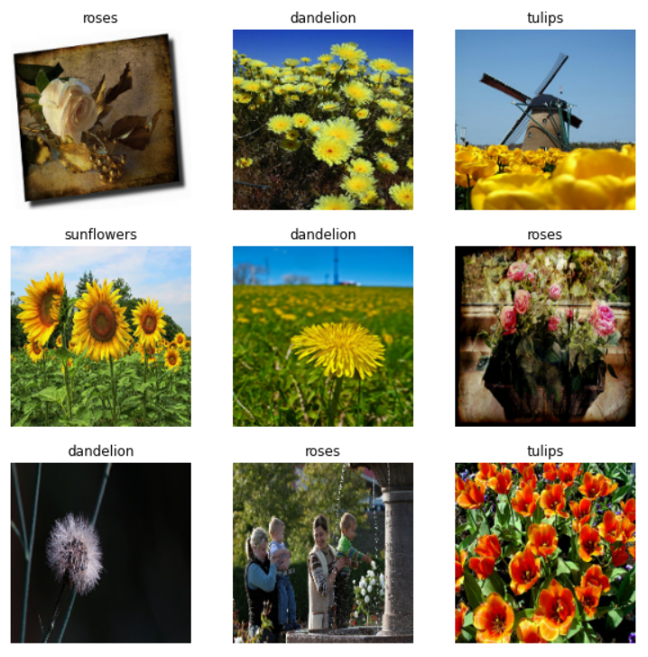

# 加载和预处理图像

- [加载和预处理图像](#加载和预处理图像)
  - [简介](#简介)
  - [配置](#配置)
    - [下载 flowers 数据集](#下载-flowers-数据集)
  - [使用 Keras 工具加载数据](#使用-keras-工具加载数据)
    - [创建数据集](#创建数据集)
    - [可视化数据](#可视化数据)
    - [标准化数据](#标准化数据)
    - [配置数据集性能](#配置数据集性能)
    - [训练模型](#训练模型)
  - [参考](#参考)

2022-01-14, 09:53
@author Jiawei Mao
***

## 简介

下面介绍三种加载和预处理图像数据集的方式：

- 第一种，使用 Keras 预处理工具（如 `tf.keras.utils.image_dataset_from_directory`） 和 layers（如 `tf.keras.layers.Rescaling`）从目录读取图像；
- 第二种，使用 `tf.data` 从头开始编写输入管道；
- 第三种，从 [TensorFlow Datasets](https://www.tensorflow.org/datasets) 下载数据集。

## 配置

```python
import numpy as np
import os
import PIL
import PIL.Image
import tensorflow as tf
import tensorflow_datasets as tfds
```

```python
print(tf.__version__)
```

```sh
2.9.1
```

### 下载 flowers 数据集

本教程使用一个包含几千张花照片的数据集。该数据集包含五个子目录，对应五个类别:

```sh
flowers_photos/
  daisy/
  dandelion/
  roses/
  sunflowers/
  tulips/
```

下载数据集：

```python
import pathlib
dataset_url = "https://storage.googleapis.com/download.tensorflow.org/example_images/flower_photos.tgz"
data_dir = tf.keras.utils.get_file(origin=dataset_url,
                                   fname='flower_photos',
                                   untar=True)
data_dir = pathlib.Path(data_dir)
```

下载完成后（218 MB），可以发现共有 3670 张图片：

```python
image_count = len(list(data_dir.glob('*/*.jpg')))
print(image_count)
```

```sh
3670
```

每个目录都包含该类型花的图像。例如，玫瑰花：

```python
roses = list(data_dir.glob('roses/*'))
PIL.Image.open(str(roses[0]))
```


```py
roses = list(data_dir.glob('roses/*'))
PIL.Image.open(str(roses[1]))
```


## 使用 Keras 工具加载数据

使用 `tf.keras.utils.image_dataset_from_directory` 从磁盘上加载图像。

### 创建数据集

定义加载参数：

```py
batch_size = 32
img_height = 180
img_width = 180
```

在开发模型时，最好拆分验证集。这里使用 80% 作为训练集，20% 作为验证集。先创建训练集：

```py
train_ds = tf.keras.utils.image_dataset_from_directory(
    data_dir,
    validation_split=0.2,
    subset="training",
    seed=123,
    image_size=(img_height, img_width),
    batch_size=batch_size)
```

```sh
Found 3670 files belonging to 5 classes.
Using 2936 files for training.
```

再创建验证集：

```py
val_ds = tf.keras.utils.image_dataset_from_directory(
    data_dir,
    validation_split=0.2,
    subset="validation",
    seed=123,
    image_size=(img_height, img_width),
    batch_size=batch_size)
```

```sh
Found 3670 files belonging to 5 classes.
Using 734 files for validation.
```

通过数据集的 `class_names` 属性可以查看类别名称：

```py
['daisy', 'dandelion', 'roses', 'sunflowers', 'tulips']
```

### 可视化数据

查看训练集的前 9 张图像：

```py
import matplotlib.pyplot as plt

plt.figure(figsize=(10, 10))
for images, labels in train_ds.take(1):
    for i in range(9):
        ax = plt.subplot(3, 3, i + 1)
        plt.imshow(images[i].numpy().astype("uint8"))
        plt.title(class_names[labels[i]])
        plt.axis("off")
```



可以将该数据集传入 `model.fit` 训练模型，也饿可以手动迭代数据集，查看不同批次：

```py
for image_batch, labels_batch in train_ds:
    print(image_batch.shape)
    print(labels_batch.shape)
    break
```

```sh
(32, 180, 180, 3)
(32,)
```

`image_batch` 是 shape (32, 180, 180, 3) 的张量，即 32 张 180x180x3 的图像。`label_batch` 是 shape (32,) 的张量，对应 32 张图像的标签。

### 标准化数据

RGB 通道的值在 [0, 255]，不适合神经网络。

下面使用 `tf.keras.layers.Rescaling` 将值缩放到 `[0, 1]`：

```py
normalization_layer = tf.keras.layers.Rescaling(1./255)
```

使用该 layer 的方法有两种。一是调用 `Dataset.map`：

```py
normalized_ds = train_ds.map(lambda x, y: (normalization_layer(x), y))
image_batch, labels_batch = next(iter(normalized_ds))
first_image = image_batch[0]
# 此时像素值在 [0,1] 范围
print(np.min(first_image), np.max(first_image))
```

```sh
0.0 0.96902645
```

第二种是在模型定义中包含该 layer，这样可以简化部署。

> 如果想将像素值缩放到 [-1, 1]，可以使用 `tf.keras.layers.Rescaling(1./127.5, offset=-1)`
> 前面使用 `tf.keras.utils.image_dataset_from_directory` 的 `image_size` 参数调整了图像大小，如果想要将这个步骤也放在模型中，可以使用 `tf.keras.layers.Resizing` layer。

### 配置数据集性能

使用缓冲预取功能，可以避免 I/O 阻塞。下面两个方法对加载数据很重要：

- `Dataset.cache` 在第一个 epoch 从磁盘加载数据后，将其保存在内存。这将确保在训练模型时，数据集不会成为瓶颈。如果数据集太大，无法放入内存，仍然可以使用该方法创建高性能的磁盘缓存。
- `Dataset.prefetch` 训练时数据预处理和模型执行重叠进行。

这两个方法的详细信息，可以参考 [使用 tf.data API 提高性能](../../guide/data_performance.md)。

```py
AUTOTUNE = tf.data.AUTOTUNE

train_ds = train_ds.cache().prefetch(buffer_size=AUTOTUNE)
val_ds = val_ds.cache().prefetch(buffer_size=AUTOTUNE)
```

### 训练模型


## 参考

- https://www.tensorflow.org/tutorials/load_data/images
