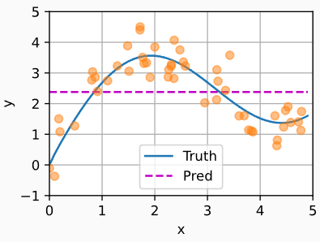

# 注意力

2022-02-22, 18:04
****

## 注意力提示

注意力在我们的环境中是稀缺的，而环境中的信息却并不少。

非自主性提示是基于环境中物体的突出性和易见性。自主性选择受认知和意识的控制，因此注意力在基于自主性提示去辅助选择时更为谨慎。

自主性与非自主性的注意力提示解释了人类的注意力的方式，那么，我们如何通过这两种注意力提示，设计基于神经网络的注意力机制框架。

首先，考虑一个相对简单的情况，即只使用非自主性提示。要向将选择偏向于感官输入，我们可以简单地使用参数化的全连接层，甚至是非参数化的最大汇聚层或平均汇聚层。

在注意力机制的背景下，我们将自主性提示称为**查询**（query）。给定任何查询，注意力机制通过**注意力汇聚**（attention pooling）将选择引导至感官输入（sensory inputs，如中间特征表示）。在注意力机制中，这些感官输入被称为值（value）。简而言之，每个值与一个键（key）配对，我们可以设计注意力汇聚，使给定的查询（自主性提示）可以与键（非自主性提示）进行匹配，这将引导得出最匹配的值（感官输入），如下图所示：


> 注意力机制通过注意力汇聚将查询（自主性提示）和键（非自主性提示）结合在一起，实现对值（感官输入）的选择倾向

总而言之：

- 人类的注意力是有限的、有价值和稀缺的资源；
- 受试者使用非自主性和自主性提示有选择性地引导注意力。前者基于突出性，后者依赖于意识；
- 注意力机制与全连接层或汇聚层的区别源于增加的自主提示；
- 注意力机制通过注意力汇聚使选择偏向于值（感官输入），其中包含查询（自主性提示）和键（非自主性提示）。键和值是成对的。

## 注意力汇聚

1964 年提出的 Nadaraya-Watson 核回归模型是一个简单但完整的例子，可用于演示具有注意力机制的机器学习。

### 生成数据集

简单起见，考虑下面这个回归问题：给定数据集 $\{(x_1,y_1),...,(x_n,y_n)\}$，如何学习 $f$ 来预测任意新输入 x 的输出 $\hat{y}=f(x)$？

根据非线性函数生成一个人工数据集，并加入噪音项 ϵ:

$$y_i=2sin(x_i)+x_i^{0.8}+\epsilon \tag{1}$$

其中噪音 ϵ 服从均值为 0、标准差为 0.5 的正态分布。

### 平均汇聚

我们先使用最简单的估计器来解决回归问题，基于平均汇聚来计算所有训练样本输出值的平均值：

$$f(x)=\frac{1}{n}\sum_{i=1}^n y_i \tag{2}$$

如下图所示，这个估计器不大聪明的样子：真实函数 Truth 和预测函数 Pred 相差很大。



### 非参数注意力汇聚

显然，平均汇聚忽略了输入 $x_i$。于是 Nadaraya 和 Watson 提出了一个更好的想法，根据输入的位置对输出 $y_i$ 进行加权：

$$f(x)=\sum_{i=1}^n \frac{K(x-x_i)}{\sum_{i=1}^n K(x-x_j)}y_i \tag{3}$$

其中 `K` 是核（kernel）。公式（3）描述的估计器被称为 Nadaraya-Watson 核回归。受此启发，我们从注意力机制框架出发，对（3）进行重写，获得一个更加通用的注意力汇聚（attention pooling）公式：

$$f(x)=\sum_{i=1}^n\alpha (x,x_i)y_i \tag{4}$$

其中 x 是查询，$(x_i, y_i)$ 是键值对，注意力汇聚是 $y_i$ 的加权平均。将查询 x 和键 $x_i$ 之间的关系建模为注意力权重（attention weight）$\alpha (x,x_i)$，这个权重将被分配给每一个对应 $y_i$ 值。对于任何查询，模型在所有键值对注意力权重都是一个有效的概率分布，它们是非负的，总和为 1。

为了更好地理解注意力汇聚，我们考虑一个高斯核（Gaussian kernel），其定义为：

$$K(\mu)=\frac{1}{\sqrt{2\pi}}exp(-\frac{\mu ^2}{2}) \tag{5}$$

将高斯核带入式子（3）和（4）得到：

$$\begin{aligned}
f(x) &=\sum_{i=1}^n\alpha(x,x_i)y_i \\
     &=\sum_{i=1}^n \frac{exp(-\frac{1}{2}(x-x_i)^2)}{\sum_{j=1}^n exp(-\frac{1}{2}(x-x_j)^2)}y_i\\
     &=\sum_{i=1}^n softmax(-\frac{1}{2}(x-x_i)^2)y_i \tag{6}
\end{aligned}$$

键 $x_i$ 越接近给定的查询 x，分配给这个键对应值 $y_i$ 的注意力权重就越大。也就获得了更多的“注意力”。

值得注意的是，Nadaraya-Watson 核回归是一个非参数模型，式(6)是非参数的注意力汇聚（nonparametric attention pooling）模型。接下来，我们基于这个非参数的注意力汇聚模型绘制预测结果。你会发现新的模型预测线是平滑的，并且比平均汇聚的预测更接近真实。


现在，我们来观察注意力的权重。这里测试数据的输出相当于查询，而训练数据的输入相当于键。因为两个输入都是经过排序的，因此由观察可知“查询-键”对越接近，注意力汇聚的注意力权重就越高。


### 带参数注意力汇聚

非参数的 Nadaraya-Watson 核回归具有一致性（consistency）的优点：如果有足够的数据，此模型会收敛到最优结果。尽管如此，我们还是可以轻松地将可学习的参数集成到注意力汇聚中。

与非参注意力汇聚式(6)不同，在下面的查询 x 和键 $x_i$ 之间的距离乘以可学习参数 w:

$$\begin{aligned}
f(x) &= \sum_{i=1}^n \alpha (x,x_i)y_i \\
     &=\sum_{i=1}^n \frac{exp(-\frac{1}{2}((x-x_i)w)^2)}{\sum_{j=1}^n exp(-\frac{1}{2}((x-x_j)w)^2)}y_i\\
     &=\sum_{i=1}^n softmax(-\frac{1}{2}(x-x_i)^2)y_i \tag{7}
\end{aligned}$$

下面，我们通过训练这个模型（7）来学习注意力汇聚的参数。

#### 批量矩阵乘法

为了更有效地计算小批量数据的注意力，我们可以利用深度学习框架中提高的批量矩阵乘法。

假设第一个批量数据包含 n 个矩阵 $X_1,...,X_n$,形状为 $a\times b$，第二个小批量包含 n 个矩阵 $Y_1,...,Y_n$，形状为 $b\times c$。它们的矩阵乘法得到 n 个矩阵 $X_1Y_1,...,X_nY_n$，形状为 $a\times c$。因此，假定两个张量的形状分别是 $(n,a,b)$和 $(n,b,c)$，它们的批量矩阵乘法的输出的形状为$(n,a,c)$.

在注意力机制中，我们可以使用小批量矩阵乘法来计算小批量数据中的加权平均值。

#### 定义模型

基于上面的带参数的注意力汇聚公式，使用小批量矩阵乘法，定义 Nadaraya-Watson 核回归的带参数版本。

```python
class NWKernelRegression(tf.keras.layers.Layer):
    def __init__(self, **kwargs):
        super().__init__(**kwargs)
        self.w = tf.Variable(initial_value=tf.random.uniform(shape=(1,)))

    def call(self, queries, keys, values, **kwargs):
        # 对于训练，“查询”是x_train。“键”是每个点的训练数据的距离。“值”为'y_train'。
        # queries和attention_weights的形状为(查询个数，“键－值”对个数)
        queries = tf.repeat(tf.expand_dims(queries, axis=1), repeats=keys.shape[1], axis=1)
        self.attention_weights = tf.nn.softmax(-((queries - keys) * self.w)**2 /2, axis =1)
        # values的形状为(查询个数，“键－值”对个数)
        return tf.squeeze(tf.matmul(tf.expand_dims(self.attention_weights, axis=1), tf.expand_dims(values, axis=-1)))
```

## 注意力打分函数


## 参考

- 动手学深度学习，Aston Zhang, Mu Li, Zachary C. Lipton, Alexander J. Smola
