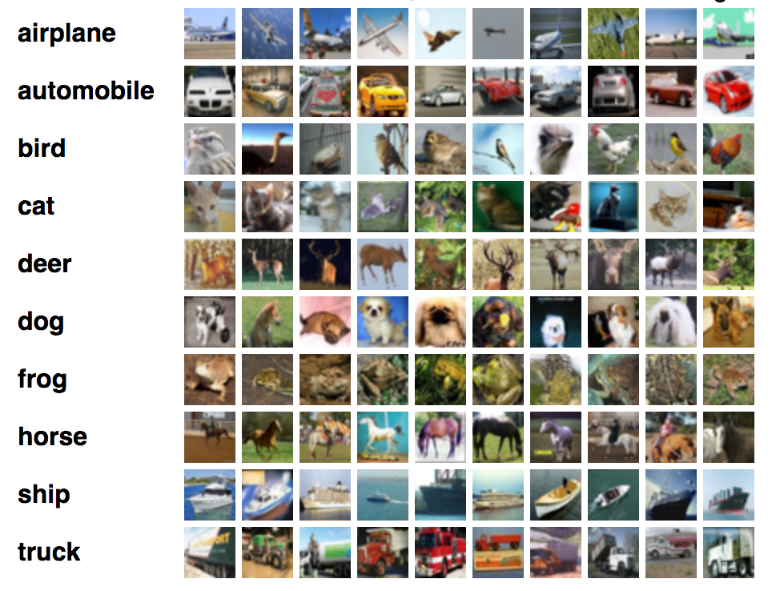
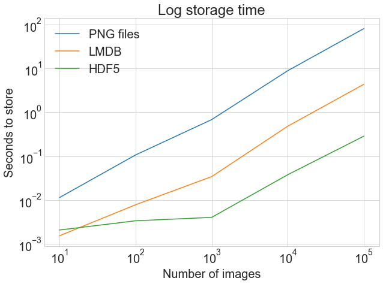
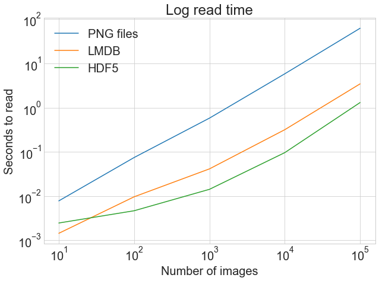
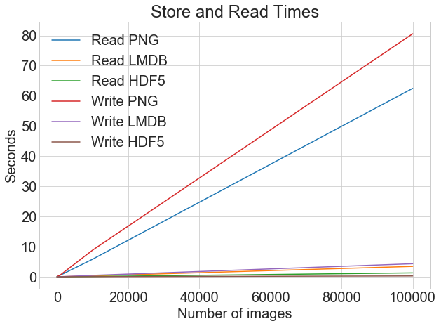

# 在 Python 中读写图像的三种方式

- [在 Python 中读写图像的三种方式](#在-python-中读写图像的三种方式)
  - [配置](#配置)
    - [数据集](#数据集)
    - [LMDB 入门](#lmdb-入门)
    - [HDF5 入门](#hdf5-入门)
  - [保存单张图像](#保存单张图像)
    - [保存到 Disk](#保存到-disk)
    - [保存到 LMDB](#保存到-lmdb)
    - [保存到 HDF5](#保存到-hdf5)
    - [性能对比](#性能对比)
  - [保存多张图像](#保存多张图像)
    - [准备数据](#准备数据)
    - [性能对比](#性能对比-1)
  - [读取单张图像](#读取单张图像)
    - [从 Disk 读取](#从-disk-读取)
    - [从 LMDB 读取](#从-lmdb-读取)
    - [从 HDF5 读取](#从-hdf5-读取)
    - [性能对比](#性能对比-2)
  - [读取多个图像](#读取多个图像)
  - [磁盘占用](#磁盘占用)
  - [总结](#总结)
  - [参考](#参考)


## 配置

### 数据集

下面使用 CIFAR-10 图像数据集进行演示。该数据集包含 60,000 张 32x32 彩色图像，包含 dogs, cat 等 10 个类别。完整的 [TinyImages 数据集](https://groups.csail.mit.edu/vision/TinyImages/) 包含 80M 图像，差不多 400GB。

[CIFAR-10 下载地址](https://www.cs.toronto.edu/~kriz/cifar.html)，Python 版本大约 163MB。



下载并解压，你会发现里面的文件不是图像，它们实际上使用 [cPickle](https://docs.python.org/3/library/pickle.html) 批量保存的序列化格式。

`pickle` 的主要优势是可以序列化任何 Python 对象，缺点是存在安全风险，且不能很好地处理大量数据。

下面 unpickle 5 批文件，并将所有图像加载到 NumPy 数组：

```python
import numpy as np
import pickle
from pathlib import Path

# Path to the unzipped CIFAR data
data_dir = Path(r"D:\repo\datasets\cifar-10-batches-py")

# Unpickle function provided by the CIFAR hosts
def unpickle(file):
    with open(file, "rb") as fo:
        dict = pickle.load(fo, encoding="bytes")
    return dict


images, labels = [], []
for batch in data_dir.glob("data_batch_*"):
    batch_data = unpickle(batch)
    for i, flat_im in enumerate(batch_data[b"data"]):
        im_channels = []
        # Each image is flattened, with channels in order of R, G, B
        for j in range(3):
            im_channels.append(
                flat_im[j * 1024: (j + 1) * 1024].reshape((32, 32))
            )
        # Reconstruct the original image
        images.append(np.dstack((im_channels)))
        # Save the label
        labels.append(batch_data[b"labels"][i])

print("Loaded CIFAR-10 training set:")
print(f" - np.shape(images)     {np.shape(images)}")
print(f" - np.shape(labels)     {np.shape(labels)}")
```

```txt
Loaded CIFAR-10 training set:
 - np.shape(images)     (50000, 32, 32, 3)
 - np.shape(labels)     (50000,)
```

此时所有图像保存在 `images` 变量中。

- 安装 Pillow 用于图像操作：

```powershell
pip install Pillow
```

### LMDB 入门

[LMDB](https://en.wikipedia.org/wiki/Lightning_Memory-Mapped_Database) (Lightning Database) 闪电数据库，使用内存映射文件，速度快。基于键值存储，不是关系数据库。

LMDB 使用 B+ 树数显，即在内存中采用树形结构存储，每个 key-value 为一个 node，每个 node 可以有多个子 node。同一级别的 node 相互连接，便于快速遍历。

B+ 树的大小被设置为与操作系统的页面大小一致，从而在访问数据库中的任何 key-value 对时最大化效率。因此 LMDB 的效率依赖于底层文件系统的具体实现。

另外 LMDB 使用内存映射，它直接返回指向 key 和 value 的内存地址的指针，而不需要复制内存中的内容。

安装 lmdb:

```powershell
pip install lmdb
```

### HDF5 入门

HDF5 (Hierarchical Data Format) 是 HDF 目前维护的版本。

HDF 文件主要包含两种类型对象：

- Datasets
- Groups

Datasets 是多维数组，groups 包含 Datasets 和其它 groups。dataset 可以保存任意大小和类型的多维数组，但是单个 dataset 中维度和类型必须统一。

安装 h5py:

```powershell
pip install h5py
```

## 保存单张图像

对比不同格式的性能，读写文件时间和磁盘存储空间是两个重要标准。

由于不同方法可能针对不同操作和文件数量进行了优化，因此可以比较不同数量的文件之间的性能，从单个图像到 100,000 张图像。由于 5 批 CIFAR-10 加起来只有 50,000 张图像，可以每张图像使用两次。

为了便于演示，为每种方法创建一个文件夹：

```python
from pathlib import Path

disk_dir = Path("data/disk/")
lmdb_dir = Path("data/lmdb/")
hdf5_dir = Path("data/hdf5/")
```

`Path` 不会自动创建目录，需要调用 `mkdir`：

```python
disk_dir.mkdir(parents=True, exist_ok=True)
lmdb_dir.mkdir(parents=True, exist_ok=True)
hdf5_dir.mkdir(parents=True, exist_ok=True)
```

### 保存到 Disk

图像在内存中为 NumPy 数组，希望将其保存为 .png 图像，将 `image_id` 作为文件名。这里用 Pillow 包实现该功能：

```python
from PIL import Image
import csv

def store_single_disk(image, image_id, label):
    """ 
    将单个图像以 png 格式保存到磁盘。
    Parameters:
    ---------------
    image       image array, (32, 32, 3) to be stored
    image_id    integer unique ID for image
    label       image label
    """
    Image.fromarray(image).save(disk_dir / f"{image_id}.png")

    with open(disk_dir / f"{image_id}.csv", "wt") as csvfile:
        writer = csv.writer(
            csvfile, delimiter=" ", quotechar="|", quoting=csv.QUOTE_MINIMAL
        )
        writer.writerow([label])
```

这样就能保存图像。在所有实际应用中，还需要保存图像的元数据，对 CIFAR 数据集，元数据就是图像标签。将图像保存到 disk 时，保存元数据有多种选择。

一种是将标签编码到图像名称中，这样做的好处是不需要额外文件。

这有一个很大的缺点，当使用标签进行任何操作时，都需要处理所有文件。将标签存储在单独的文件中可以单独使用标签，而无需加载图像。这里将标签存储在单个 csv 文件中。

### 保存到 LMDB

LMDB 是一个 key-value 存储系统，每条记录以字节数组的形式保存，对 CIFAR-10 数据集，key 是每个图像的唯一标识符，value 就是图像。key 和 value 都需要是字符串，通常的做法是将 value 序列化为字符串，然后在读出时反序列化。

可以使用 pickle 进行序列化。因此可以序列化任何 Python 对象，所以可以同时包含图像及其元数据。

创建一个 Python 类保存图像及其元数据：

```python
class CIFAR_Image:
    def __init__(self, image, label):
        # 图像维度，用于重建图像，对本数据集实际上不需要，但是有些数据集可能包含不同尺寸的图像
        self.channels = image.shape[2]
        self.size = image.shape[:2]

        self.image = image.tobytes()
        self.label = label

    def get_image(self):
        """ Returns the image as a numpy array. """
        image = np.frombuffer(self.image, dtype=np.uint8)
        return image.reshape(*self.size, self.channels)
```

由于 LMDB 是内存映射的，所以创建新数据库时需要知道它预计会占用多少内存。对本例相对简单，但在其它数据中可能很困难，该参数称为 `map_size`。

最后，LMDB 的读写操作在 `transactions` 中执行。下面是将单个图像保存到 LMDB 的代码：

```python
import lmdb
import pickle

def store_single_lmdb(image, image_id, label):
    """
    保存单个图像到 LMDB
    Parameters:
    ---------------
    image       image array, (32, 32, 3) to be stored
    image_id    integer unique ID for image
    label       image label
    """
    map_size = image.nbytes * 10

    # 创建一个新的 LMDB 环境
    env = lmdb.open(str(lmdb_dir / f"single_lmdb"), map_size=map_size)

    # Start a new write transaction
    with env.begin(write=True) as txn:
        # All key-value pairs need to be strings
        value = CIFAR_Image(image, label)
        key = f"{image_id:08}"
        txn.put(key.encode("ascii"), pickle.dumps(value))
    env.close()
```

> **NOTE:** 计算每个 key-value 所占用的准确字节数很合理。
> 对图像大小不一的数据集不好计算，但是可以用 `sys.getsizeof()` 获得一个合理的近似。需要注意的是，`sys.getsizeof(CIFAR_IMAGE)` 返回的是类定义的大小，即 1056，而不是实例化对象的大小。另外，该函数无法计算嵌套项、列表或包含其它对象引用的对象。
> 也可以使用 `pympler` 工具包来计算对象的确切大小。

### 保存到 HDF5

HDF5 可以包含多个 dataset，对本示例，可以创建两个数据集，一个保存图像，一个保存元数据：

```python
import h5py

def store_single_hdf5(image, image_id, label):
    """ 
    保存单个图像到 HDF5 文件
    Parameters:
    ---------------
    image       image array, (32, 32, 3) to be stored
    image_id    integer unique ID for image
    label       image label
    """
    # Create a new HDF5 file
    file = h5py.File(hdf5_dir / f"{image_id}.h5", "w")

    # Create a dataset in the file
    dataset = file.create_dataset(
        "image", np.shape(image), h5py.h5t.STD_U8BE, data=image
    )
    meta_set = file.create_dataset(
        "meta", np.shape(label), h5py.h5t.STD_U8BE, data=label
    )
    file.close()
```

`h5py.h5t.STD_U8BE` 指定存储的数据类型，这里为 unsigned-8-bit 整数。

> **NOTE:** 数据类型的选择影响 HDF5 的性能，选择足够满足需求的类型即可。

### 性能对比

将三个函数放到一个 dict，后续直接调用：

```python
_store_single_funcs = dict(
    disk=store_single_disk, lmdb=store_single_lmdb, hdf5=store_single_hdf5
)
```

保存 CIFAR 第一张图像及其标签，以三种不同的方式进行存储：

```python
from timeit import timeit

store_single_timings = dict()

for method in ("disk", "lmdb", "hdf5"):
    t = timeit(
        "_store_single_funcs[method](image, 0, label)",
        setup="image=images[0]; label=labels[0]",
        number=1,
        globals=globals(),
    )
    store_single_timings[method] = t
    print(f"Method: {method}, Time usage: {t}")
```

```txt
Method: disk, Time usage: 0.011353199999999841
Method: lmdb, Time usage: 0.003095300000000023
Method: hdf5, Time usage: 0.0018091999999998443
```

|方法|保存单张图像+元数据|大小|
|---|---|---|
|Disk|11.353 ms|4 K|
|LMDB|3.095 ms|40 K|
|HDF5|1.809 ms|8 K|

总结：

- 所有方法都比较快
- LMDB 占用磁盘最多

## 保存多张图像

保存多个图像，对保存到 disk，多次调用 `store_single_disk` 即可，但对 LMDB 或 HDF5 则不同。

```python
def store_many_disk(images, labels):
    """
    图像数组保存到 disk
    Parameters:
    ---------------
    images       images array, (N, 32, 32, 3) to be stored
    labels       labels array, (N, 1) to be stored
    """
    num_images = len(images)

    # 逐个保存图像
    for i, image in enumerate(images):
        Image.fromarray(image).save(disk_dir / f"{i}.png")

    # 所有标签保存到一个 csv 文件
    with open(disk_dir / f"{num_images}.csv", "w") as csvfile:
        writer = csv.writer(
            csvfile, delimiter=" ", quotechar="|", quoting=csv.QUOTE_MINIMAL
        )
        for label in labels:
            # This typically would be more than just one value per row
            writer.writerow([label])


def store_many_lmdb(images, labels):
    """
    图像数组保存到 LMDB
    Parameters:
    ---------------
    images       images array, (N, 32, 32, 3) to be stored
    labels       labels array, (N, 1) to be stored
    """
    num_images = len(images)

    map_size = num_images * images[0].nbytes * 10

    # Create a new LMDB DB for all the images
    env = lmdb.open(str(lmdb_dir / f"{num_images}_lmdb"), map_size=map_size)

    # Same as before — but let's write all the images in a single transaction
    with env.begin(write=True) as txn:
        for i in range(num_images):
            # All key-value pairs need to be Strings
            value = CIFAR_Image(images[i], labels[i])
            key = f"{i:08}"
            txn.put(key.encode("ascii"), pickle.dumps(value))
    env.close()


def store_many_hdf5(images, labels):
    """ Stores an array of images to HDF5.
        Parameters:
        ---------------
        images       images array, (N, 32, 32, 3) to be stored
        labels       labels array, (N, 1) to be stored
    """
    num_images = len(images)

    # Create a new HDF5 file
    file = h5py.File(hdf5_dir / f"{num_images}_many.h5", "w")

    # Create a dataset in the file
    dataset = file.create_dataset(
        "images", np.shape(images), h5py.h5t.STD_U8BE, data=images
    )
    meta_set = file.create_dataset(
        "meta", np.shape(labels), h5py.h5t.STD_U8BE, data=labels
    )
    file.close()
```

### 准备数据

拼接数据，获得所需的 100,000 张图像：

```python
cutoffs = [10, 100, 1000, 10000, 100000]

# Let's double our images so that we have 100,000
images = np.concatenate((images, images), axis=0)
labels = np.concatenate((labels, labels), axis=0)

# Make sure you actually have 100,000 images and labels
print(np.shape(images))
print(np.shape(labels))
```

```txt
(100000, 32, 32, 3)
(100000,)
```

### 性能对比

```python
_store_many_funcs = dict(
    disk=store_many_disk, lmdb=store_many_lmdb, hdf5=store_many_hdf5
)

from timeit import timeit

store_many_timings = {"disk": [], "lmdb": [], "hdf5": []}

for cutoff in cutoffs:
    for method in ("disk", "lmdb", "hdf5"):
        t = timeit(
            "_store_many_funcs[method](images_, labels_)",
            setup="images_=images[:cutoff]; labels_=labels[:cutoff]",
            number=1,
            globals=globals(),
        )
        store_many_timings[method].append(t)

        # Print out the method, cutoff, and elapsed time
        print(f"Method: {method}, Time usage: {t}")
```

下图是大致的性能展示：



可以看到，保存到 png 所需时间最长，保存少量图像时 HDF5 比 LMDB 慢，但随着数据量增加，HDF5 更具有优势。

下面是绘图代码：

```python
import matplotlib.pyplot as plt

def plot_with_legend(
        x_range, y_data, legend_labels, x_label, y_label, title, log=False
):
    """ Displays a single plot with multiple datasets and matching legends.
        Parameters:
        --------------
        x_range         list of lists containing x data
        y_data          list of lists containing y values
        legend_labels   list of string legend labels
        x_label         x axis label
        y_label         y axis label
    """
    plt.style.use("seaborn-whitegrid")
    plt.figure(figsize=(10, 7))

    if len(y_data) != len(legend_labels):
        raise TypeError(
            "Error: number of data sets does not match number of labels."
        )

    all_plots = []
    for data, label in zip(y_data, legend_labels):
        if log:
            temp, = plt.loglog(x_range, data, label=label)
        else:
            temp, = plt.plot(x_range, data, label=label)
        all_plots.append(temp)

    plt.title(title)
    plt.xlabel(x_label)
    plt.ylabel(y_label)
    plt.legend(handles=all_plots)
    plt.show()


# Getting the store timings data to display
disk_x = store_many_timings["disk"]
lmdb_x = store_many_timings["lmdb"]
hdf5_x = store_many_timings["hdf5"]

plot_with_legend(
    cutoffs,
    [disk_x, lmdb_x, hdf5_x],
    ["PNG files", "LMDB", "HDF5"],
    "Number of images",
    "Seconds to store",
    "Storage time",
    log=False,
)

plot_with_legend(
    cutoffs,
    [disk_x, lmdb_x, hdf5_x],
    ["PNG files", "LMDB", "HDF5"],
    "Number of images",
    "Seconds to store",
    "Log storage time",
    log=True,
)
```

存储空间：

- Disk: 390 MB
- HDF5: 325 MB
- LMDB: 3.17 GB

## 读取单张图像

### 从 Disk 读取

在三种方法中，由于序列化步骤，LMDB 操作最繁琐。

从 .png 和 .csv 文件读取单个图像文件及其元数据：

```python
def read_single_disk(image_id):
    """
    读取单个 PNG 图像为
    Parameters:
    ---------------
    image_id    integer unique ID for image

    Returns:
    ----------
    image       image array, (32, 32, 3) to be stored
    label       associated meta data, int label
    """
    image = np.array(Image.open(disk_dir / f"{image_id}.png"))

    with open(disk_dir / f"{image_id}.csv", "r") as csvfile:
        reader = csv.reader(
            csvfile, delimiter=" ", quotechar="|", quoting=csv.QUOTE_MINIMAL
        )
        label = int(next(reader)[0])

    return image, label
```

### 从 LMDB 读取

```python
def read_single_lmdb(image_id):
    """
    从 LMDB 读取单个图像
    Parameters:
    ---------------
    image_id    integer unique ID for image

    Returns:
    ----------
    image       image array, (32, 32, 3) to be stored
    label       associated meta data, int label
    """
    # 打开 LMDB 环境
    env = lmdb.open(str(lmdb_dir / f"single_lmdb"), readonly=True)

    # Start a new read transaction
    with env.begin() as txn:
        # Encode the key the same way as we stored it
        data = txn.get(f"{image_id:08}".encode("ascii"))
        # Remember it's a CIFAR_Image object that is loaded
        cifar_image = pickle.loads(data)
        # Retrieve the relevant bits
        image = cifar_image.get_image()
        label = cifar_image.label
    env.close()

    return image, label
```

### 从 HDF5 读取

```python
def read_single_hdf5(image_id):
    """
    从 HDF5 读取单张图像
    Parameters:
    ---------------
    image_id    integer unique ID for image

    Returns:
    ----------
    image       image array, (32, 32, 3) to be stored
    label       associated meta data, int label
    """
    # Open the HDF5 file
    file = h5py.File(hdf5_dir / f"{image_id}.h5", "r+")

    image = np.array(file["/image"]).astype("uint8")
    label = int(np.array(file["/meta"]).astype("uint8"))

    return image, label
```

### 性能对比

```python
_read_single_funcs = dict(
    disk=read_single_disk, lmdb=read_single_lmdb, hdf5=read_single_hdf5
)
from timeit import timeit

read_single_timings = dict()

for method in ("disk", "lmdb", "hdf5"):
    t = timeit(
        "_read_single_funcs[method](0)",
        setup="image=images[0]; label=labels[0]",
        number=1,
        globals=globals(),
    )
    read_single_timings[method] = t
    print(f"Method: {method}, Time usage: {t}")
```

```txt
Method: disk, Time usage: 0.016301200000000904
Method: lmdb, Time usage: 0.0010626999999914233
Method: hdf5, Time usage: 0.00488690000000247
```

|Method|Read Single Image + Meta|
|---|---|
|Disk|16.301 ms|
|LMDB|1.062 ms|
|HDF5|4.886 ms|

单张图像的速度差异不明显。

## 读取多个图像

```python
def read_many_disk(num_images):
    """
    读取 PNG 图像
    Parameters:
    ---------------
    num_images   number of images to read

    Returns:
    ----------
    images      images array, (N, 32, 32, 3) to be stored
    labels      associated meta data, int label (N, 1)
    """
    images, labels = [], []

    # Loop over all IDs and read each image in one by one
    for image_id in range(num_images):
        images.append(np.array(Image.open(disk_dir / f"{image_id}.png")))

    with open(disk_dir / f"{num_images}.csv", "r") as csvfile:
        reader = csv.reader(
            csvfile, delimiter=" ", quotechar="|", quoting=csv.QUOTE_MINIMAL
        )
        for row in reader:
            labels.append(int(row[0]))
    return images, labels


def read_many_lmdb(num_images):
    """
    从 LMDB 读取图像
    Parameters:
    ---------------
    num_images   number of images to read

    Returns:
    ----------
    images      images array, (N, 32, 32, 3) to be stored
    labels      associated meta data, int label (N, 1)
    """
    images, labels = [], []
    env = lmdb.open(str(lmdb_dir / f"{num_images}_lmdb"), readonly=True)

    # Start a new read transaction
    with env.begin() as txn:
        # Read all images in one single transaction, with one lock
        # We could split this up into multiple transactions if needed
        for image_id in range(num_images):
            data = txn.get(f"{image_id:08}".encode("ascii"))
            # Remember that it's a CIFAR_Image object
            # that is stored as the value
            cifar_image = pickle.loads(data)
            # Retrieve the relevant bits
            images.append(cifar_image.get_image())
            labels.append(cifar_image.label)
    env.close()
    return images, labels


def read_many_hdf5(num_images):
    """
    从 HDF5 读取图像
    Parameters:
    ---------------
    num_images   number of images to read

    Returns:
    ----------
    images      images array, (N, 32, 32, 3) to be stored
    labels      associated meta data, int label (N, 1)
    """
    # Open the HDF5 file
    images, labels = [], []
    file = h5py.File(hdf5_dir / f"{num_images}_many.h5", "r+")

    images = np.array(file["/images"]).astype("uint8")
    labels = np.array(file["/meta"]).astype("uint8")

    return images, labels


_read_many_funcs = dict(
    disk=read_many_disk, lmdb=read_many_lmdb, hdf5=read_many_hdf5
)
```

```python
from timeit import timeit

read_many_timings = {"disk": [], "lmdb": [], "hdf5": []}

for cutoff in cutoffs:
    for method in ("disk", "lmdb", "hdf5"):
        t = timeit(
            "_read_many_funcs[method](num_images)",
            setup="num_images=cutoff",
            number=1,
            globals=globals(),
        )
        read_many_timings[method].append(t)

        # Print out the method, cutoff, and elapsed time
        print(f"Method: {method}, No. images: {cutoff}, Time usage: {t}")
```



在实践中，写入实践通常没有读取实践重要。

读写时间放一起：



```python
plot_with_legend(
    cutoffs,
    [disk_x_r, lmdb_x_r, hdf5_x_r, disk_x, lmdb_x, hdf5_x],
    [
        "Read PNG",
        "Read LMDB",
        "Read HDF5",
        "Write PNG",
        "Write LMDB",
        "Write HDF5",
    ],
    "Number of images",
    "Seconds",
    "Log Store and Read Times",
    log=False,
)
```

PNG 的读写时间差异较大，LMDB 和 HDF5 则不是很明显。

## 磁盘占用


```python
# Memory used in KB
disk_mem = [24, 204, 2004, 20032, 200296]
lmdb_mem = [60, 420, 4000, 39000, 393000]
hdf5_mem = [36, 304, 2900, 29000, 293000]

X = [disk_mem, lmdb_mem, hdf5_mem]

ind = np.arange(3)
width = 0.35

plt.subplots(figsize=(8, 10))
plots = [plt.bar(ind, [row[0] for row in X], width)]
for i in range(1, len(cutoffs)):
    plots.append(
        plt.bar(
            ind, [row[i] for row in X], width, bottom=[row[i - 1] for row in X]
        )
    )

plt.ylabel("Memory in KB")
plt.title("Disk memory used by method")
plt.xticks(ind, ("PNG", "LMDB", "HDF5"))
plt.yticks(np.arange(0, 400000, 100000))

plt.legend(
    [plot[0] for plot in plots], ("10", "100", "1,000", "10,000", "100,000")
)
plt.show()
```

HDF5 和 LMDB 都比使用普通的 PNG 文件占用更多的磁盘空间。需要注意的是，LMDB 和 HDF5 磁盘占用高度依赖于多种因素，包括操作系统，存储数据大小。

LMDB 通过缓存和利用系统页面大小来提高效率，对于较大的图像，LMDB 会占用更多磁盘，因为图像无法装入 LMDB 的 leaf 页面，因此存在许多溢出页面。

## 总结

- HDF5 比 LMDB 更节省磁盘空间；
- LMDB 文档不完善，相对来说 h5py 文档要完善许多；
- LMDB 写入新数据时不会覆盖或移动现有数据；
- LMDB 的 `map_size` 参数很麻烦；
- 对 LMDB 来说，按顺序访问性能较好，对 HDF5，访问大块数据比逐个访问性能更好；

## 参考

- https://realpython.com/storing-images-in-python/