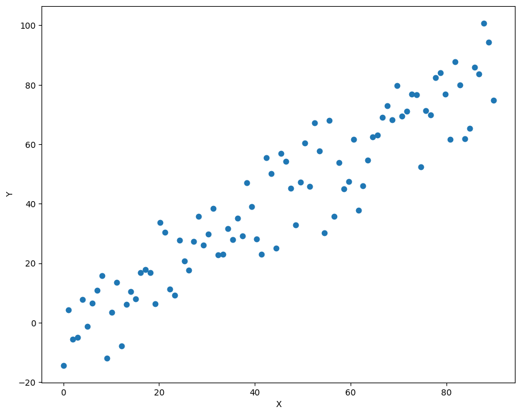
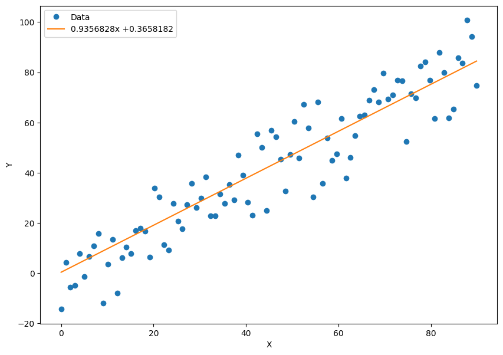
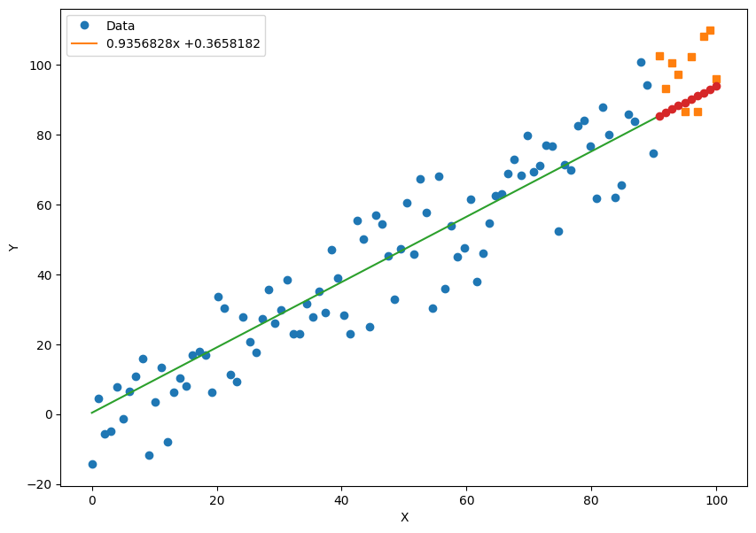

# 房价预测（PyTorch）

- [房价预测（PyTorch）](#房价预测pytorch)
  - [简介](#简介)
  - [准备数据](#准备数据)
  - [设计模型](#设计模型)
  - [训练](#训练)
  - [预测](#预测)

Last updated: 2023-01-30, 19:20
****

## 简介

根据历史数据预测未来的房价。实现一个线性回归模型，并用梯度下降算法求解该模型，从而给出预测直线。

## 准备数据

按理说，我们需要真实的房价数据来进行拟合和预测。简单起见，我们人为编造一批数据，重点关注方法和流程。

首先，我们编造一批时间数据。假设我们每隔一个月能获得一次房价数据，那么时间数据就可以为 0, 1, …，表示第 0、1、2……个月份，这里用PyTorch的`linspace` 函数来生成 0~100 之间的均匀数字作为时间变量 x：

```python
x = torch.linspace(0, 100, steps=100)
```

加上一点随机噪声：

```python
rand = torch.randn(100) * 10
y = x + rand
```

现在有 100 个时间点 $x_i$ 和对应的房价 $y_i$。

下面将数据分为训练集和测试集。前 90 个作为训练集，后 10 个作为测试集：

```python
x_train = x[:-10]
x_test = x[-10:]
y_train = y[:-10]
y_test = y[-10:]
```

可视化训练集：

```python
import matplotlib.pyplot as plt

plt.figure(figsize=(10, 8))  #设定绘制窗口大小为10*8 inch
plt.plot(x_train.numpy(), y_train.numpy(), 'o')
plt.xlabel('X')
plt.ylabel('Y')
plt.show()
```



从散点图可以看出整体呈线性，所以用线性回归来进行拟合。

## 设计模型

线性拟合：

$$y=ax+b$$

损失函数定义为均方差：

$$L=\frac{1}{N}\sum_i^N (y_i-\hat{y}_i)=\frac{1}{N}\sum_i^N(y_i-ax_i-b)^2$$

计算思路：使用 PyTorch 的 `backward()` 计算损失 L 对 a 和 b 的偏导数，然后按照梯度下降更新 a 和 b。

## 训练

定义微分变量 a 和 b，取随机值：

```python
a = torch.rand(1, requires_grad=True)
b = torch.rand(1, requires_grad=True)
```

设置学习率：

```python
learning_rate = 0.0001
```

然后迭代 1000 次：

```python
for i in range(1000):
    predictions = a.expand_as(x_train) * x_train + b.expand_as(x_train)  #计算在当前a、b条件下的模型预测数值
    loss = torch.mean((predictions - y_train) ** 2)  #通过与标签数据y比较，计算误差
    print('loss:', loss)
    loss.backward()  #对损失函数进行梯度反传
    with torch.no_grad():
        a.add_(- learning_rate * a.grad.data)
        b.add_(- learning_rate * b.grad.data)
        a.grad.zero_()  #清空a的梯度数值
        b.grad.zero_()  #清空b的梯度数值
```

绘制拟合结果：

```python
x_data = x_train.data.numpy()  # 获得x包裹的数据
plt.figure(figsize=(10, 7))  #设定绘图窗口大小
xplot, = plt.plot(x_data, y_train.numpy(), 'o')  # 绘制原始数据
yplot, = plt.plot(x_data, a.data.numpy() * x_data + b.data.numpy())  #绘制拟合数据
plt.xlabel('X')  #更改坐标轴标注
plt.ylabel('Y')  #更改坐标轴标注
str1 = str(a.data.numpy()[0]) + 'x +' + str(b.data.numpy()[0])  #图例信息
plt.legend([xplot, yplot], ['Data', str1])  #绘制图例
plt.show()
```



## 预测

```python
predictions = a.expand_as(x_test) * x_test + b.expand_as(x_test)  #计算模型的预测结果
predictions  #输出
```

```txt
tensor([85.4279, 86.3730, 87.3182, 88.2633, 89.2084, 90.1536, 91.0987, 92.0438,
        92.9890, 93.9341], grad_fn=<AddBackward0>)
```

将预测结果和实际数据绘制在一起：

```python
x_data = x_train.data.numpy()  # 获得x包裹的数据
x_pred = x_test.data.numpy()
plt.figure(figsize=(10, 7))  #设定绘图窗口大小
plt.plot(x_data, y_train.data.numpy(), 'o')  # 绘制训练数据
plt.plot(x_pred, y_test.data.numpy(), 's')  # 绘制测试数据
x_data = np.r_[x_data, x_test.data.numpy()]
plt.plot(x_data, a.data.numpy() * x_data + b.data.numpy())  #绘制拟合数据
plt.plot(x_pred, a.data.numpy() * x_pred + b.data.numpy(), 'o')  #绘制预测数据
plt.xlabel('X')  #更改坐标轴标注
plt.ylabel('Y')  #更改坐标轴标注
str1 = str(a.data.numpy()[0]) + 'x +' + str(b.data.numpy()[0])  #图例信息
plt.legend([xplot, yplot], ['Data', str1])  #绘制图例
plt.show()
```



方块为实际数据，红色圆点为预测数据。
