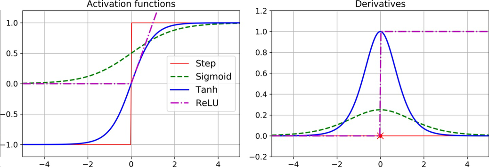

# activations

- [activations](#activations)
  - [简介](#简介)
  - [relu](#relu)
  - [sigmoid](#sigmoid)
  - [softmax](#softmax)
  - [tanh](#tanh)

2021-06-04, 09:35
***

## 简介

包含内置的激活函数。



激活函数及其倒数。

## relu

整流线性单位激活函数。

```python
tf.keras.activations.relu(
    x, alpha=0.0, max_value=None, threshold=0
)
```

默认为标准的 ReLU 激活函数： `max(x, 0)` 。

修改默认参数可以使用非 0 阈值，可以修改函数的最大值，对低于阈值的数值可以使用非零倍数。

| 参数 | 说明 |
| --- | --- |
| x | 输入 tensor 或 variable |
| alpha | float，对低于阈值的数值的斜率 |
| max_value | float，饱和阈值，即函数可以返回的最大值 |
| threshold | float，激活函数阈值，即低于该值会被设置为 0 |

返回： `Tensor` ，和输入 tensor 对应，shape 和 dtype 和输出 `x` 相同。

## sigmoid

$$f(x) = \frac{1}{1+e^{-x}}$$

```py
tf.keras.activations.sigmoid(x)
```

sigmoid 激活函数。对较小值（< -5）， `sigmoid` 返回值接近 0，对较大值（> 5），返回值接近 1.

## softmax

$$\sigma(z)_j=\frac{e^{z_j}}{\sum_{k=1}^{K}e^{z_k}}$$

```python
tf.keras.activations.softmax(
    x, axis=-1
)
```

softmax 将实数向量转换为分类概率向量。输出向量的元素值在 (0, 1) 之间，加和为 1.

每个向量单独处理， `axis` 指定将 softmax 应用于哪个轴。

softmax 一般用于分类网络的最后一层，其结果可以解释为概率分布。

## tanh

双曲正切激活函数。

```py
tf.keras.activations.tanh(x)
```

例如：

```py
a = tf.constant([-3.0,-1.0, 0.0,1.0,3.0], dtype = tf.float32)
b = tf.keras.activations.tanh(a)
b.numpy()
```
