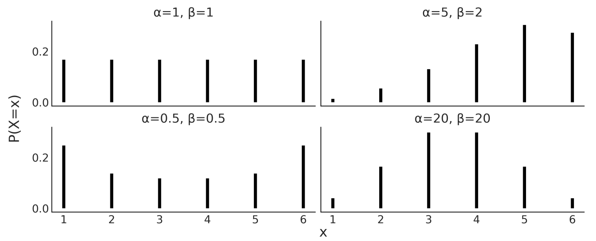

# 贝叶斯概述

## 概念

### 样本空间和事件

样本空间：可能的样本分布。

事件：样本空间的子集。

概率：事件发生的可能性

- 最大值为 1，概率为 1 的事件称为必然事件
- 最小值为 0，概率为 0 的事件称为不可能事件

互斥事件：不能同时发生的事件。

概率定义：给定样本空间 $S$, 和事件 $A$, $A$ 是 $S$ 的子集，概率是一个函数 $P$。

函数 $P$ 有以下限制（三个公理）：

1. 事件发生的概率为非负数；
2. $P(S)=1$
3. 如果 $A_1, A_2,...$ 为互斥事件，即它们不能同时发生，那么 $P(A_1,A_2,\cdots)=P(A_1)+P(A_2)+\cdots$

> 公理，公认为真的理论，可以作为推理的起点。

概率，就是一种特殊的函数，没有什么特别的。

### 随机变量

随机变量：将样本空间映射到实数 $\Reals$ 的函数。

例如，如果变量 $X$ 代表掷一次筛子的点数，那么其值 $x$ 包含整数 $\{1, 2, 3, 4, 5, 6\}$。此时可以用：

- $P(X=3)$ 表示获得 3 的概率；
- $P(X=x)$ 表示获得 $x$ 的概率；
- $P(X\le x)$ 表示获得值小于等于 $x$ 的概率。

随机变量的用处与 Python 函数类似：将代码封装在函数中，就可以存储、重用和隐藏对数据的复杂操作。还可以将多个函数组合起来使用。随机变量在统计学中起着类似作用。

样本空间到 $\R$ 的映射是确定的，没有随机性。那么为什么称为随机变量？因为我们可以反复从变量请求值，每次获得的值都看额能不同。随机性来自与事件相关的概率。

随机变量分为离散型和连续型。

### 离散随机变量的分布

概率分布（probability distribution）：所有可能事件的概率。

以圆为例：
$$
x^2+y^2=r^2
$$
给定参数 $r$，就能够定义一个圆（忽略圆心问题）。

概率分布和圆一样，都有其数学表达式和对应的参数，每个不同的参数值对应一个成员。例如，下图是 `BetaBinomial` 分布的 4 个成员，bar 的高度为对应 $x$ 值的概率。$x$ 小于 1 或大于 6 时，概率为 0。

> `BetaBinomial` 分布包含参数 $\alpha$ 和 $\beta$。
>
> 图示：http://www.distributome.org/js/calc/BetaBinomialCalculator.html

`BetaBinomial` 分布的**概率质量函数**（probability mass function）：
$$
pmf(x)=\binom{n}{x}\frac{B(x+\alpha, n-x+\beta)}{B(\alpha, \beta)}
$$

对离散随机变量，pmf 函数返回对应 $x$ 值的概率，即 $pmf(x)=P(X=x)$。

理解或记住 `BetaBinomial` 对我们来说毫无意义。这里只是要说明，概率分布就是一个函数。

数学表达式非常有用，它很简洁，可以用来推导属性，但是理解起来比较困难。可视化则可以更好的帮助我们理解概率分布。

### 连续随机变量的分布

正态分布是最广为人知的连续随机变量分布。

连续随机变量的概率用**概率密度函数**（probability density function, pdf）表示，但是和 $x$ 对应的函数值不是概率，而是概率密度，通过积分获得概率：
$$
P(a<X<b)=\int_a^b pdf(x)dx
$$

### 累计分布函数

除了 pmf 和 pdf，还可以已使用**累计分布函数**（cumulative distribution function, cdf）描述分布。

随机变量 $X$ 的累计分布函数 $F_X$ 定义为：
$$
F_X(x)=P(X\le x)
$$
即获得小于等于 $x$ 的概率。

### 条件概率

给定两个事件 $A$ 和 $B$，$P(B)>0$，$B$ 发生的条件下 $A$ 的概率记为 $P(A|B)$：
$$
P(A|B)=\frac{P(A,B)}{P(B)}
$$
 $P(A,B)$ 是事件 A 和 B 同时发生的概率。

$P(A|B)$ 被称为**条件概率**，它是在已经事件 B 发生时，事件 A 发生的概率。

- 条件概率可以大于、小于或等于无条件概率。
- 如果知道 B 不能提供关于 A 的信息，则 $P(A|B)=P(A)$，即 A 和 B 相互独立。
- 相反，如果 B 提供了关于 A 的有用信息，那么条件概率可能大于或小于无条件概率，取决于知道 B 是使 A 发生的可能性增加还是减小。

以掷筛子为例，对均匀 6 面骰子，获得 3 的概率为 $P(X=3)=1/6$：

- 如果知道是奇数，则 $P(X=3|X=\{1,3,5\})=1/3$；
- 如果知道是偶数，则 $P(X=3|X=\{2,4,6\})=0$；

可以发现，以发现的数据为条件，实际上改变了样本空间。

**条件概率**是统计学的核心。

如下图所示：

- 中心部分以灰度表示概率 $P(A,B)$，颜色越深概率密度越高。
- 上边和右边为 $p(A)$ 和 $p(B)$ 的**边缘分布**（marginal distributions）。
- 要计算 A 的边缘分布，计算联合概率 $p(A,B)$ 在 B 上的平均值，直观上就是将联合分布投影到一个维度。
- 图中虚线是 3 个不同 B 值的条件概率 $p(A|B)$，通过给定 B 值计算联合概率 $p(A,B)$ 获得。可以将其看作给定 B 值 A 的分布。

### 期望值

如果 $X$ 是离散随机变量，那么其期望值为：
$$
E(X)=\sum_x xP(X=x)
$$
这就是均值，或者加权平均值。

期望值，计算的是分布的平均值。

只要确定了分布的参数，理论上就可以计算它的期望值。就和圆一样，知道了半径，就可以计算圆的面积。

另一个期望值为方差（variance），方差描述分布的扩散。标准差的单位与变量相同，使用比方差更广泛。

均值和方差又称为分布的**矩**（moment），其它的矩还有：

- 偏度（skewness, $\gamma$）：分布的不对称性；
- 峰度（kurtosis, $\kappa$）：tails 和 extreme 值。

### 贝叶斯理论

Bayes 定理：

$$
p(\theta|Y)=\frac{p(Y|\theta)p(\theta)}{p(Y)}
$$

这就是 Bayes 统计的核心。

根据条件概率公式很容易推导出 Bayes 定理：
$$
p(\theta,Y)=p(\theta|Y)p(Y)=p(Y|\theta)p(\theta)
$$

因此：

$$
p(\theta|Y)=\frac{p(Y|\theta)p(\theta)}{p(Y)}
$$

为什么贝叶斯定理很重要？

如果 $Y$ 是因，$\theta$ 是果，那么贝叶斯定理将从因到果，转换为从果到因。

$p(\theta,Y)$ 和 $p(Y|\theta)$ 很可能不一样。例如，一个阿根廷人为教皇的概率，和教皇为阿根廷人的概率不同。47,000,000 阿根廷人，只有一个是教皇，即 $p(教皇|阿根廷人)\approx \frac{1}{47000000}$，但是教皇一定是阿根廷人呢，即 $p(阿根廷人|教皇)=1$。

如果将 $\theta$ 替换为假设，将 $Y$ 替换为数据，贝叶斯定理告诉我们如何根据数据 $Y$ 计算假设 $\theta$ 的概率。那么，如何将一个假设转换为贝叶斯可以处理的东西呢？这就要用到概率分布。

这里，假设的概率非常狭义，通常就是对一个概率分布函数的参数的假设。

下面再次对贝叶斯定理的不同部分进行解释：

说明：

- **先验分布**（prior distribution）$p(\theta)$：反应我们看到数据 Y 之前对参数 $\theta$ 的了解。

- **似然**（likelihood）$p(Y|\theta)$：在这里将数据引入分析，它表示给定参数下数据的合理性，即观测到样本 $Y$ 的**条件概率**。

- **后验分布**（posterior distribution）$p(\theta|Y)$：后验分布是 Bayes 分析的结果，反映了给定数据和模型下我们对问题的所有了解。

  后验分布是模型参数的概率分布，不是单个值。后验分布是先验分布和似然之间的平衡。从概念上讲，后验是根据数据更新先验得到的结果。理论上，一个 bayes 分析得到的后验可以作为另一个分析的先验。因此，贝叶斯特别适合按顺序提供的数据。

- **边缘似然**（marginal likelihood）$p(Y)$：有时也称为证据，是观测到的数据在参数所有可能取值上的平均概率。可以写为 $\int_{\Theta}p(Y|\theta)p(\theta)d\theta$。边缘似然可以看作一个 **Normalization** 因子，确实后验分布 pmf  或 pdf 取值合适。如果忽略边缘似然，贝叶斯定理可以写为：

$$
p(\theta|Y)\propto p(Y|\theta)p(\theta)
$$

## 概率

概率可以解释为长期实验的结果，其反复实验，得到指定结果的比例大概有多少。这通常称为**频率论**解释（frequentist）。

概率的另一种解释为主观解释（subjective）或 **Bayes 解释**（Bayesian interpretation），将概率看作对事件不确定性的度量。即概率是我们对世界的认知状态，不一定是基于重复试验。

## 概率，不确定性和逻辑

概率可以帮助我们量化不确定性。

如果我们没有关于某个问题的信息，则可以假设，每一种可能事件等可能发生，即每个可能的事件分配相同概率。在没有信息时，不确定性最大。

如果知道某些事件发生的可能性更大，那么就可以提高这些事件的概率，而赋予其它事件更低的概率。

事件：只是变量可以取的任何可能值（或子集）。

概率的概念也与逻辑学有关。逻辑的 true 和 false 对应概率的极限情况。

> **贝叶斯精神**
>
> 概率用来衡量我们对参数的不确定性，贝叶斯定理是一种根据新的数据更新概率的方法，期望减少这种不确定性。

## 单个参数推断

到目前对贝叶斯统计的概念有了基本了解，下面通过一个简单的例子来介绍如何做贝叶斯统计。即采用贝叶斯方法推断单个未知参数。

### (1) 抛硬币问题

抛硬币问题，或者是 BetaBinomial 模型，是一个统计学中的经典问题：多次抛硬币，记录正面和反面的次数。基于试验数据，判断硬币是否均匀？或者说，硬币的 bias 有多大。

抛硬币问题是学习 Bayes 统计基础的很好示例，因为它的模型简单，求解和计算容易。此外，许多现实问题都是这种 binary 形式。

为了估计硬币的 bias，或者说，采用贝叶斯分析回答任何问题，都需要**数据**和**概率模型**。对抛硬币问题，假设抛了多次，记录观察到正面的次数，数据收集已完成。下面详细介绍模型。

第一步，概括 bias 的概念。设硬币总是正面的 bias 为 1，总是反面的 bias 为 0，bias 为 0.5 表示一半正面一半反面。用参数 $\theta$ 表示 bias，变量 $Y$ 表示正面次数。根据 Bayes 定理，还需要先验 $p(\theta)$ 和似然 $p(Y|\theta)$。

### (2) 选择似然度

选择 likelihood，就是选择条件概率 $p(Y|\theta)$ 的模型。假设：

- 只有两种可能的结果：正面和反面；
- 两次抛硬币互相不影响，即抛硬币相互独立；
- 所有抛硬币都来自相同的分布；

因此，随机变量抛硬币是**独立同分布**变量（independent and identically distributed, iid）。

基于这些假设，二项分布是 likelihood 的良好近似：
$$
p(Y|\theta)=\binom{N}{y}\theta^y(1-\theta)^{N-y}
$$

其中 $\binom{N}{y}$ 为归一化因子。

这是一个离散分布，在给定 $\theta$ 下，返回 $N$ 次抛硬币得到 $y$ 次正面的概率。

下面是 Binomial family 的 9 个分布：

>  对离散分布，概率加和为 1.

对抛硬币问题，二项分布是 likelihood 的合理选择。其中 $\theta$ 是抛硬币得到正面的概率。

### (3) 选择先验

选择 Beta 分布作为先验。Beta 分布在贝叶斯统计中很常用，定义：

$$
p(\theta)=\frac{\Gamma(\alpha+\beta)}{\Gamma(\alpha)+\Gamma(\beta)}\theta^{\alpha-1}(1-\theta)^{\beta-1}
$$

其中 $\frac{\Gamma(\alpha+\beta)}{\Gamma(\alpha)+\Gamma(\beta)}$ 为归一化项。

可以发现，Beta 分布和二项分布很相似，就归一化项不同。其中 $\Gamma$ 表示 gamma 函数，在这里不是很重要，它保证分布的积分为 1。

Beta 分布有两个参数，$\alpha$ 和 $\beta$，下图是 9 个 Beta 分布：

为什么选择 Beta 分布？

- 一个重要原因是 Beta 分布被限制在 0 到 1 之间，和参数 $\theta$ 一样。当需要建模二项变量的比例时，通常使用 Beta 分布。
- 另一个原因是 Beta 分布很灵活。如上图所示，Beta 分布有很多形状，有类似均匀分布、高斯分布，也是类似 U 型分布。
- 第三个原因：Beta 分布是二项分布的共轭先验。当先验分布和 likelihood 结合，返回的后验分布与先验分布具有相同的函数形式，就称它为 likelihood 的共轭先验。

选择二项分布作为似然，Beta 分布作为先验。Beta 分布和二项分布结合，产生的后验依然是 Beta 分布，所以 **Beta 分布是二项分布的共轭先验**。

另外还有一对共轭先验：**正态分布是正态分布的共轭先验**。

贝叶斯分析在很多年都局限于使用共轭先验。共轭性确保了后验的数学可追溯性（tractability），这一点很重要，因为贝叶斯统计的一个常见问题是得到一个无法获得解析解的后验。

现在这已经不是问题，不管是否选择共轭先验，现代计算方法都能够解决。

### (4) 计算后验

根据贝叶斯定理，后验与先验*似然成正比。因此，对抛硬币问题，需要将二项分布与 Beta 分布相乘：

$$

$$
