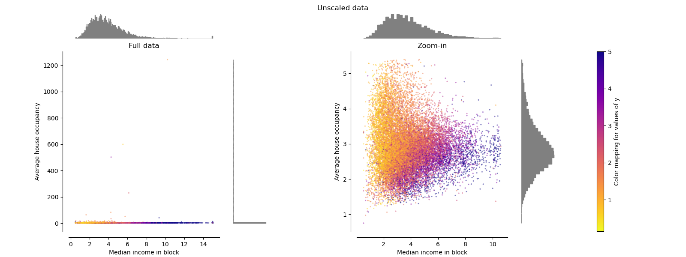
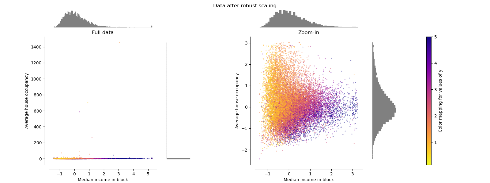
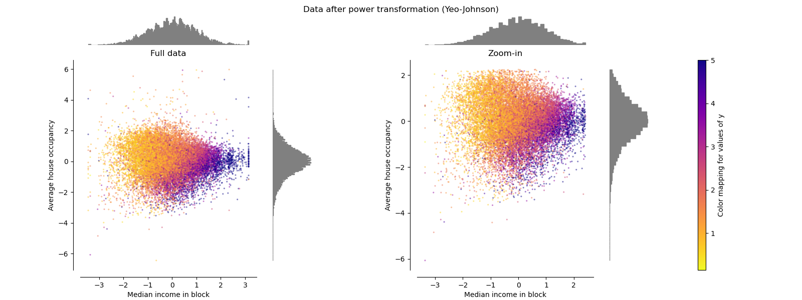
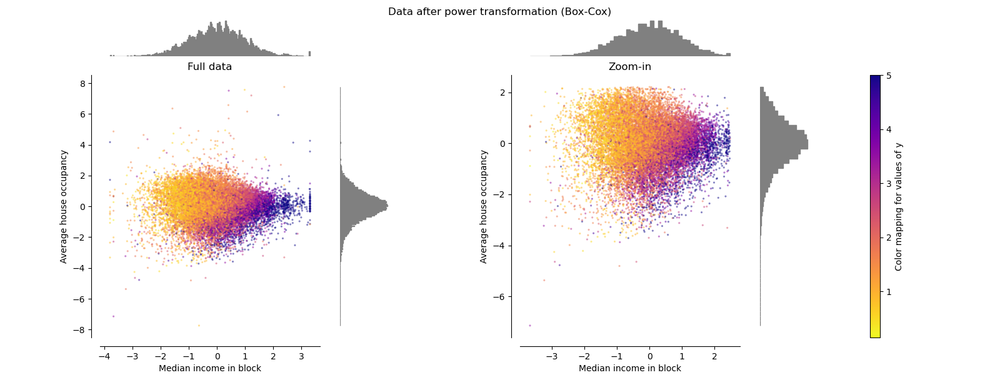
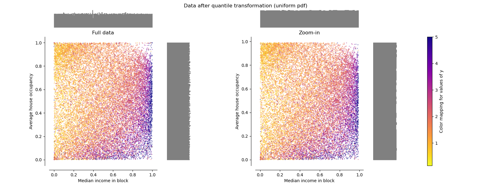
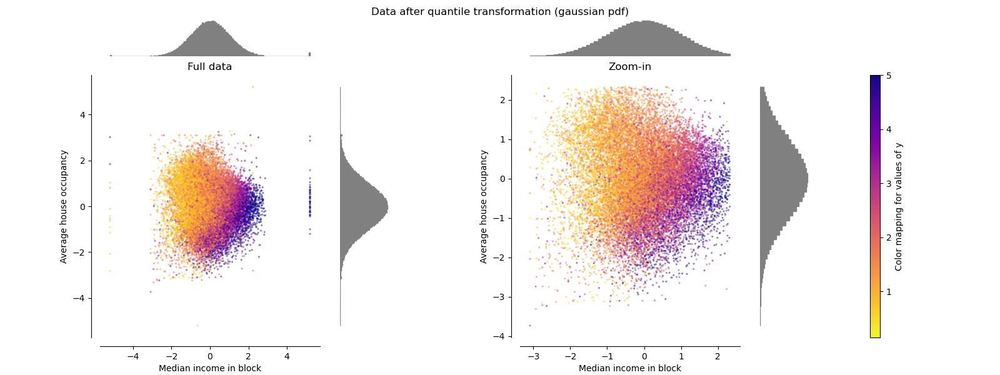
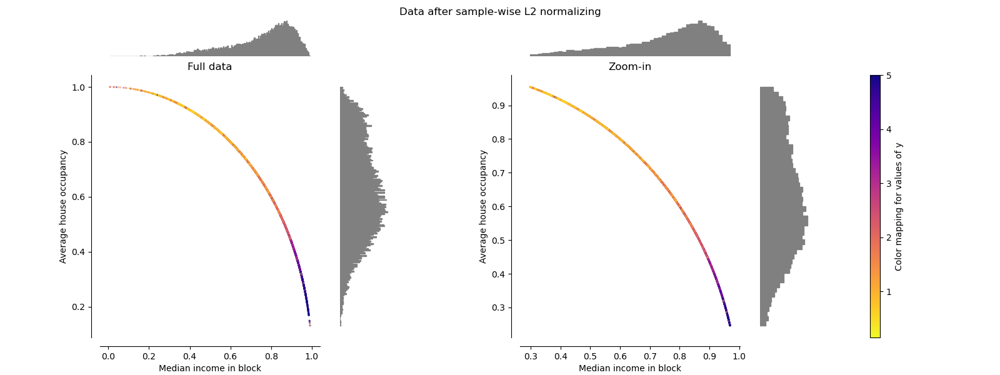

# 不同 scaler 对包含离群值数据集的影响

- [不同 scaler 对包含离群值数据集的影响](#不同-scaler-对包含离群值数据集的影响)
  - [简介](#简介)
  - [原始数据](#原始数据)
  - [StandardScaler](#standardscaler)
  - [MinMaxScaler](#minmaxscaler)
  - [MaxAbsScaler](#maxabsscaler)
  - [RobustScaler](#robustscaler)
  - [PowerTransformer](#powertransformer)
  - [QuantileTransformer (uniform output)](#quantiletransformer-uniform-output)
  - [QuantileTransformer (Gaussian output)](#quantiletransformer-gaussian-output)
  - [Normalizer](#normalizer)
  - [参考](#参考)

Last updated: 2022-06-15, 14:38
@author Jiawei Mao
****

## 简介

[加利福尼亚州住房数据集](../../user_guide/7_Dataset_loading_utilities/7.2_real_world_datasets.md#加利福尼亚州住房数据集) 的特征 0（收入中位数）和特征 5（平均住房占有率）尺度相差很大，并且包含非常大的 outlier。这两个特点使得数据集可视化困难，更重要的是，它们会降低许多机器学习算法的预测性能。未缩放的数据还会减慢甚至阻止许多基于梯度的 estimator 收敛。

事实上，许多 estimator 的设计都假定每个特征的值都接近 0，更重要的是，所有特征都在可比较的尺度上变化。特别是，基于指标（metric）和基于梯度（gradient）的 estimator 通常假设数据分布近似标准化（标准差为 1）。基于决策树的 estimator 是个例外，它对数据的缩放具有鲁棒性。

下面使用不同的缩放器（scaler）、转换器（transformer）和标准化器（normalizer）将数据置于预定义范围。

scaler 为线性变换，不同 scaler 的主要差别在于特征平移和缩放的参数不同。

[QuantileTransformer](../../api/sklearn/preprocessing/QuantileTransformer.md) 提供了非线性变换，该变换使得 outliers 和 inliers 的距离缩小。

[PowerTransformer](../../api/sklearn/preprocessing/PowerTransformer.md) 提供的非线性变换，将数据映射到正态分布，从而稳定方差并最小化偏度（skewness）。

和 transformer 对 feature 进行转换不同，normalizer 对每个样本进行转换。

代码：

```py
# Author:  Raghav RV <rvraghav93@gmail.com>
#          Guillaume Lemaitre <g.lemaitre58@gmail.com>
#          Thomas Unterthiner
# License: BSD 3 clause

import numpy as np

import matplotlib as mpl
from matplotlib import pyplot as plt
from matplotlib import cm

from sklearn.preprocessing import MinMaxScaler
from sklearn.preprocessing import minmax_scale
from sklearn.preprocessing import MaxAbsScaler
from sklearn.preprocessing import StandardScaler
from sklearn.preprocessing import RobustScaler
from sklearn.preprocessing import Normalizer
from sklearn.preprocessing import QuantileTransformer
from sklearn.preprocessing import PowerTransformer

from sklearn.datasets import fetch_california_housing

dataset = fetch_california_housing()
X_full, y_full = dataset.data, dataset.target
feature_names = dataset.feature_names

feature_mapping = {
    "MedInc": "Median income in block",
    "HousAge": "Median house age in block",
    "AveRooms": "Average number of rooms",
    "AveBedrms": "Average number of bedrooms",
    "Population": "Block population",
    "AveOccup": "Average house occupancy",
    "Latitude": "House block latitude",
    "Longitude": "House block longitude",
}

# Take only 2 features to make visualization easier
# Feature MedInc has a long tail distribution.
# Feature AveOccup has a few but very large outliers.
features = ["MedInc", "AveOccup"]
features_idx = [feature_names.index(feature) for feature in features]
X = X_full[:, features_idx]
distributions = [
    ("Unscaled data", X),
    ("Data after standard scaling", StandardScaler().fit_transform(X)),
    ("Data after min-max scaling", MinMaxScaler().fit_transform(X)),
    ("Data after max-abs scaling", MaxAbsScaler().fit_transform(X)),
    (
        "Data after robust scaling",
        RobustScaler(quantile_range=(25, 75)).fit_transform(X),
    ),
    (
        "Data after power transformation (Yeo-Johnson)",
        PowerTransformer(method="yeo-johnson").fit_transform(X),
    ),
    (
        "Data after power transformation (Box-Cox)",
        PowerTransformer(method="box-cox").fit_transform(X),
    ),
    (
        "Data after quantile transformation (uniform pdf)",
        QuantileTransformer(output_distribution="uniform").fit_transform(X),
    ),
    (
        "Data after quantile transformation (gaussian pdf)",
        QuantileTransformer(output_distribution="normal").fit_transform(X),
    ),
    ("Data after sample-wise L2 normalizing", Normalizer().fit_transform(X)),
]

# scale the output between 0 and 1 for the colorbar
y = minmax_scale(y_full)

# plasma does not exist in matplotlib < 1.5
cmap = getattr(cm, "plasma_r", cm.hot_r)


def create_axes(title, figsize=(16, 6)):
    fig = plt.figure(figsize=figsize)
    fig.suptitle(title)

    # define the axis for the first plot
    left, width = 0.1, 0.22
    bottom, height = 0.1, 0.7
    bottom_h = height + 0.15
    left_h = left + width + 0.02

    rect_scatter = [left, bottom, width, height]
    rect_histx = [left, bottom_h, width, 0.1]
    rect_histy = [left_h, bottom, 0.05, height]

    ax_scatter = plt.axes(rect_scatter)
    ax_histx = plt.axes(rect_histx)
    ax_histy = plt.axes(rect_histy)

    # define the axis for the zoomed-in plot
    left = width + left + 0.2
    left_h = left + width + 0.02

    rect_scatter = [left, bottom, width, height]
    rect_histx = [left, bottom_h, width, 0.1]
    rect_histy = [left_h, bottom, 0.05, height]

    ax_scatter_zoom = plt.axes(rect_scatter)
    ax_histx_zoom = plt.axes(rect_histx)
    ax_histy_zoom = plt.axes(rect_histy)

    # define the axis for the colorbar
    left, width = width + left + 0.13, 0.01

    rect_colorbar = [left, bottom, width, height]
    ax_colorbar = plt.axes(rect_colorbar)

    return (
        (ax_scatter, ax_histy, ax_histx),
        (ax_scatter_zoom, ax_histy_zoom, ax_histx_zoom),
        ax_colorbar,
    )


def plot_distribution(axes, X, y, hist_nbins=50, title="", x0_label="", x1_label=""):
    ax, hist_X1, hist_X0 = axes

    ax.set_title(title)
    ax.set_xlabel(x0_label)
    ax.set_ylabel(x1_label)

    # The scatter plot
    colors = cmap(y)
    ax.scatter(X[:, 0], X[:, 1], alpha=0.5, marker="o", s=5, lw=0, c=colors)

    # Removing the top and the right spine for aesthetics
    # make nice axis layout
    ax.spines["top"].set_visible(False)
    ax.spines["right"].set_visible(False)
    ax.get_xaxis().tick_bottom()
    ax.get_yaxis().tick_left()
    ax.spines["left"].set_position(("outward", 10))
    ax.spines["bottom"].set_position(("outward", 10))

    # Histogram for axis X1 (feature 5)
    hist_X1.set_ylim(ax.get_ylim())
    hist_X1.hist(
        X[:, 1], bins=hist_nbins, orientation="horizontal", color="grey", ec="grey"
    )
    hist_X1.axis("off")

    # Histogram for axis X0 (feature 0)
    hist_X0.set_xlim(ax.get_xlim())
    hist_X0.hist(
        X[:, 0], bins=hist_nbins, orientation="vertical", color="grey", ec="grey"
    )
    hist_X0.axis("off")
```

每个 scaler/normalizer/transformer 显示两个图。左图显示完整数据集的散点图，右图则排除了 1% 的 outliers，只考虑 99% 的值。另外，每个特征的边缘分布显示在散点图边上。

```py
def make_plot(item_idx):
    title, X = distributions[item_idx]
    ax_zoom_out, ax_zoom_in, ax_colorbar = create_axes(title)
    axarr = (ax_zoom_out, ax_zoom_in)
    plot_distribution(
        axarr[0],
        X,
        y,
        hist_nbins=200,
        x0_label=feature_mapping[features[0]],
        x1_label=feature_mapping[features[1]],
        title="Full data",
    )

    # zoom-in
    zoom_in_percentile_range = (0, 99)
    cutoffs_X0 = np.percentile(X[:, 0], zoom_in_percentile_range)
    cutoffs_X1 = np.percentile(X[:, 1], zoom_in_percentile_range)

    non_outliers_mask = np.all(X > [cutoffs_X0[0], cutoffs_X1[0]], axis=1) & np.all(
        X < [cutoffs_X0[1], cutoffs_X1[1]], axis=1
    )
    plot_distribution(
        axarr[1],
        X[non_outliers_mask],
        y[non_outliers_mask],
        hist_nbins=50,
        x0_label=feature_mapping[features[0]],
        x1_label=feature_mapping[features[1]],
        title="Zoom-in",
    )

    norm = mpl.colors.Normalize(y_full.min(), y_full.max())
    mpl.colorbar.ColorbarBase(
        ax_colorbar,
        cmap=cmap,
        norm=norm,
        orientation="vertical",
        label="Color mapping for values of y",
    )
```

## 原始数据

每个变换都绘制两个变换特征，左侧为整个数据集，右侧为去除 outliers 后的图。大多数样本都在一个特定范围，收入中位数为 [0, 10]，平均住房占有率为 [0, 6]。包含部分 outlier，例如部分平均住房占有率达到 1200。下面，我们将介绍不同预处理方法在处理 outlier 时的效果。

```py
make_plot(0)
```



## StandardScaler

[StandardScaler](../../api/sklearn/preprocessing/StandardScaler.md) 将数据缩放到均值为 0，标准差为 1。如下图所示，该操作缩小了特征值的范围，但是 outlier 对平均值和标准差有影响。特别要注意的是，不同特征的 outlier 值大小不同，导致每个特征转换后范围也不同：收入中位数转换后大多在 [-2, 4]，而平均住房率转换后在 [-0.2, 0.2]。

因此，`StandardScaler` 不能在存在 outlier 的情况下保证特征范围的平衡。

```py
make_plot(1)
```


## MinMaxScaler

[MinMaxScaler](../../api/sklearn/preprocessing/MinMaxScaler.md) 将所有数据缩放到 [0, 1] 范围。然而，该转换将平均住房率的所有 inliers 数据压缩到 [0, 0.005]。

`StandardScaler` 和 `MinMaxScaler` 都对 outlier 敏感。

```py
make_plot(2)
```


## MaxAbsScaler

[MaxAbsScaler](../../api/sklearn/preprocessing/MaxAbsScaler.md) 与 `MinMaxScaler` 类似。如果只有正数，则映射到 [0, 1]；如果只有负数，则映射到 [-1, 0]；如果正负数都有，则映射到 [-1, 1]。只有正数时，`MaxAbsScaler` 与 `MinMaxScaler` 一样，因此也受 大的 outlier 影响。

```py
make_plot(3)
```


## RobustScaler

和前面的 scaler 不同，[RobustScaler](../../api/sklearn/preprocessing/RobustScaler.md) 的 center 和 scaling 统计量是基于百分位计算的，因此不受少量非常大的 outlier 的影响。转换后的特征值的范围比前面的 scaler 大，不过重要的是，转换后的两个特征基本都在 [-2, 3] 范围。注意，outlier 值依然在转换后的数据中，如果希望对 outlier 单独进行裁剪，则需要做非线性变换（见下文）。

```py
make_plot(4)
```



## PowerTransformer

[PowerTransformer](../../api/sklearn/preprocessing/PowerTransformer.md) 对每个特征应用幂转换，使数据更接近高斯分布，从而减小方差，并最小化偏度。目前支持 Yeo-Johnson 和 Box-Cox 变换，两个方法都使用最大似然估计确定最佳缩放参数。`PowerTransformer` 默认应用均值 0，方差 1 归一化。Box-Cox 只能应用于正数，收入和房屋占有率正好都是正数，如果有负数，则首选 Yeo-Johnson 转换。

```py
make_plot(5)
make_plot(6)
```





## QuantileTransformer (uniform output)

[QuantileTransformer](../../api/sklearn/preprocessing/QuantileTransformer.md)使用非线性变换，使得每个特征的概率密度函数映射到均匀分布或高斯分布。

下面，将所有数据，包括 outlier 映射到 [0, 1] 之间的均匀芬恩不，使离群值与 inlier 无法区分。

`RobustScaler` 和 `QuantitleTransformer` 对 outlier 具有鲁棒性，在训练集中添加或删除 outlier 获得的转换基本相同。不过和 `RobustScaler` 相反，`QuantitleTransformer` 会将 outlier 设置为预定义的范围边界 (0 和 1)。这可能会导致极端值附近的饱和。

```py
make_plot(7)
```



## QuantileTransformer (Gaussian output)

设置 `output_distribution='normal'` 即可映射到高斯分布。

```py
make_plot(8)
```



## Normalizer

[Normalizer](../../api/sklearn/preprocessing/Normalizer.md) 缩放每个样本的向量，使其具有单位范数，从而与样本的分布无关。从下图可以看到，所有样本都映射到单位圆上。在我们的示例中，两个选定的特征只有正数，所以转换后的数据都位于第一象限。

```py
make_plot(9)

plt.show()
```



## 参考

- https://scikit-learn.org/stable/auto_examples/preprocessing/plot_all_scaling.html
