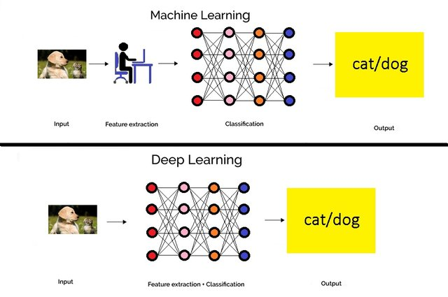

# 数据集

- [数据集](#数据集)
  - [概述](#概述)
    - [深度学习需要大数据](#深度学习需要大数据)
    - [深度学习有时会矫枉过正](#深度学习有时会矫枉过正)
  - [数据表示形式](#数据表示形式)
  - [ImageNet](#imagenet)
  - [参考](#参考)

2021-06-04, 09:41
***

## 概述

深度学习（DL）无疑彻底改变了计算机视觉（CV）和人工智能。许多曾经看起来无法解决的问题，现在都得到了解决，甚至机器比人类做的更好。图像分类可能是最典型的例子。

在深度学习出现之前，如果需要执行图像分类，首先要经过特征提取（feature extraction）步骤。特征（feature）指图片中有趣的、富含信息的或更具代表性的信息。使用传统的计算机视觉技术，如边缘检测（edge detection）、角检查（corner detection）以及目标检测（object detection）等可以提取特征。在使用这些技术时，希望从一类物体（如猫、汽车）的图像中尽可能多地提取特征，并将这些特征视为对该对象的定义（称为词袋 bag-of-words）。然后在其他图像中搜索这些“定义”。如果一个词袋中的大量特征位于一个图像中，则该对象就被分类为包含该对象（猫、汽车等）的图片。

在图形分类中，特征提取方法的困难在于，对每个图片你都必须确定寻找哪些特征。当需要分类的图片数量增加，例如10 或 20，寻找特征就变得非常麻烦，几乎不可能实现。寻找 corners? edges? texture?不同类型的物体最佳描述特征各不相同。如果你使用大量特征，就需要处理模型的大量参数，对各个参数进行微调（fine-tune）更痛苦。

而深度学习是端到端的学习，简而言之，就是告诉算法这个图片是什么类别，它就会自动为每个物体找出最具描述性和最显著的特征。有了端到端的学习，就不再需要手动决定使用哪种传统的计算机视觉技术，深度学习为你搞定这些。

> 如果你想教一个深度神经网络识别一只猫，你不会告诉它去找胡须、耳朵、皮毛、尾巴和眼睛，你只需要向它展示成千上万张猫的照片，最后它就能识别猫。如果它总把狐狸误认为猫，你不需要重写代码，只要一直指导它，给它更多的狐狸和猫的图片，告诉它哪些是狐狸，哪些是猫，最后它就能区分猫和狐狸。

下图描述了特征提取（传统 CV）和端到端学习的区别：

Halder, Rohit, Rajdeep Chatterjee, Debarshi Kumar Sanyal, and Pradeep Kumar Mallick. “Deep Learning-Based Smart Attendance Monitoring System.” In _Proceedings of the Global AI Congress 2019_, edited by Jyotsna Kumar Mandal and Somnath Mukhopadhyay, 101–15. Advances in Intelligent Systems and Computing. Singapore: Springer, 2020. [https://doi.org/10.1007/978-981-15-2188-1_9](https://doi.org/10.1007/978-981-15-2188-1_9).

### 深度学习需要大数据

> 数据是机器学习的命根子。从数据种寻找答案、从数据种发现模式、根据数据讲故事。如果没有数据，就无从谈起。

深度学习需要数据，需要很多很多的数据。那些著名的图像分类模型都是在庞大的数据集上训练的。排名前三的数据集：

- [ImageNet](http://www.image-net.org/), 包含 1000 个类别的150 万图片
- [Microsoft Common Objects in Context (COCO)](https://cocodataset.org/#home) 包含 91 个类型 250 万图片
- [PASCAL VOC Dataset](http://host.robots.ox.ac.uk/pascal/VOC/), 包含 20 个类别 50 万图片

比图像分类简单的任务不需要这么多数据，但仍然需要大量数据。

一个没训练好的模型，在训练数据集之外往往表现不佳，没有足够的数据，它泛化能力（generalise）往往较差。

而且深度学习很难查看或调整模型内部参数，因为深度学习模型内部往往有几十上百万的参数，每个参数都在训练过程中自动调整。从某种程度上来说，深度学习是一个黑匣子。而传统的计算机视觉技术给人充分的透明度，从而可以更好地衡量模型是否可以在训练环境之外工作。

### 深度学习有时会矫枉过正

这可能是支持学习传统计算机视觉技术的最佳理由。

训练深度学习网络需要很长时间。需要专门的硬件（例如高性能的 GPU）。有些可以使用传统方法解决的问题，使用深度学习费时费力。

简而言之：

- 深度学习需要很多数据
- 有些问题用传统方法解决更简单
- 了解传统方法有助于理解深度学习

## 数据表示形式

机器学习需要处理的数据大部分可以表示为以下类型：

- 向量数据：2D 张量，形状为 `(samples, features)`
- 时间序列数据或序列数据：3D 张量，形状为 `(samples, timesteps, features)`
- 图像：4D 张量，形状为 `(samples, height, width, channels)` 或 `(samples, channels, height, width)`
- 视频：5D 张量，形状为 `(samples, frames, height, width, channels)`

## ImageNet

[http://image-net.org/](http://image-net.org/)

ImageNet 是一个计算机视觉系统识别项目，是目前世界上图像识别最大的数据库。是美国斯坦福的计算机科学家，模拟人类的识别系统建立的。能够从图片识别物体。ImageNet是一个非常有前景的研究项目，未来用在机器人身上，就可以直接辨认物品和人了。

ImageNet 是根据 WordNet 分层结构组织的图像数据集。WordNet 有意义的概念，

## 参考

- [http://zbigatron.com/has-deep-learning-superseded-traditional-computer-vision-techniques/](http://zbigatron.com/has-deep-learning-superseded-traditional-computer-vision-techniques/)
