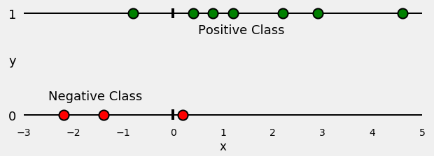
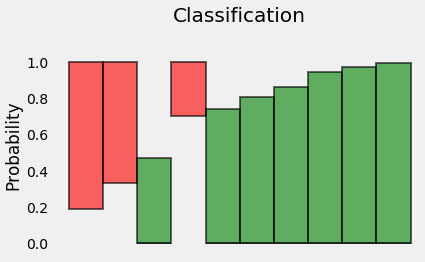

# 损失函数

- [损失函数](#损失函数)
  - [简介](#简介)
  - [损失函数的选择](#损失函数的选择)
  - [0-1 损失函数](#0-1-损失函数)
  - [均方差（MSE）](#均方差mse)
  - [二元交叉熵](#二元交叉熵)
  - [交叉熵损失函数](#交叉熵损失函数)
  - [Hinge 损失函数](#hinge-损失函数)
  - [参考](#参考)

2021-05-27, 15:32
***

## 简介

**损失函数**是一个非负实数函数，用来量化模型预测和真实标签之间的差异。也称为**代价函数**，**目标函数**。

机器学习训练算法的目的就是为了最小化损失函数，获得对应的参数值。

在进行神经网络的学习时，之所以引入损失函数，不能使用精度作为指标，是因为如果以识别精度作为指标，则参数的导数在绝大多数地方都会变为 0。为什么参数的导数在绝大多数地方都会变成 0？因为稍微改变权重参数值，识别精度往往没有变化，即使识别精度有所改善，它的值也不是连续的，而是 33%、34% 这样的不连续值。

总而言之，识别精度对微小的参数变化基本上没有反应，即便由反应，它的值也是不连续地、突然地变化。作为激活函数的阶跃函数也有同样的情况。出于相同的原因，如果使用阶跃函数作为激活函数，神经网络的学习将无法进行。

## 损失函数的选择

常见问题损失函数选择：

- 对于序列学习问题，可以用联结主义时序分类（CTC，connectionist temporal classification）损失函数。

|问题类型|最后一层激活函数|损失函数|
|---|---|---|
|二分类问题|sigmoid|二元交叉熵（binary_corssentropy）|
|多分类、单标签问题|softmax|分类交叉熵（categorical_crossentropy）|
|多分类、多标签问题|sigmoid|binary_crossentropy|
|回归到任意值|无|mse|
|回归到 0~1 范围内的值|sigmoid|mse 或 binary_crossentropy|

## 0-1 损失函数

0-1损失函数是最直观的损失函数，表征模型在训练集上的错误率：

$$
\begin{align}
L(y.f(x;\theta)) &= \begin{cases}
0 &\text{if} \quad y = f(x;\theta)\\
1 &\text{if} \quad y \ne f(x;\theta)
\end{cases}\\
&=I(y\ne f(x;\theta))
\end{align}
$$

其中 $I(\cdot)$ 是[指示函数](数学基础/../函数基础.md#指示函数)。

虽然 0-1 损失函数能够客观评价模型的好坏，但数学性质不好：不连续且导数为 0，难以优化。因此经常使用连续可微的损失函数替代。

大多数情况下，权重和偏置的微小变化不会影响正确分类的数量，因此采用正确分类数作为指标很难通过改变权重和偏执提升表现，而平滑的损失函数能更好通过微调权重和偏置来改善效果。

## 均方差（MSE）

平方损失函数（Quadratic Loss Function）经常用在预测标签 y 为实数值的任务中，定义为：

$$
L(y,f(x;\theta)) = \frac{1}{2} (y-f(x;\theta))^2
$$

平方损失函数一般不适用于分类问题。

Python 实现：

```py
def mean_squared_error(y, t):
    """
    均方差损失函数
    :param y: 输出值
    :param t: 监督数据，即正确值
    :return: 损失值
    """
    return 0.5 * np.sum((y - t) ** 2)
```

## 二元交叉熵

适合二分类以及多分类多标签问题。

下面用一个简单的分类问题来解释什么是二元交叉熵。

假设我们有 10 个随机点：

```py
x = [-2.2, -1.4, -0.8, 0.2, 0.4, 0.8, 1.2, 2.2, 2.9, 4.6]
```

feature x 的分布如下图所示：


然后给数据点分配颜色：红色和绿色，对应数据标签。


分类问题：对特征 x，预测其标签，红色或绿色。

由于是二分类问题，我们可以把问题定义为预测点是绿色或者红色的概率？

在这里，将绿点设置为 positive，红点设置为 negative。

如果我们拟合一个模型来执行这个分类，它将预测每个点是绿色的概率。

二元交叉熵损失函数：

$$
H_p(q)=-\frac{1}{N}\sum_{i=1}^N y_i \times log(p(y_i))+(1-y_i)\times log(1-p(y_i))
$$

其中 y 是数据标签，对绿点为 1，对红点为 0，$p(y)$ 是点为绿色的概率。

从该公式可以看出，对绿点（$y=1$），加上 $log(p(y))$；如果为红点（$y=0$），加上 $log(1-p(y_i))$。

下面我们使用图示展示二元交叉熵的计算过程，首先，我们将绿点和红点样本分开：



加入我们训练一个逻辑回归模型对点进行分类，回归曲线是一个 sigmoid curve，表示点为绿点的概率。如下：


对所有绿点，分类器给出的预测概率为 S 曲线对应的数值，如下：


而对红点，由于 S 曲线给出的是绿点的概率，所以红点概率是上方距离，如下：


两者合并一下：


条形图代表每个点分类正确的预测概率。

接下来我们需要使用预测概率计算损失值。整理一下上图：



进一步整理：


既然我们要计算损失值，那么预测完全正确，损失值应该为 0，如果预测错误，比如概率为 0.01，我们需要损失值很大。而概率的-log 很适合，因为 0.0 到 1.0 之间概率的对数是负数，去负以获得正值损失。

## 交叉熵损失函数

交叉熵误差公式如下：

$$
L = -\sum_k t_klogy_k
$$

这里 $y_k$ 是模型预测值，$t_k$ 是正确解标签。并且 $t_k$ 为 one-hot 表示，即只有一个值为 1，其他为 0。所以上式只需要计算正解标签的输出的自然对数。比如，假设正确解标签的索引为 “2”，与之对应的神经网络的输出是 0.6，则交叉熵误差是 $-log0.6=0.51$。即**交叉熵误差的值是由正确解标签对应的输出结果决定的**。


自然对数的图像如图所示：

- $x=1$ 时 y 为 0，表示完全正确；
- 随着 x 向 0 靠近，y 逐渐变小。

交叉熵损失函数（Cross-Entropy Loass Function）一般用于分类问题。假设样本的标签 $y \in \{1,...,C\}$为离散的类别，模型 $f(x;\theta) \in [0,1]^C$ 的输出为类别标签的条件概率分布，即：

$$p(y=c|x;\theta)=f_c(x;\theta)$$

> $f_c(x;\theta)$ 表示 $f(x;\theta)$的输出向量的第 c 维。

并满足：

$$f_c(x;\theta)\in [0,1],  \sum_{c=1}^Cf_c(x;\theta)=1$$

我们可以用一个 C 维的 [one-hot 向量](函数基础.md#one-hot-向量) y 来表示样本标签。假设样本的标签为 k，那么标签向量 y 只有第 k 维的值为 1，其余元素的值为 0。标签向量 y 可以看作样本标签的真实条件概率分布 $p_r(y|x)$，即第 c 维（记为$y_c$，$1\le c \le C$）是类别为 c 的真实条件概率。假设样本的类别为 k，那么它属于第 k 类的概率为 1，属于其他类的概率为 0.

对于两个概率分布，一般可以用交叉熵来衡量它们的差异。标签的真实分布 y  和模型预测分布 $f(x;\theta)$之间的交叉熵为：

$$\begin{align}
L(y,f(x;\theta)) &= -y^Tlogf(x;\theta)\\
&= -\sum_{c=1}^C y_clogf_c(x;\theta)
\end{align}$$

比如对于三分类问题，一个样本的标签向量为 $y=[0,0,1]^T$，模型预测的标签分布为 $f(x;\theta)=[0.3,0.3,0.3]^T$，则它们的交叉熵为 $-(0\times log(0.3)+0\times log(0.3)+1\times log(0.4))=-log(0.4)$.

因为 y 为 one-hot 向量，所以交叉熵可以简化为：

$$L(y,f(x;\theta))=-logf_y(x;\theta)$$

其中 $f_y(x;\theta)$可以看作真实类别 y 的似然函数。因此，交叉熵损失函数也就是负对数似然函数（Negative Log-likelihood）。

交叉熵 Python 实现：

```py
def cross_entropy_error(y, t):
    """
    交叉熵误差，实际是正确解标签输出自然数对数。
    :param y: 神经网络输出值
    :param t: 监督值
    :return: 损失值
    """
    if y.ndim == 1:  # 求单个数据的交叉熵
        t = t.reshape(1, t.size)
        y = y.reshape(1, y.size)

    # 监督数据是one-hot-vector的情况下，转换为正确解标签的索引
    if t.size == y.size:
        t = t.argmax(axis=1)

    batch_size = y.shape[0]
    # np.arange(batch_size) 生成 0 到 batch_size - 1 的序列，
    return -np.sum(np.log(y[np.arange(batch_size), t] + 1e-7)) / batch_size # 加上 1e-7 是为了避免出现 np.log(0) 变为负无穷的情况。
```

## Hinge 损失函数

对于二分类问题，假设 y 的取值为 $\{-1,+1\}$，$f(x;\theta)\in R$，Hinge 损失函数（Hinge Loss Function）为：

$$\begin{align}
L(y,f(x;\theta)) &= max(0, 1-yf(x;\theta)) \\
&\triangleq [1-yf(x;\theta)]_+
\end{align}$$

其中 $[x]_+=max(0,x)$。

## 参考

- 神经网络与深度学习，邱锡鹏
- https://towardsdatascience.com/understanding-binary-cross-entropy-log-loss-a-visual-explanation-a3ac6025181a
