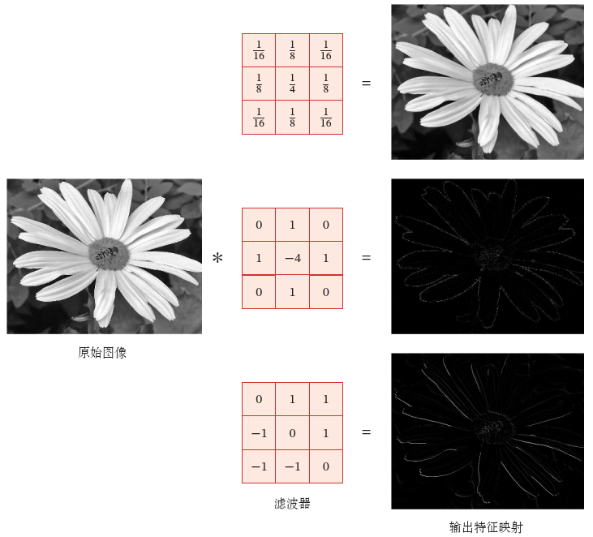

# 卷积神经网络

- [卷积神经网络](#卷积神经网络)
  - [简介](#简介)
  - [卷积](#卷积)
    - [一维卷积](#一维卷积)
    - [二维卷积](#二维卷积)
    - [互相关](#互相关)
    - [卷积变种](#卷积变种)
  - [池化层](#池化层)
  - [构建卷积神经网络](#构建卷积神经网络)
    - [用卷积代替全连接](#用卷积代替全连接)
  - [参考](#参考)

2021-06-04, 09:16
***

## 简介

卷积神经网络（Convolutional Neural Network, CNN 或 ConvNet）是一种具有**局部连接**、**权重共享**等特性的深层前馈神经网络。

卷积神经网络最早主要用来处理图像信息。在用全连接前馈神经网络处理图像时，会存在以下两个问题：

1. 参数太多

如果输入图像大小为 100x100x3 （即高 100，宽 100，RGB 3 通道），在全连接前馈网络中，第一个隐藏层每个神经元到输入层有 100x100x3=30 000 个互相独立的连接，每个连接都对应一个权重参数。随着隐藏层神经元数量的增多，参数的规模也会急剧增加。这会导致整个神经网络的训练效率非常低，也很容易出现过拟合。

2. 局部不变性特征

自然图像中的物体都具有局部不变性特征，比如尺度缩放、平移、旋转等操作不影响其语义信息。而全连接前馈网络很难提取这些局部变性特征，一般需要进行**数据增强**来提高性能。

卷积神经网络是受生物学上感受野的启发而提出的。**感受野**（Receptive Field）机制主要是指听觉、视觉等神经系统中一些神经元的特性，即神经元只接受其所支配的刺激区域内的信号。在视觉神经系统中，视觉皮层汇总的神经细胞的输出依赖于视网膜上的光感受器。视网膜上的光感受器受刺激兴奋时，将神经冲动信号传到视觉皮层，但不是所有视觉皮层中的神经元都会接受这些信号。一个神经元的感受野是指视网膜上的特定区域，只有这个区域内的刺激才能够激活该神经元。

目前的卷积神经网络一般是由卷积层、汇聚层和全连接层交叉堆叠而成的前馈神经网络，全连接层一般在卷积网络的最顶层。卷积神经网络有三个结构上的特性：**局部连接**、**权重共享**以及**汇聚**。这些特性使得CNN具有一定程度的平移、缩放和旋转不变性。和前馈神经网络相比，CNN的参数更少。

CNN 主要用在图像和视频分析中，如图像分类、人脸识别、物体识别和图像分隔等，其准确率一般远远超过其他的神经网络模型。近年来，CNN 也广泛地应用到自然语言处理、推荐系统等领域。

## 卷积

卷积（Convolution）是分析数学中的一种运算。在信号处理和图像处理中，经常使用一维或二维卷积。

### 一维卷积

一维卷积经常用在信号处理中，用于计算信号的延迟累积。假设一个信号发生器每个时刻 t 产生一个信号 $x_t$，其信息的衰减率为 $w_k$，即在 $k-1$个时间步长后，信息为原来的 $w_k$倍。假设 $w_1=1, w_2=1/2,w_3=1/4$，那么在时刻 t 收到的信号 $y_t$ 为当前时刻产生的信息和以上时刻延迟信息的叠加，

$$
\begin{aligned}
y_t &= 1\times x_t +1/2\times x_{t-1}+1/4\times x_{t-2}\\
&=w_1\times x_t+w_2\times x_{t-1}+w_3\times x_{t-2}\\
&=\sum _{k=1}^3 w_kx_{t-k+1}
\end{aligned}
$$

我们把 $w_1, w_2,...$称为滤波器（Filter）或卷积核（Convolution Kernel）。假设滤波器长度为 K，它和一个信号序列 $x_1, x_2,...$的卷积为：

$$y_t=\sum_{k=1}^K w_kx_{t-k+1}$$

信号序列 x 和滤波器 w 的卷积定义为：

$$y=w*x$$

其中 * 表示卷积运算。一般情况下滤波器的长度 K 远小于信号序列 x 的长度。

我们可以设计不同的滤波器来提取信号序列的不同特征。比如，当令滤波器 $w=[1/K,...1/K]$时，卷积相当于信号序列的**简单移动平均**（窗口大小为K）；当滤波器 $w=[1, -2, 1]$ 时，可以近似实现对信号序列的二阶微分，即：

$$x''(t)=x(t+1)+x(t-1)-2x(t)$$

下图是两个滤波器的一维卷积示例，下层是输入信号序列，上层为卷积结果，连接边上的数字为滤波器权重：

可以看出，两个滤波器分别提取了输入序列的不同特征，滤波器 $w=[1/3,1/3,1/3]$ 可以检测信号序列中的低频信息，而滤波器 $w=[1, -2, 1]$ 可以检测信号序列中的高频信息。

> 这里高频和低频指信号变化的强烈程度。

### 二维卷积

卷积也经常用在图像处理中，因为图像为二维数据，所以需要将一维卷积进行扩展。给定图像 $X\in R^{M\times N}$ 和滤波器 $W \in R^{U \times V}$，一般 $U << M, V << N$，其卷积为：

$$y_{ij}=\sum_{u=1}^U\sum_{v=1}^V w_{uv}x_{i-u+1,j-v+1} \tag{7}$$

输入信息X和滤波器W的二维卷积定义为：

$$Y=W*X \tag{8}$$

其中 * 表示卷积运算。例如：

在图像处理中常用的均值滤波（Mean Filter）就是一种二维卷积，将当前位置的像素值设为滤波器窗口中所有像素的平均值，即 $w_{uv}=\frac{1}{UV}$。

在图像处理中，卷积经常作为特征提取的有效方法。一幅图像在经过卷积操作后得到结果称为**特征映射**（Feature Map）。下图给出在图像处理中几种常用的滤波器，以及其对应的特征映射．图中最上面的滤波器是常用的**高斯滤波器**，可以用来对图像进行平滑去噪；中间和最下面的滤波器可以用来提取边缘特征．

### 互相关

在机器学习和图像处理领域，卷积的主要功能是在一个图像（或某种特征）上滑动一个**卷积核**（即滤波器），通过卷积操作得到一组新的特征．在计算卷积的过程中，需要进行**卷积核翻转**．在具体实现上，一般会以互相关操作来代替卷积，从而会减少一些不必要的操作或开销．**互相关**（Cross-Correlation）衡量两个序列相关性的函数，通常是用滑动窗口的点积计算来实现．给定一个图像 $X \in R^{M \times N}$ 和卷积核 $W \in R^{U \times V}$，它们的互相关为:

$$y_{ij}=\sum_{u=1}^U\sum_{v=1}^V w_{uv}x_{i+u-1, j+v-1} \tag{9}$$

和公式 (7) 相比，互相关和卷积的区别仅在于卷积核是否进行翻转．因此互相关也可以称为**不翻转卷积**．

互相关和卷积的区别也可以理解为图像是否进行翻转。

卷积神经网络中的卷积严格意义上来说是互相关。

### 卷积变种

在卷积的标准定义基础上，还可以引入卷积核的滑动步长和零填充来增加卷积的多样性，可以更灵活地进行特征抽取．

**步长**（Stride）是指卷积核在滑动时的时间间隔．下图（a）给出了步长为 2 的卷积示例．

**零填充**（Zero Padding）是在输入向量两端进行补零．上图（b）给出了输入的两端各补一个零后的卷积示例．

假设卷积层的输入神经元个数为 𝑀，卷积大小为 𝐾，步长为 𝑆，在输入两端各填补 𝑃 个 0（zero padding），那么该卷积层的神经元数量为 (𝑀 − 𝐾 + 2𝑃)/𝑆 + 1．

> 通常可以通过选择合适的卷积大小以及步长使得（M-K+2P)/S+1 为整数

一般常用的卷积有以下三类：

1) **窄卷积**（Narrow Convolution）：步长 𝑆 = 1，两端不补零 𝑃 = 0，卷积后输出长度为 𝑀 − 𝐾 + 1．
2) **宽卷积**（Wide Convolution）：步长 𝑆 = 1，两端补零 𝑃 = 𝐾 − 1，卷积后输出长度 𝑀 + 𝐾 − 1．
3) 等宽卷积（Equal-Width Convolution）：步长 𝑆 = 1，两端补零 𝑃 = (𝐾 − 1)/2，卷积后输出长度 𝑀．

## 池化层

## 构建卷积神经网络

### 用卷积代替全连接

在全连接前馈神经网络中，如果第 𝑙 层有 $M_l$ 个神经元，第 𝑙 − 1 层有 $M_{l-1}$ 个神经元，连接边就有 $M_l \times M_{l-1}$ 个，也就是权重矩阵有 $M_l \times M_{l-1}$ 个参数．当 $M_l$ 和 $M_{l-1}$ 都很大时，权重矩阵的参数非常多，训练的效率会非常低．

## 参考

- 神经网络与深度学习，邱锡鹏
